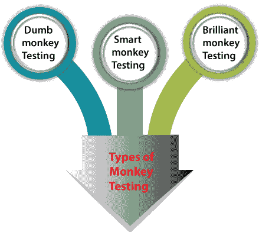
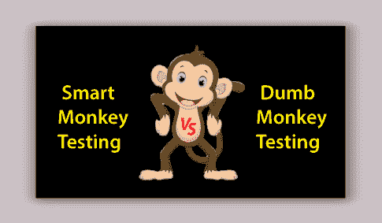
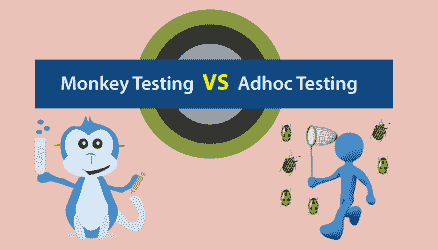

# 猴子测试

> 原文：<https://www.javatpoint.com/monkey-testing>

在**软件开发生命周期(SDLC)** 中，为了帮助测试工程师建立产品的质量、性能、一致性、效率和安全性，在产品发布前后，测试阶段起着至关重要的作用。

因为我们知道测试过程是识别特定软件中的**bug 和缺陷**并立即控制它们的最佳方式，它们被测试工程师团队检测到。

在本教程中，我们将了解以下特定类型软件测试的主题，即 **Monkey testing** 。

*   **猴子测试介绍**
*   **猴子测试的属性**
*   **猴子测试的用法**
*   **猴子测试类型**
*   **聪明猴测试 vs 哑巴猴测试**
*   **猴子测试与特殊测试**
*   **猴子测试的优势**
*   **猴子测试的缺点**

## 猴子测试介绍

[软件测试](https://www.javatpoint.com/software-testing-tutorial)的独特类型之一是**猴子测试**。它最早是在 ***《软件测试的艺术》*** 一书中介绍的，该书由**格兰福德·j·迈尔斯在 **1979** 中撰写。**

这是一种软件测试技术，用户通过随机输入来检查应用；这就是为什么它也被称为**随机测试**。

如果我们没有足够的时间编写和执行测试，我们将实施**猴子测试。**

它也被称为**随机测试**，最适合桌面、网络以及移动应用。如果我们使用随机测试或猴子测试输入，这是一个省时省力的过程。

Monkey 测试通常作为随机的、自动化的单元测试来执行，它为我们提供了从测试结果中有效评估软件可靠性的好处。

monkey 测试主要是自动实现的，用户插入任何随机的无效输入并测试其性能。

如果我们正在执行负载和压力测试， **Monkey testing** 工作得非常好，或者我们可以说这是一个非常好的方法。

从随机测试中创建或开发的数据还可以用于近似产品一致性。另一方面，各种测试方法不能以这种方式来近似软件一致性。

这在测试工程师中很流行，因为他们使用这种测试通过提供随机输入和检查应用的行为来测试应用。

通过使用试探性性能来检测软件应用中的错误和错误是执行 monkey 测试的主要目的。

## 猴子测试的特点

随后， **Monkey Testing** 包括通过给出一些随机数据来测试软件或应用，检测系统是否出现故障。

执行 monkey 测试的主要目的是识别软件中的缺陷和错误，并确保一旦软件产品的整个开发完成，系统不会崩溃。

**猴子测试或随机测试的一些显著特征如下:**

*   在执行猴子测试时，没有规范。
*   这是一种本能的测试，是在没有任何精确测试的情况下进行的。
*   当没有定期检测到缺陷时，就实施 Monkey 测试。
*   猴子测试用于列出系统的可靠性和性能。
*   在猴子测试中投入的时间和精力相对比实际测试努力要少。
*   猴子测试的实现保证了系统的可靠性和效率。

## 猴子测试的使用

*   Monkey 测试可以通过开始一个事务并插入一些随机数据来用于数据库测试。
*   它也可以在硬件的帮助下进行测试，或者更好的是在软件的帮助下进行测试，以模仿插入随机数据的猴子的活动。
*   为了测试应用的 OWASP 问题，我们可以使用预编译的随机数据。

## 猴子测试的类型

根据其执行方式，**猴子测试**分为多种类型。为了快速了解它，我们可以在下面的图片中看到:

*   **哑猴测试**
*   **聪明猴测试**
*   **亮猴测试**

现在，让我们一个接一个地看它们，以便更好地理解:

### 哑巴猴子测试

第一种猴子测试是**哑猴测试**。这是最简单直接的猴子测试类型，它不知道自己或系统的能力或应用的流程。

在这个测试中，我们可以比聪明的猴子识别更少的 bug，但是可以天真地发现很难找到的重要 bug。

在这种情况下，**测试经理或负责人**任命一名不了解应用特定模块的测试工程师来测试产品。

甚至那些测试工程师也不知道给定的输入是有效的还是无效的。这就是为什么哑猴测试也被称为**无知猴**。

换句话说，我们可以说哑巴猴子不知道工作流或数据被应用或系统持续。

测试工程师被要求自动测试应用，并在测试工程师认为合适的地方输入随机数据。

以下特征可以识别哑猴:

*   测试工程师的行为可能就像一个没有技术知识但试图使用应用的用户。
*   测试工程师可以根据他们的理解测试应用，并输入无效的数据。
*   当测试工程师对应用没有任何概念时。
*   为了查看它是否如预期的那样运行，我们可以记下应用的行为。
*   测试人员不知道输入是否有效。
*   当测试人员不太了解用户界面和功能时。

### 聪明的猴子测试

下一种猴子测试是**智能猴子测试**，其中**测试工程师完全关注系统或应用。**

此外，测试团队知道确切产品的功能，并因此给出输入，这些输入是合适且有效的，有助于在产品上执行测试。

此外，智能猴子测试知道应用的页面将重定向到哪里。

在智能猴子测试中，测试工程师专注于超越应用，如果他们发现了错误，他们就足够聪明来报告错误。此外，智能测试是执行**负载测试和压力测试**的绝佳选择。

换句话说，我们可以说测试工程师对系统、其目标和功能有一点具体的了解，并且测试工程师浏览系统并提供有效的输入来执行测试。

### 聪明的猴子测试

最后也是第三种猴子测试是聪明的猴子测试。在这种猴子测试中，测试工程师对系统有很好的了解。

这种类型的测试还可以识别一些 bug，这些 bug 将来可能会在软件中发现。

此外，测试工程师知道使用产品的模式，因此，他们可以从用户的角度进行测试。

换句话说，我们可以说聪明的猴子测试比聪明的猴子测试领先一步。

在这种情况下，测试工程师或一组测试工程师被指派执行任务，因为他们对特定的软件领域及其特性有完整的了解。

## 聪明猴测试和笨猴测试的区别

让我们在下表中看到**聪明猴测试和哑猴测试**之间的一些显著比较。

| 没有 | 聪明的猴子测试 | 哑巴猴子测试 |
| **1。** | 在这种情况下，聪明的猴子知道系统的工作流程，这意味着产品在哪里，它将被管理在哪里。 | 在这种情况下，哑巴猴子不知道系统的工作流程。 |
| **2。** | 在智能猴子测试中，他们对软件产品有一些工作思路。 | 在哑猴中，它们没有任何与系统及其特征相关的知识。 |
| **3。** | 在这种情况下，聪明的猴子可以报告检测到的错误或缺陷。 | 与智能猴子测试相比，它发现的 bug 较少，但可能会发现难以检测的 bug，即使是智能猴子也很难检测到。 |
| **4。** | 在智能猴子测试中，测试人员可以了解系统的能力及其优势。 | 在哑猴测试中，测试人员无法建立系统的能力。 |
| **5。** | 在智能猴子测试中，智能猴子非常清楚系统持续的输入。这意味着他们理解输入的有效和无效类型。 | 在哑猴中，哑猴不知道输入类型，并提供有效或无效的系统。 |

## 猴子测试类似于大猩猩测试和模糊测试吗？

*   众所周知，**大猩猩测试**是预先计划好的，而猴子测试本质上是非常 Adhoc 的，和大猩猩测试相比，我们肯定被搞糊涂了很多次。
*   如果我们将模糊测试与大猩猩测试和猴子测试进行比较，它们会有很大的不同。
*   关于模糊测试的关注点是随机选择的数据输入，而猴子测试则处理执行测试的随机动作。
*   因此，我们可以得出结论:**猴子测试**不同于其他类型的测试程序，它们服务于不同的目的。我们可以根据自己的需求选择合适的测试类型，无论是**猴子测试、大猩猩测试还是模糊测试。**

#### 注意:有些人认为 monkey 和 Adhoc 测试是类似类型的测试技术，这是不正确的，因为即席测试是在没有任何计划或文档工作的情况下进行的。

为了澄清上述说法，我们可以区分猴子测试和 Adhoc 测试。

## 猴子测试与特殊测试

让我们看看下表中猴子测试和[即席测试](https://www.javatpoint.com/adhoc-testing)之间的一些显著差异:

| 没有 | 猴子测试 | 专项测试 |
| **1。** | 它是随机执行的，没有显式预定义的测试用例。 | 它是根据客户的要求执行的。 |
| **2。** | 它可以由任何人实现，甚至是不了解计算机或应用的个人。 | 它可以由开发人员以及对应用有很好了解的测试工程师来执行。 |
| **3。** | 实现 monkey Testing 的主要目标是用随机或无效的数据随机执行测试，以检查应用是否失败。 | 即席测试旨在通过随机使用应用来检查系统是否使应用崩溃或发现缺陷。 |
| **4。** | 在猴子测试中，我们可以使用测试用例，因为它是随机的。 | 即席测试也是随机执行的，但不依赖或使用测试用例。 |
| **5。** | 在猴子测试中，测试工程师可能不知道系统是关于什么的，也不知道它的目标。 | 在即席测试中，测试工程师必须在执行测试过程之前全面了解系统。 |

## 猴子测试的利弊

这是一个分析测试场景的软件测试过程，测试场景是随机的和即席的。尽管给最终用户和测试工程师带来了各种好处，但是猴子测试有许多缺点，这会抑制它的积极能力。

因此，猴子测试的一些基本优点和缺点如下所述:

### 猴子测试的优势

以下是猴子测试的一些重要好处:

*   不需要熟练的测试工程师来执行猴子测试。
*   猴子测试非常划算。
*   个人可以在这个测试的帮助下快速分类 bug，这可能会显著影响软件的效率和性能。
*   为了测试软件的可靠性，这是一个很好的方法。
*   猴子测试技术易于设置和实现。
*   在猴子测试中可以发现新的虫子；它们不会在整个传统测试中被发现。
*   这是以即席方式执行压力测试和负载测试的最佳方法。

### 猴子测试的缺点

以下是 Monkey 测试的缺点:

*   评估猴子测试过程中发现的意外问题使得这个过程非常困难和耗时。
*   在猴子测试中，识别出的 bug 可能超出范围或业务需求。
*   测试工程师不能保证测试用例的准确性，因为他们很难定义准确的测试场景。
*   猴子测试的实现可能会在对 bug 进行分类之前消耗大量时间，因为它没有任何预定义的测试。
*   随机完成；这就是为什么测试用例覆盖不能是特定的。

## 概观

**在本教程中，我们了解到 Monkey Testing** 是一种相对较新的软件测试类型，在软件测试工程师中比较流行，在一些测试领域非常有益。

猴子测试在知情的情况下不同于大猩猩测试和 T2 专项测试。

猴子测试分为三种类型的测试是**哑巴猴子测试、聪明猴子测试和聪明猴子测试。**

在 Monkey 测试中，用户输入随机输入，然后执行测试来检查其性能，并知道系统或应用是否失败。

此外，猴子测试是由一组测试工程师进行的自动化测试，没有考虑任何详细的测试。

最后，我们可以说 Monkey 测试是检查软件特性质量和软件性能最简单的方法；由于这种质量，猴子测试也被称为随机测试。

* * *