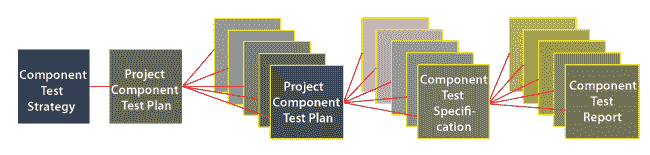
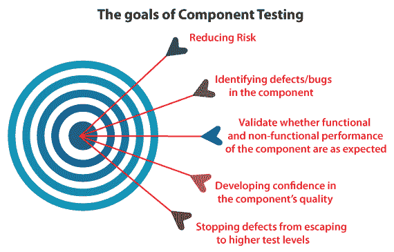
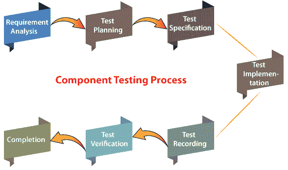
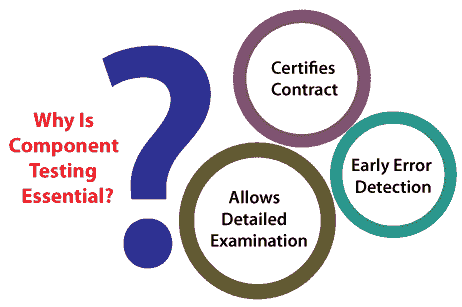
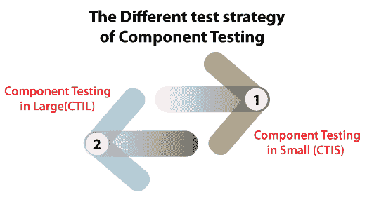
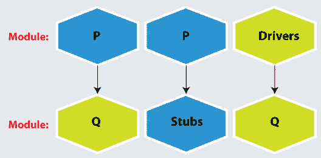

# 组件测试

> 原文：<https://www.javatpoint.com/component-testing>

软件是在几个模块或组件的帮助下开发的。在这里，我们将探讨和讨论以下与**组件测试**相关的主题，这些主题有助于我们理解软件测试中组件测试和产品可靠性的要求。

*   **什么是组件测试？**
*   **组件测试的目标**
*   **谁执行组件测试？**
*   **组件测试流程**
*   **什么时候需要进行组件测试？**
*   **为什么组件测试必不可少？**
*   **组件测试的不同测试策略**
*   **组件测试示例**

在深入上述所有主题之前，我们非常清楚，无论如何，所有的测试方法都有一个目标，这就是为什么所有这些都应该准确地执行。

## 什么是组件测试？

另一种软件测试是**组件测试**。它用于单独测试所有组件以及可用性测试；还对每个特定组件进行交互式评估。它也被称为**模块测试或程序测试和单元测试。**

为了实现组件测试，所有组件或模块都需要处于独立状态和可管理状态。软件的所有相关组件都应该是用户可以理解的。

这种类型的测试提供了一种发现缺陷的方法，缺陷发生在所有模块中。也有助于证明软件每个组件的工作。

组件测试是**质量保证团队**执行的**黑盒测试**中重复次数最多的一种。

它可以单独执行，即与其余系统分离。然而，它依赖于首选生命周期的模型。

组件测试可以使用**调试**或**测试结构工具**。

在组件测试中，当错误被识别出来时，可以尽快修复，而无需保留任何记录。

简而言之，我们可以说组件测试的执行确保了所有应用组件都按照要求正确工作。组件测试在与**集成测试**一起分发之前执行。

## 组件测试的目标

执行组件测试的主要目的是验证测试对象的输入/输出性能。并确保指定测试对象的功能按照所需的需求或规范正常工作。

让我们看看组件测试的其他一些重要目标:

*   **降低风险**
*   **识别部件中的缺陷/缺陷**
*   **验证部件的功能性和非功能性性能是否如预期**
*   **培养对部件质量的信心**
*   **阻止缺陷逃逸到更高的测试水平**

*   **降低风险**

组件测试的实现验证了应用的每个单元。并帮助开发人员识别代码中的错误并修复它们。因此，我们可以说组件测试从根本上降低了风险的可能性。

*   **识别部件中的缺陷/缺陷**

执行组件测试的另一个基本目的是**识别源代码中的错误**。此外，还验证了**的控制流程、功能、数据结构等。，**在程序中使用。

*   **验证部件的功能性和非功能性是否如预期**

执行组件测试的目的是验证组件的功能和非功能特性是否正常运行。

换句话说，我们可以描述组件测试的执行保证了它们的设计和规范按预期执行。

它可能涉及功能性特性，如**计算的正确性**和**非功能性**特性，如**探索内存泄漏。**

*   **培养对部件质量的信心**

正如我们从组件测试的定义中所理解的，它发生在单元级别，并且大多数错误是在编码本身时被识别和修复的。

组件测试在建立对组件的信心方面起着至关重要的作用，这意味着额外测试中的错误或缺陷更少。

*   **阻止缺陷逃逸到更高的测试水平**

最后，在组件测试中，编码错误由开发人员识别和修复。结果是，组件测试减少了高级测试中错误的存在。

## 谁执行组件测试？

组件测试由**测试工程师或在 IDE 帮助下编写代码的开发人员**执行。正如我们已经知道的那样， [**单元测试**](https://www.javatpoint.com/unit-testing) 由开发人员执行，以执行特定特性或方法的测试。

## 组件测试过程

组件测试过程可以通过以下七个步骤完成，如下图所示:

让我们一个接一个地讨论它们，以便更好地理解:

### 第一步:需求分析

组件测试的第一步是**需求分析**，检测每个组件关联的用户需求。

### 第二步:测试计划

一旦完成**需求分析**阶段，我们将进入组件测试流程的下一步，即**测试计划**。在此阶段，测试旨在评估用户/客户给出的需求。

### 步骤 3:测试规范

一旦**测试计划阶段**完成，我们将进入下一阶段，称为**测试规范。**这里，我们将识别那些需要执行和错过的测试用例。

### 步骤 4:测试实现

组件测试过程的第四步是**测试实现。**当测试用例按照用户需求或者规范被识别时，那么只有我们能够实现测试用例。

### 步骤 5:测试记录

当以上所有步骤都成功完成后，我们将进入下一步，即**测试记录。**在组件测试过程的这一步，我们有在组件测试实施过程中发现的那些缺陷/bug 的记录。

### 步骤 6:测试验证

一旦错误或缺陷被成功记录，我们将进入**测试验证**阶段。它是检验产品是否符合规格的过程。

### 第七步:完成

成功完成以上所有步骤后，我们将进入组件测试流程的最后一步。在这一特定步骤中，将对结果进行评估，以交付高质量的产品。

## 我们什么时候需要执行组件测试？

当在特定应用上完成单元测试时，我们可以继续进行组件测试。组件一旦开发出来就要进行测试；因此，从测试中的组件检索的输出依赖于迄今为止尚未创建的其他组件。

根据**开发生命周期模型**，组件测试可能与其他系统组件隔离执行。

执行隔离是为了阻止外部影响。因此，我们将使用**存根和驱动程序**来假装软件组件之间的接口来测试该组件。

#### 注意:集成测试仅在组件测试执行之后执行。

所有模块的主要功能都在组件测试中进行测试，例如:

| 组件测试的进入标准 | 组件测试的退出标准 |
| 应该创建单元测试中涉及的最少数量的组件，并进行单元测试。 | 所有组件/模块的功能应该运行良好。并且在缺陷日志中没有严重或高或中等严重性和优先级的缺陷。 |

## 为什么组件测试必不可少？

在软件测试中，组件测试起着至关重要的作用。让我们借助以下几点来理解这一点:

### 允许详细检查

组件测试的执行允许在获得每个模块或组件后进行详细检查。

它可以完全或彻底地测试实际网络服务器上所有可能的错误。这个事实对于**组件测试**来说是完全例外的，因为我们比较了单元测试，在单元测试中，每个单元都不是在实时服务器上测试的。

### 早期错误检测

正如我们从上面对组件测试的解释中所理解的，它可以在任何阶段实现，这有助于我们相对较快地识别和修复那些错误，因此，我们既省钱又省时。

开发团队可以在将组件交给质量评估团队之前，针对所有可预防的错误或缺陷对其进行测试。

### 证明合同

组件测试的实现将帮助我们**认证合同**，这意味着组件测试是可重复的。

因此，我们可以说组件测试是验证我们模块的最佳方式，它提供了它承诺的全部内容。因此，与给定软件的任何集成都可以在没有任何不确定性和疑虑的情况下进行。

## 组件测试的不同测试策略

根据测试级别的复杂性，组件测试分为以下两种类型。

1.  **小(CTIS)区成分检测**
2.  **大型(CTIL)部件测试**

为了更好地理解，让我们一个接一个地讨论它们:

### 1.小型组件测试(CTIS)

一些组件测试可以在特定应用或被测软件中有或没有其他模块的情况下执行。如果在与其他模块的隔离中执行组件测试，则表示为小的 ***组件测试，*** 也表示为 **CTIS** 。

让我们看一个示例，在这里我们可以清楚地理解小规模的组件测试是如何工作的。

**例如:**假设我们有一个网站，它包括五个不同的网页。因此，单独测试每个网页并隔离其他组件被称为小中的**组件测试。**

### 2.大型组件测试(CTIL)

大型中的**组件测试是测试，我们在没有与软件的其他模块分离的情况下执行组件测试。**

这种类型的测试发生在依赖于模块的性能流的时候，因此，我们不能将它们分开。我们依赖的那些组件还没有被创建，然后我们使用复制模块而不是实际的模块或组件。

#### 注意:这些复制的模块被称为存根(被调用函数)和驱动程序(调用函数)。

让我们看一个大中**组件测试的例子，以便我们更好的理解。**

**例如**

假设我们有一个包含三个不同模块的 web 应用:**模块 P、模块 Q、**和**模块 R** 。

这里开发者已经创建了**模块 Q** ，需要测试。

但是，要完全测试**模块 Q** ，其部分功能依赖于**模块 P** ，部分功能依赖于**模块 R** 。

因此，特定模块的性能流程如下:

**模块 P →模块 Q →模块 R**

该性能流程意味着**模块 P 和模块 R** 都依赖于**模块 Q** 。如下图所示，我们有 stub 和 Driver，stub 被称为**调用函数，**，Driver 被称为**调用函数**。

但是**模块 P 和模块 R** 到现在还没有建立。所以，在这个场景中，如果我们想完全测试**模块 Q** 。

这样，我们就可以根据需要借助**存根和驱动程序**互换**模块 P** 和**模块 R** 。

因此，**模块 P 和模块 R** 主要由**存根和驱动程序**更改，它们作为复制对象执行，直到创建它们。

#### 注意:
Stub:从需要测试的软件模块或组件中调用一个 Stub；从上图中我们可以看到，Stubs 是由一个 Module P.
Driver 调用的:一个驱动调用模块/组件，这需要进行测试，正如我们在上图中看到的 Driver 调用模块 q。

## 组件测试示例

假设我们有一个 web 应用，包含三个不同的模块**登录、主页和用户**。

第一个模块(登录)安装在测试环境中，但是另外两个模块 **Home 和 User** 需要由尚未完成的**登录模块**调用。

出于测试目的，开发人员将添加一段代码来复制其余模块的调用方法。这个特定的代码段被称为**stub**，被认为是一种**自上而下的方法**。

如果**第二个模块(Home)** 和**第三个模块(User)** 准备好了，但是**登录**模块还有待开发，两个组件都从这里获取返回值，开发人员将添加一个复制登录模块的代码。

这段特定的代码被称为**驱动程序**，这被认为是一种**自下而上的方法。**

## 结论

在本节中，我们已经讨论了**组件测试**的深入知识。而且，我们可以得出结论，这是评估任何模块在任何开发阶段的功能的准确方法。

在软件开发中，组件测试节省了成本，并且通过消除所有可避免的错误，在未来阶段省去了不必要的麻烦。

最后，我们可以说**单元测试和**组件测试是同时执行的。与开发团队执行的单元测试相反，组件/模块测试由测试团队执行。

总是建议在开始**集成测试之前进行完整的组件测试。因为如果组件测试是准确的，我们将在集成测试期间识别更多的小缺陷。**

 *** * ***