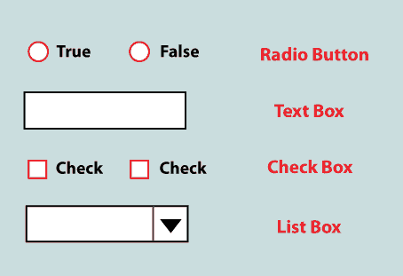
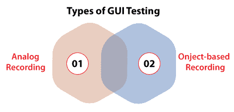
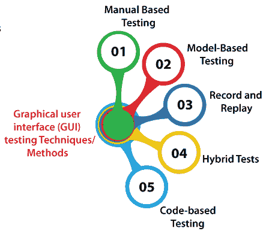
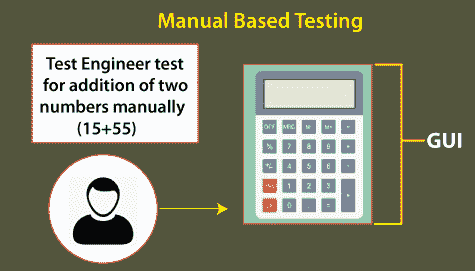
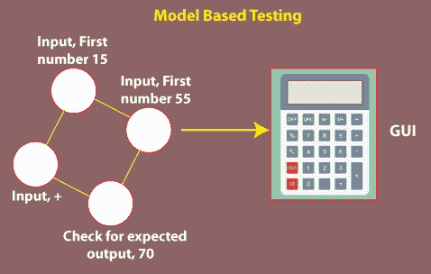
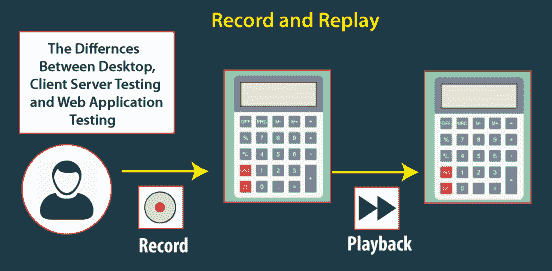

# 图形用户界面测试

> 原文：<https://www.javatpoint.com/gui-testing>

在本节中，我们将讨论所有图形用户界面测试，包括以下重要主题:

*   **什么是 GUI 测试？**
*   **为什么需要进行 GUI 测试？**
*   **图形用户界面测试的特点**
*   **图形用户界面测试类型**
*   **图形用户界面测试示例**
*   **图形用户界面测试期间面临的不同挑战**
*   **图形用户界面测试工具**

在深入上述所有主题之前，首先，我们将了解图形用户界面。

## 什么是 GUI？

在计算机应用中，我们主要有两种类型的接口，例如:

*   **命令行界面**
*   **图形用户界面**

当我们需要输入文本时，使用**命令行界面**，同时计算机响应该命令。

另一方面，**图形用户界面**用于通过使用图像而不是文本与计算机相关联。

我们有一些关键的图形用户界面元素，可以用于用户和应用之间的通信。

*   **复选框**
*   **列表框**
*   **单选按钮**
*   **文本框**

如下图所示:

现在，我们将转移到我们的主要讨论点，即图形用户界面测试。

## 什么是图形用户界面测试？

这是**软件测试** 的独特[类型之一，经常用于检查应用或软件的图形用户界面功能。](https://www.javatpoint.com/types-of-software-testing)

通常，图形用户界面测试用于评估元素或功能的设计，例如:

*   **文本框**
*   **字体大小**
*   **字体颜色**
*   **按钮**
*   **菜单**
*   **链接**
*   **布局**
*   **标签**
*   **文本格式**
*   **列表**
*   **字幕**
*   **图标**
*   **内容**

图形用户界面测试的主要目标是验证软件的特性，或者应用按照给定的需求/规范运行。

**图形用户界面测试**过程由**第三方机构**而不是开发人员或最终用户手动或自动实施并重复执行。

换句话说，我们可以说，图形用户界面测试是一种方法，在这种方法中，如果软件或应用与用户界面性能相关，则测试应用的用户界面。

## 为什么我们需要执行图形用户界面测试？

在理解了图形用户界面测试的定义后，我们得到了它的基本概念。但是会出现一些问题，比如:

*   测试应用是否需要图形用户界面测试？
*   为什么我们需要执行图形用户界面测试？
*   《应用》的特性和逻辑的测试是不是太多了？？那么为什么我们需要在执行 UI 测试上浪费时间呢？

如果我们想要上面提到的所有问题的答案，我们需要像用户一样思考，而不是测试工程师。因为用户不接触指定的应用或软件，所以是应用的用户界面决定了用户是否会更多地使用该应用。

这里，首先，普通用户理解应用或软件的外观和设计，以及她/他理解用户界面有多容易。

如果用户对界面不满意或无法识别应用的困难以便理解它，他/她将永远不会再使用该应用。由于上述场景，必须实现图形用户界面测试，以确保图形用户界面测试交付无缺陷的应用。

## 为什么图形用户界面测试是必要的？

在软件测试技术中，图形用户界面的实现对于执行其他类型的软件测试**至关重要。**

 **正如我们所知，交付高质量的产品并满足客户的需求和无缺陷的产品是执行任何类型测试的首要关注点。

并且已经声明“**我们不能把质量审核成产品**”

这就是为什么为了提高产品的质量，开发团队从一开始就寻求将其开发到他们的项目中。

为了提高产品的质量，我们可以在 [**【软件开发生命周期】**](https://www.javatpoint.com/software-development-life-cycle) 中使用更早的测试流程，这也称为**左移测试**。

开发团队增加了在单元和接口测试中花费的时间和资源，而不是在应用完成后等待**系统测试。结果，开发过程中的早期错误检测将降低修复它们的成本。**

 **正如我们已经知道的那样，**单元和接口/API 测试**对于自动化是兼容的，因为开发人员在编码时开发单元测试；另一方面，API 测试倾向于非常稳定，并且比 APIs GUI 测试涉及更少的维护。

我们可以观察到**左移测试**的重要性是妖娆的，使得 GUI 测试不堪一击。尽管如此，手动图形用户界面测试可能是一个耗时且资源密集型的过程。

虽然测试自动化对图形用户界面来说有点刺激，因为用户界面可以频繁修改，但是早期运行的自动化图形用户界面测试可能会失败，需要相当大的决心来维护它们。

然而，**单元和接口测试**无法评估系统的所有方面，尤其是**工作流程**和**可用性**的关键特性。这就是图形用户界面测试的重要性，它是从用户的角度而不是从开发人员的角度来实现的。

通过从**用户的角度评估应用**帮助我们将信息传递给项目团队，在那里他们需要选择应用是否准备好部署。

**例如**，出现在**视窗火狐浏览器**中的下拉列表将与**MAC-火狐**不同。这些问题可能足够了，因为这些是操作系统功能，我们需要以同样的方式接受它们。

## 图形用户界面测试的特点

图形用户界面测试的一些最重要的特性如下所述:

*   图形用户界面测试用于在具有固定 Selenium WebDriver 的 Selenium 网格上执行匹配或分配测试。
*   图形用户界面测试的执行将允许我们从用户的角度测试应用的特性。
*   作为图形用户界面测试的结果，我们可以得到定制的测试报告。
*   它还产生一个一致的对象文档，同时为网络元素和动态标识。
*   有时系统的内部性能工作正常，但用户界面却不正常；这就是为什么为了测试其他类型的应用，GUI 测试是一个很好的方法。

## 图形用户界面测试的类型

图形用户界面测试分为两种不同的类型，如下所述:

### 模拟录音

第一种图形用户界面测试是**模拟记录**。在模拟录制的帮助下，人们将始终与图形用户界面测试工具保持联系。

本质上，图形用户界面测试工具用于封装精确的**键盘按压、鼠标点击和其他用户活动**，然后将其存储在文件中以供回放。让我们看一个例子来理解模拟录音的基本功能。

**例**

模拟记录可能会记录用户在 X = 700 像素、Y = 600 像素的位置左键单击，或者在框中输入单词“**登录”**，然后按下键盘上的**回车**键。

### 基于对象的记录

另一种图形用户界面测试类型是**基于对象的记录**。在这种情况下，测试工具可以以编程方式连接到需要测试的应用，并且**将每个特定的用户界面模块(如**文本框、按钮和超链接)观察为一个不同的对象。****

在基于对象的记录中，我们可以执行以下活动，例如

*   **点击**
*   **输入文本**
*   **读取状态(是启用还是禁用)**

看完所有类型的图形用户界面测试后，我们将进入下一个主题，即**图形用户界面测试技术或不同的方法**。

## 图形用户界面测试技术/方法

为了执行图形用户界面测试，我们有一些独特的技术，如下所示:

*   **手动测试**
*   **基于模型的测试**
*   **记录和回放**
*   **混合测试**
*   **基于代码的测试**

让我们详细了解它们，以便更好地理解:

### 1.基于人工的测试

GUI 测试的第一种方法是**手动基础测试**。执行图形用户界面测试的最简单方法是纯粹手动使用应用。通常，基于人工的测试是由热情的参数测试工程师实施的。

换句话说，我们可以说在这种方法中，图形化项目是由测试工程师按照 **BRS(业务需求规范**)文档中指定的需求手工测试的。

正如我们已经知道的那样，**手动测试**是没有生产力的，因为有时手动测试的执行是缓慢、单调和容易出错的。如果我们想适当地发布高质量的软件，我们应该坚持尝试自动化我们的测试策略。

但是在当前的测试策略中，手工测试仍然扮演着重要的角色。我们确定正确的平衡来执行手动测试。准确地说是图形用户界面测试，手动测试工程师可以有更多的界面主观方面，比如它的**外观和感觉以及可用性**。

### 2.基于模型的测试

图形用户界面测试的下一个方法是**基于模型的测试**，因为我们知道模型是系统性能的视觉叙述，它帮助我们理解和预测系统性能或活动。

这些模型有利于在系统需求的帮助下开发一个实际的测试用例。

在执行基于模型的测试方法时，需要考虑一些基本要求:

*   创建模型
*   验证模型的输入
*   对于特定模型，分析预期结果
*   实施测试
*   平衡实际结果和预期结果
*   对模型上附加动作的评估

为了在给定需求的帮助下创建测试用例，这也是一个不断发展的过程。与其他图形用户界面测试方法相比，基于模型的测试提供了修复我们的图形用户界面可以完成的不利状态的好处。

我们可以在其他一些基于模型的方法的帮助下获得测试用例:

*   **决策表**
*   **图表**

**决策表:**决策表用于控制每个相关输入的输出。

**图表:**图表技术表示系统的状态，并在一些输入后测试状态。

### 3.录制和重播

我们可以在自动化工具的帮助下执行图形用户界面测试，这可以通过两种方式完成。在整个记录部分，测试步骤由自动化工具封装。在回放中，这些记录的测试步骤在被测应用上实现。**比如:QTP。**

自动化方法是最常见的技术，在这种技术中，图形用户界面自动化测试证明自己超越了记录和回放方法。

顾名思义，记录和重放方法依赖于让测试工程师使用特定的工具来记录测试会话。记录和重放方法的显著好处是，它不需要任何编码技巧来减少我们使用它的障碍。记录和回放测试的主要缺点是它们的弱点。

因为**用户界面**是应用的一部分，经常修改，并且依赖于用于与屏幕上的元素相互关联的策略。

### 4.混合测试

为了在当前时间执行图形用户界面测试，混合测试是不同的方法。对于非技术背景的用户来说，通过记录他们的会话来开发测试用例是一种有益的技术。之后，熟悉编码的用户可以从技术上进一步控制这些记录的测试。

拥有编码知识的人可以进一步操作这些记录的测试，以针对更复杂的情况修改它们。

### 5.基于代码的测试

执行图形用户界面测试的另一种方法是基于代码的测试。为了使用代码开发测试用例，图形用户界面测试提供了一些图形用户界面测试工具。为了发现更困难的测试场景，我们可以使用基于代码的测试方法。

随后，他们的代码、测试用例可以和应用的代码一起在源代码管理中设计。

基于代码的方法的明显缺点是，它们要么让我们让开发人员远离编码，让他们编写测试用例，要么教我们的测试工程师编码或编程。

## 图形用户界面测试示例

在描述了图形用户界面之后，图形用户界面测试的描述很快就跟上了。并且我们可以声明这是一种测试方法，用来验证一个产品的 GUI 是否。

让我们看看各种元素/对象/模块，可以在 GUI 测试下进行测试。基本上，图形用户界面测试包括以下内容:

*   图形用户界面测试，检查屏幕的各个部分，并以不同的分辨率分析屏幕。
*   它检查界面是否吸引人或令人愉快，图像是否清晰。
*   图形用户界面测试分析标题是否正确对齐。
*   GUT 测试测试**拼写、位置大小、宽度、特征或元素的高度、字体的颜色、超链接的颜色、图像的对齐、图像的大小、错误信息的颜色、警告信息、**
*   根据页面的大小测试滚动条，如果有的话，字体是否透明/可读。
*   它还会检查是否显示错误消息，以及禁用的字段(如果有)。
*   它还确保用户在使用系统界面时不会感到沮丧。

## 图形用户界面测试期间面临的不同挑战

在**软件测试**中，执行回归测试时最常见的缺点或问题是图形用户界面定期变化。对于测试工程师来说，为了执行测试并发现它是问题还是改进，这变得非常困难。

当我们没有任何与图形用户界面修改相关的文档时，问题就会出现。在执行图形用户界面测试期间，最常见的挑战如下:

*   **物体的稳定性**
*   **技术支持**
*   **仪器仪表**

## 图形用户界面测试工具

为了识别设计阶段出现的 bug 或缺陷，我们将使用**图形用户界面(GUI)测试工具**，帮助我们提高软件质量。

通过使用这些工具，我们可以轻松地发现漏洞，而不是手动实现图形用户界面测试。

根据应用行为，我们将测试涉及**鼠标和键盘操作**的应用，以及一些附加的图形用户界面项目，如**对话框、按钮、菜单栏、工具栏和编辑字段。**

一些最常用的图形用户界面测试工具如下:

*   **拉诺雷克斯工作室**
*   **茄子**
*   **压扁**
*   **汽车**
*   **日测试**

有关 GUI 测试工具的更多信息，请参考以下链接:[https://www.javatpoint.com/gui-testing-tools](https://www.javatpoint.com/gui-testing-tools)。

## 结论

在彻底了解了所有的图形用户界面测试主题之后，我们可以说图形用户界面测试的执行是必不可少的。软件产品的完成依赖于图形用户界面如何与最终用户相关联，并帮助使用它的几个属性。

图形用户界面测试的执行是非常必要的，因为它确保应用在不同的平台和浏览器中呈现相同的外观和工作方式。因此，图形用户界面测试非常重要，因为它将确保可观的客户基础和商业价值。

在图形用户界面测试中，有时执行手动图形用户界面测试是一个重复而乏味的过程。但是，强烈建议对图形用户界面测试过程进行自动化。

* * *****