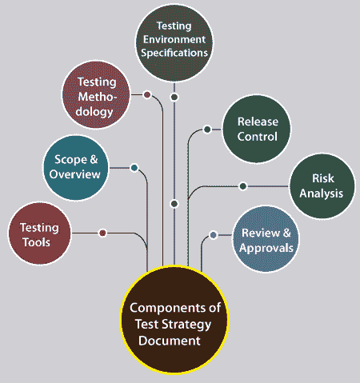
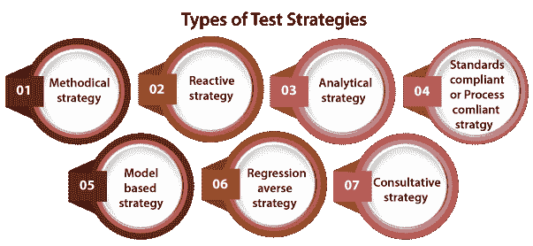

# 测试策略

> 原文：<https://www.javatpoint.com/test-strategy>

在本节中，我们将了解**测试策略文档**，它是测试文档不可分割的一部分。

我们还了解了测试策略的**特征、测试策略的组成部分、测试策略的类型以及不同的测试活动，**包括测试策略文档。

## 什么是测试策略？

高级文档用于验证要为产品执行的测试类型或级别，并指定**软件开发生命周期的**测试方法，称为测试策略文档。

测试策略一旦写好，我们就不能修改，并且要经过**项目经理，开发团队的批准。**

测试策略还指定了以下细节，这些细节在我们编写测试文档时是必要的:

*   **必须使用的另一个程序是什么？**
*   **要测试哪个模块？**
*   **适用哪些出入境标准？**
*   **需要实施哪种类型的测试？**

换句话说，我们可以说它是一个文档，它表达了我们如何着手测试产品。这些方法可以借助以下几个方面来创建:

*   **自动化与否**
*   **资源观点**

我们可以基于**开发设计文档编写测试策略。**

开发设计文件包括以下文件:

*   **系统设计文档:**首先，我们将使用这些文档来编写测试策略。
*   **设计文档:**这些文档用于指定即将发布的版本中要启用的软件功能。
*   **概念设计文件:**这些是我们不常使用的文件。

#### 注意:可以为开发设计的每个阶段创建相应的测试策略来测试新的特性集。

## 测试策略的目标

编写测试策略的主要目标是确保所有目的都被所有涉众完全覆盖和理解，我们应该系统地创建一个测试策略。

此外，测试策略目标是在资源的**规划、语言、测试和集成级别、可追溯性、角色和职责等方面支持各种质量保证股东。**

## 测试策略文档的特征

在 [SDLC(软件开发生命周期)](https://www.javatpoint.com/software-development-life-cycle)中，测试策略文档起着重要的作用。它包括各种重要的方面，例如谁将实施测试，将测试什么，如何成功，以及将有哪些风险和事件与之相关。

测试策略文档的一些附加特征如下:

*   测试策略文件由以下人员批准和审查:
    *   **测试团队负责人**
    *   **开发经理**
    *   **质量分析师经理**
    *   **产品经理**
*   对于不同的测试活动，测试策略文档规定了资源、范围、计划、方法等。
*   为了指导如何实现测试，一旦测试准备好或完成，项目测试团队就使用它。
*   主要从 **BRS(业务需求规范)**文档中获取。
*   测试策略文档是一个高级文档，通常保持不变，这意味着文档中没有频繁且无意义的修改。
*   在测试策略文档的帮助下，各自的团队很容易实现测试的目标。
*   在测试策略文档的帮助下，各自的团队轻松地完成了测试目标。

## 测试策略文档的组成部分

我们知道测试策略文档是在需求阶段和需求被列出后制定的。

与其他测试文档一样，测试策略文档也包括各种组件，例如:

*   **范围和概述**
*   **测试方法**
*   **测试环境规范**
*   **测试工具**
*   **释放控制**
*   **风险分析**
*   **审查和批准**

让我们一个接一个地看，以便更好地理解:

### 1.范围和概述

*   测试策略文档的第一个组成部分是**范围和概述。**
*   任何产品的概述都包含关于谁应该批准、审查和使用该文档的信息。
*   测试策略文档还规定了需要批准的测试活动和阶段。

### 2.测试方法

*   测试策略文档中的下一个模块是**测试方法**，主要用于指定所有团队成员的**测试级别、测试程序、角色和职责**。
*   测试方法还包含变更管理过程，涉及修改请求提交、要使用的模式以及管理请求的活动。
*   最重要的是，如果测试策略文档没有被适当地建立，那么它可能会导致**错误或将来的错误**。

### 3.测试环境规范

*   测试策略文档的另一个组成部分是**测试环境规范。**
*   正如我们已经知道的那样，**测试数据**要求的规格特别重要。因此，测试策略文档的测试环境规范中包含了关于如何准备测试数据的明确指导方针。
*   该模块规定了与**相关的信息、环境数量和所需设置**。
*   还提供了备份和恢复策略，以确保不会因为编码或编程问题而丢失数据。

### 4.测试工具

*   **测试工具**是测试策略文档的另一个重要组成部分，因为它规定了测试执行活动所必需的**测试管理**和**自动化工具**的完整信息。；
*   对于**安全性、性能、负载测试**，必要的方法和工具由**这个开源或商用工具**的详细信息和它可以保留的用户数量来定义。

### 5.释放控制

*   测试策略文档的另一个重要模块是**发布控制。**
*   用于确保系统开发正确有效的**测试执行**和发布管理策略。

**6。风险分析**

*   测试策略文档的下一个组成部分是**风险分析。**
*   在测试策略文档中，所有可能的风险都被描述为与项目相关联，这可能成为测试执行中的一个问题。
*   此外，为了倾斜这些风险，还形成了明确的战略，以确保它们适当地承担。
*   如果开发团队实时面临这些风险，我们还会创建应急计划。

### 7.审查和批准

*   测试策略文档的最后一部分是**审查和批准。**
*   当所有相关测试活动都在测试策略文档中指定时，相关人员会对其进行审查，如:
    *   **系统管理团队**
    *   **项目管理团队**
    *   **开发团队**
    *   **业务团队**
*   在开始文档时，应遵循**正确日期、批准人姓名、注释和**已审核变更摘要。
*   同样，它应该随着测试过程的改进而不断地被审查和更新。

## 测试策略的类型

在这里，我们讨论一些重要类型的测试策略文档:

*   **有条不紊的策略**
*   **反应策略**
*   **分析策略**
*   **标准合规或流程合规战略**
*   **基于模型的策略**
*   **回归规避策略**
*   **咨询策略**

让我们逐一详细了解它们:

### 1.方法策略

*   测试策略文档的第一部分是**方法策略。**
*   在这种情况下，测试团队遵循一套**测试条件、预定义的质量标准**(像 ISO25000)、**清单**。
*   标准清单用于精确类型的测试，如**安全测试**。

### 2.反应策略

*   下一种测试策略被称为**反应策略。**
*   在这种情况下，只有在真正的软件交付后，我们才能设计测试并执行它们，因此**测试是基于现有系统中已识别的缺陷**。
*   假设我们使用了**探索性测试**，并且从现有的方面和性能建立了测试批准。
*   这些试验批准根据试验工程师实施的试验结果进行重组。

### 3.分析策略

*   另一种类型的测试策略是**分析策略**，用于根据需求进行测试，分析需求得出测试条件。然后**测试被设计、实施和执行**以满足这些要求。**比如基于风险的测试**或者**基于需求的测试**。
*   甚至结果都是按照**要求**来记录的，比如**要求测试通过**。

### 4.符合标准或符合流程的战略

*   在这种类型的测试策略中，测试工程师将遵循由行业专家小组或**委员会标准**创建的**程序或指南，以找到测试条件，描述测试案例，并组建测试团队。**
*   假设任何项目都遵循 **Scrum** 敏捷技术。在这种情况下，测试工程师将生成其完整的测试策略，从分类测试标准、基本测试用例、执行测试、报告状态等开始。，围绕每个**用户讲述**。
*   符合标准流程的一些好例子是遵循美国食品和药物管理局标准的 T2 医疗系统。

### 5.基于模型的策略

*   下一种测试策略是基于模型的策略。测试团队选择**当前或预期的情况**并为其生成一个模型，模型包括以下几个方面:输入**、输出、过程和可能的行为**。
*   模型也是基于当前的数据速度、软件、硬件、基础设施等建立的。

### 6.回归厌恶策略

*   在回归规避策略中，测试工程师主要**强调降低**功能性或非功能性**产品份额的回归风险**。
*   **例如**，假设我们有一个 web 应用程序来测试特定应用程序的回归**问题**。测试团队可以为这个场景的**典型和异常用例**开发测试自动化。
*   并且为了方便测试可以在应用程序改革时运行，测试团队可以使用**基于图形用户界面的自动化工具。**

### 7.咨询策略

*   咨询策略用于咨询**关键投资者作为输入**至**选择测试条件的范围**，如用户指导测试。
*   客户端会按照优先级顺序提供**浏览器及其版本列表、操作系统列表、连接类型列表、反恶意软件软件**列表，还有矛盾列表，这些都是他们想要测试的应用。
*   根据所提供清单中项目的需要，测试工程师可以使用各种测试技术，如**等价划分**

我们可以根据产品的需求和组织的要求，将两种或两种以上的策略结合起来。并且没有必要对任何测试项目使用上面列出的任何一种测试策略。

## 测试策略选择

**测试策略的选择可能取决于以下几个方面:**

*   测试策略的选择取决于**组织类型和规模**。
*   我们可以根据**项目要求选择测试策略，**如**安全保卫**相关应用需要严谨的策略。
*   我们可以基于**产品开发模型选择测试策略。**

## 测试策略文档中可能包含什么样的细节？

测试策略的最终文档包含以下因素的重要细节:

*   范围和概述
*   软件和测试工作产品的重用性。
*   不同测试级别的详细信息、测试级别之间的关系以及集成不同测试级别的程序。
*   测试环境
*   测试技术
*   测试的自动化水平
*   不同的测试工具
*   风险分析
*   对于每个测试级别的进入和退出条件
*   测试结果报告
*   每次测试的独立程度
*   测试期间要评估的度量和测量
*   确认和回归测试
*   管理检测到的缺陷
*   管理测试工具和基础设施配置
*   测试团队成员的角色和职责

## 结论

在理解了**测试策略文档**之后，最后，我们可以说测试策略文档为测试团队将为整个项目做什么提供了一个充满活力的愿景。

测试策略文档只能准备那些在**产品领域**有良好经验的人，因为测试策略文档将驱动整个团队。

并且它在整个项目生命周期中不能被修改或改变，因为它是一个静态文档。

在任何测试活动开始之前，测试策略文档可以分发给整个测试团队。

如果测试策略文档写得正确，它将开发一个高质量的系统，并扩展完整的测试过程。

* * *