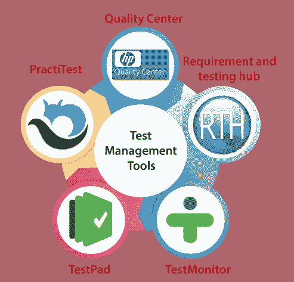

# 测试管理工具

> 原文：<https://www.javatpoint.com/test-management-tool>

测试管理工具用于跟踪所有测试活动、快速数据分析、管理手动和自动化测试用例、各种环境，以及计划和维护手动测试。

测试管理工具与自动化软件连接。这些类型的工具有不同的测试策略和多组特性。一些测试管理工具能够在需求的帮助下设计测试用例。

它最适合测试管理、调度、缺陷记录、跟踪和分析。

一些最常用的测试管理工具如下:

*   **质量中心**
*   rth
*   **测试路径**
*   **测试监视器**
*   **练习**

## 质量中心

质量中心是由[惠普](https://www.javatpoint.com/hp-full-form)推出的测试管理工具，也称为 **ALM【应用生命周期管理】**工具。

这对测试管理和 [SDLC](https://www.javatpoint.com/software-engineering-software-development-life-cycle) 都非常有帮助，因为它支持[软件开发生命周期](https://www.javatpoint.com/software-development-life-cycle)的多个阶段。

它是一个基于网络的测试工具，帮助我们从零开始控制软件，如收集需求、规划、设计、测试和维护，但这是一个耗时的过程。

该工具可集成到其他惠普产品，如 Load runner 和 UFT。

### 质量中心的特点

以下是惠普质量中心/资产负债管理的常用功能:

*   该工具用于检查测试配置。
*   在这个工具的帮助下，我们可以管理发布，编写测试和执行。
*   该工具有助于项目规划和跟踪。
*   它提供跨项目定制和测试资源。
*   它用于管理基于风险的质量和实验室管理。

## 热阻

RTH 是另一个基于网络的开源工具，它代表**需求和测试中心**。它用于管理需求、测试结果，并且还具有错误跟踪功能。该工具遵循结构化的方法，在用于[测试用例](https://www.javatpoint.com/test-case)、测试结果、需求和测试计划的公共存储库的帮助下，扩展测试过程的可见性。

## 文字路径

它是一个测试计划工具，帮助我们识别[缺陷或 bug](https://www.javatpoint.com/defect-or-bug-tracking-tool)。它是简单的清单和电子表格的组合。这些电子表格被开发者用来做笔记。在执行[探索性测试](https://www.javatpoint.com/exploratory-testing)、[回归测试](https://www.javatpoint.com/regression-testing)和[即席测试](https://www.javatpoint.com/adhoc-testing)时，该工具是测试工程师的完美选择，因为它提供了键盘驱动的界面和检查表方法。

### textpad 工具的功能

*   在测试板工具的帮助下，我们可以创建我们的模板。
*   该工具提供安全托管、安全通信和可靠数据。
*   Testpad 是移动和平板友好的。
*   在测试台上，我们可以上传截图和图片。
*   我们可以轻松地从 word、excel 或任何其他测试文件中复制和粘贴数据。
*   它有一个键盘驱动的编辑器，有响应用户界面的 JavaScript。
*   如果我们不需要账户，这个工具会邀请客户测试人员。
*   这个工具是通过拖放来组织的，并将清单分组到文件夹中。

[https://content pad . com/](https://ontestpad.com/)

## 测试监视器测试监控程序

它是一个强大的测试管理工具，帮助我们管理广泛的测试用例、里程碑和测试运行。借助这个工具，我们可以实时了解我们的测试过程。它是一个测试编辑器，可以在几分钟内运行测试用例。对于测试人员来说，它提供了一个简单的界面，测试人员可以在任何时间、任何地方执行测试用例，而不需要任何经验。

### 测试监视器工具的特性

TestMonitor 工具的一些常用特性如下:

*   该工具提供了执行测试用例和风险分析的需求规范。
*   这个工具将监控我们的计划和进度。
*   它提供了完整的结果跟踪。
*   它旨在使测试过程比 excel 更有效、更快速、更结构化。
*   该工具具有报告功能。

更多信息可以参考以下链接:[https://www.testmonitor.com/](https://www.testmonitor.com/)

## 练习测试

该工具用于增加我们完整测试过程的端到端可见性，并实时查看测试执行情况。在这个工具的帮助下，我们只能专注于测试，而不是按时报告或发布我们的产品。

### 练习测试工具的特性

以下是练习测试的一些关键特性:

*   该工具用于通过简单地向系统发送电子邮件来跟踪错误和问题，并且它提供了高级过滤器，帮助我们甚至在报告重复的错误之前就停止它们。
*   它通过定制的仪表板和报告来确保我们项目的可见性。
*   它可以帮助我们更好地计划测试过程。
*   这个工具有一个智能过滤器功能，可以帮助我们管理工作。
*   PractiTest 无需编写代码就可以轻松定制我们的项目。

更多信息可以参考以下链接:[https://www.practitest.com/](https://www.practitest.com/)

* * *