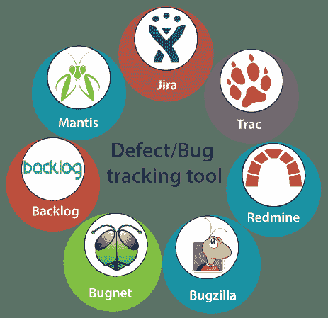
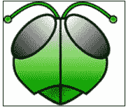

# 缺陷/Bug 跟踪工具

> 原文：<https://www.javatpoint.com/defect-or-bug-tracking-tool>

我们在软件测试中有各种类型的 bug 跟踪工具，可以帮助我们跟踪与软件或应用相关的 bug。

一些最常用的错误跟踪工具如下:

*   支尔格
*   **巴格齐拉**
*   **BugNet**
*   排雷
*   **螳螂**
*   **追踪**
*   **积压**

## JIRA

JIRA是最重要的 bug 跟踪工具之一。JIRA是一个开源工具，用于[手动测试](https://www.javatpoint.com/manual-testing)中的 bug 跟踪、项目管理和问题跟踪。JIRA包括不同的功能，如报告、记录和工作流程。在JIRA，我们可以跟踪与软件相关的、由测试工程师生成的各种 bug 和问题。

要获得有关JIRA工具的完整详细信息，请参考以下链接:

[https://www . javatppoint . com/jira 教程](https://www.javatpoint.com/jira-tutorial)

## 布JIRA

Bugzilla 是另一个重要的 bug 跟踪工具，它被许多组织广泛用于跟踪 bug。它是一个开源工具，用于帮助客户和客户端保持对 bug 的跟踪。它还被用作测试管理工具，因为在这种情况下，我们可以轻松地链接其他测试用例管理工具，如资产管理、质量中心等。

支持 Windows、 [Linux](https://www.javatpoint.com/what-is-linux) 、 [Mac](https://www.javatpoint.com/mac-full-form) 等多种操作系统。

### Bugzilla 工具的功能

[Bugzilla](https://www.javatpoint.com/bugzilla) 有一些功能可以帮助我们轻松报告 bug:

*   bug 可以以多种格式列出
*   由用户偏好控制的电子邮件通知。
*   它具有高级搜索功能
*   该工具确保了出色的安全性。
*   时间跟踪

## 巴格网

它是一个开源的缺陷跟踪和项目问题管理工具，用[ASP.NET](https://www.javatpoint.com/asp-net-tutorial)和 [C#](https://www.javatpoint.com/c-sharp-tutorial) 编程语言编写，支持微软 [SQL](https://www.javatpoint.com/sql-tutorial) 数据库。BugNet 的目标是减少代码的复杂性，从而简化部署。

BugNet 的高级版本被许可用于商业用途。

### BugNet 工具的特性

BugNet 工具的特性如下:

*   它将通过简单的导航和管理提供出色的安全性。
*   BugNet 支持各种项目和数据库。
*   借助这个工具，我们可以获得电子邮件通知。
*   这具有管理项目和里程碑的能力。
*   该工具有一个在线支持社区

## 雷米恩

这是一个开源工具，用于跟踪问题和基于网络的项目管理工具。Redmine 工具是用**[【Ruby】](https://www.javatpoint.com/ruby-tutorial)**编程语言编写的，也兼容多个数据库，如 [MySQL](https://www.javatpoint.com/mysql-tutorial) 、微软 SQL、 [SQLite](https://www.javatpoint.com/sqlite-tutorial) 。

在使用 Redmine 工具的同时，用户还可以管理各种项目和相关的子项目。

### Redmine 工具的特性

Redmine 工具的一些常见特征如下:

*   灵活的基于角色的访问控制
*   时间跟踪功能
*   灵活的问题跟踪系统
*   订阅源和电子邮件通知
*   支持多种语言(阿尔巴尼亚语、阿拉伯语、荷兰语、英语、丹麦语等)

## 曼蒂斯特

尾数代表**螳螂虫子追踪器**。这是一个基于网络的 bug 跟踪系统，也是一个开源工具。尾数用于跟踪软件缺陷。它是用 PHP 编程语言执行的。

### 尾数的特征

一些标准功能如下:

*   在这个工具的帮助下，我们拥有了全文搜索的可访问性。
*   对问题变更的审计跟踪
*   它提供了版本控制系统集成

*   文本字段和注释的修订控制
*   通知
*   外挂程式
*   问题之间的关系图。

## 开源软件应用

另一个缺陷/ bug 跟踪工具是 Trac，它也是一个开源的基于网络的工具。它是用 Python 编程语言编写的。Trac 支持 Windows、Mac、UNIX、Linux 等各种操作系统。Trac 有助于跟踪软件开发项目的问题。

我们可以通过代码访问它，查看更改，并查看历史记录。这个工具支持多个项目，并且它包括广泛的插件，这些插件提供了许多可选的特性，这使得主系统简单易用。

## 积压

积压被广泛用于管理信息技术项目和跟踪错误。它主要是为开发团队构建的，用于报告 bug 以及问题、评论、更新和状态更改的完整细节。它是一个项目管理软件。

积压工具的特性如下:

*   甘特图和燃尽图
*   它支持 Git 和 SVN 存储库
*   它具有 IP 访问控制功能。
*   支持原生 iOS 和安卓应用

* * *