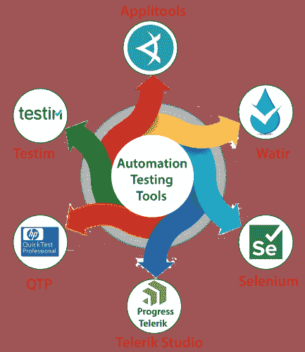
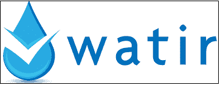
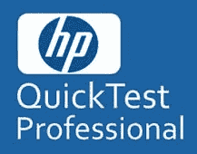
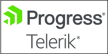
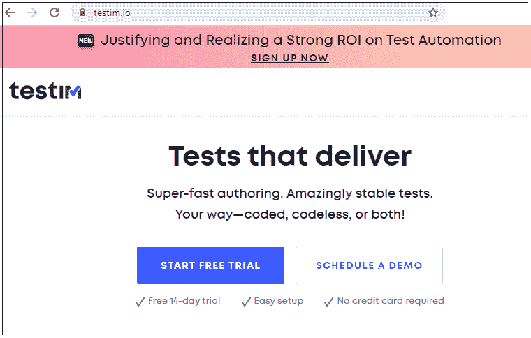

# 自动化测试工具

> 原文：<https://www.javatpoint.com/automation-testing-tool>

自动化测试用于在一些自动化工具的帮助下，将手动测试用例转换成测试脚本。

我们在市场上有各种类型的自动化测试工具。一些最常用的自动化测试工具如下:

*   **Selenium**
*   watir
*   qtp
*   **电视演播室**
*   试纸
*   **贴花工具**

## Selenium

它是自动化测试中最常用的开源工具。该工具借助测试脚本对基于 web 的应用进行测试，这些脚本可以用 [java](https://www.javatpoint.com/java-tutorial) 、 [python](https://www.javatpoint.com/python-tutorial) 、 [C#](https://www.javatpoint.com/c-sharp-tutorial) 、 [Php](https://www.javatpoint.com/php-tutorial) 等任何编程语言编写。

### Selenium的特性

这个工具最受欢迎是因为它的各种功能。以下是Selenium的标准[特性:](https://www.javatpoint.com/selenium-features)

*   Selenium 只支持基于 web 的应用，这意味着应用可以通过浏览器或类似 Gmail、Amazon 等 URL 打开。
*   Selenium 不支持独立的应用，这意味着应用不会像记事本、MS-Word、Calculator 等那样在浏览器或 URL 中打开。
*   Selenium web 驱动程序是 Selenium 社区中的最新工具，它消除了以前工具(selenium-IDE)的所有缺点。
*   Selenium web-driver 功能强大，因为它支持多种编程语言、各种浏览器和不同的操作系统，还支持 iPhone、Android 等移动应用。

更多关于Selenium的信息，请参考以下链接:[https://www.javatpoint.com/selenium-tutorial](https://www.javatpoint.com/selenium-tutorial)

## 沃特沃特 Walter

Watir 在 ruby 中代表 **web 应用测试**，它是用 [Ruby](https://www.javatpoint.com/ruby-tutorial) 编程语言编写的。用红宝石测试。它是一个 web 应用测试工具，是开源的，支持跨浏览器测试工具，可以像人一样与平台交互，可以验证文本，点击链接，填写表单。

### 沃特的特点

以下是沃特世测试工具的特点:

*   它支持不同平台上的各种浏览器，如谷歌浏览器、Opera、火狐、互联网浏览器和 Safari。
*   Watir 是一个轻量级且强大的工具。
*   我们可以很容易地下载用户界面的测试文件。
*   测试完成后，我们可以截图，这有助于我们跟踪中间测试。
*   这个工具有一些内置的库，有助于检查警报、浏览器窗口、页面性能等。

## 工具

QTP 工具用于测试基于 web 的应用的功能回归测试用例。QTP 代表**快测专业**，现在被称为**微焦点 UFT【统一功能测试】**。这对新的测试工程师非常有帮助，因为他们可以在几分钟内理解这个工具。QTP 是基于像 VB 脚本这样的脚本语言设计的，用于自动化应用。

### QTP 的特色

以下是 QTP 最常见的特征:

*   该工具支持录音和回放功能。
*   QTP 使用脚本语言来部署对象，出于分析目的，它提供测试报告。
*   技术和非技术测试人员都可以使用 QTP。
*   QTP 支持多种软件开发环境，如甲骨文、思爱普、JAVA 等。
*   在 QTP 的帮助下，我们可以测试桌面和基于网络的应用。
*   在这个工具中，我们可以执行 BPT(业务流程测试)。

## 电视演播室

它是支持功能测试自动化的现代 web 应用。在这个工具的帮助下，我们可以测试 web 和移动应用的负载、性能和功能，还可以识别跨浏览器的问题。

### Telerik 测试工作室的特点

以下是 Telerik 测试工作室的一些基本功能:

*   Telerik 测试工作室允许我们按时交付高质量的产品。
*   该工具支持所有类型的应用，如桌面、网络和移动。
*   这个工具支持 Asp.Net、AJAX、HTML、JavaScript、WPF 和 Silverlight 应用测试。
*   它支持多种浏览器，如火狐、Safari、谷歌浏览器和互联网浏览器，用于测试执行过程。
*   借助这个工具，我们可以进行基于句子的 UI 验证。

有关 Telerik 测试工作室的更多信息，请参考以下链接:[https://www.telerik.com/teststudio](https://www.telerik.com/teststudio)

## 西班牙加泰隆语

它是另一个自动化测试工具，可以在很短的时间内执行测试用例，并在各种网络和移动应用中运行它们。这个工具将帮助我们增强测试套件的可扩展性和稳定性。借助 [JavaScript](https://www.javatpoint.com/javascript-tutorial) 和 [HTML](https://www.javatpoint.com/html-tutorial) ，它提供了覆盖平台功能的灵活性。

### 测试的特点

*   测试工具的测试稳定性很高。
*   该工具将支持并行执行。
*   在这个工具中，我们可以捕捉截图。
*   该工具将自动创建测试。
*   借助这个工具，我们可以执行基于需求和参数化的测试。

有关更多信息，请参考以下链接:

[https://www.testim.io/test-automation-tool/](https://www.testim.io/test-automation-tool/)

## 应用工具

该工具用于检查外观和用户对应用的反馈。它可以很容易地与当前的测试相结合，而不是创建新的分析。Applitools 是一个监控软件，它提供可视化应用管理和人工智能驱动的可视化用户界面测试。它是一个开源工具，帮助我们交付高质量的产品。

### 应用工具的特点

以下是贴花工具的特点:

*   该工具具有活动的用户访问管理。
*   对于各种设备，它允许跨浏览器测试。
*   它将向用户交付视觉测试报告。
*   它可在公共云和专用云上获得。

* * *