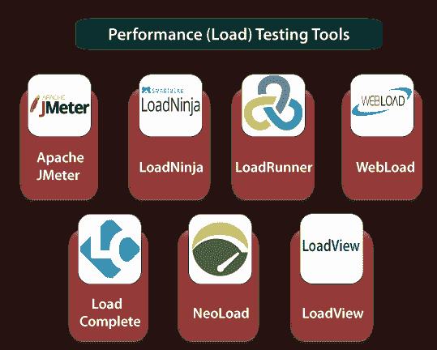
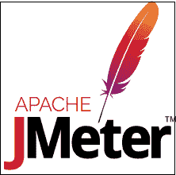
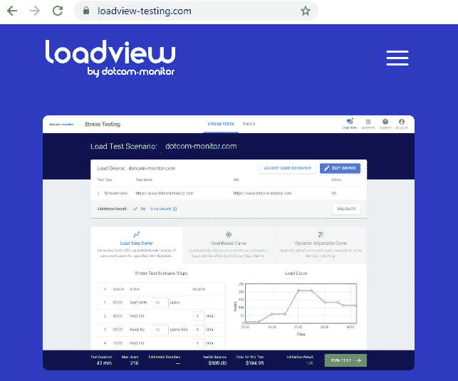

# 性能测试工具(负载测试工具)

> 原文：<https://www.javatpoint.com/performance-testing-tools>

当我们必须测量应用程序的负载、稳定性、响应时间时，我们需要一些性能(负载)测试工具，帮助我们测试软件或应用程序的性能。性能测试工具可以是开源的，也可以是商业的。

我们在市场上有各种类型的性能测试工具；一些最常用的性能(负载)测试工具如下:

*   **Apache JMeter**
*   **装载机[HP]**
*   **加载忍者**
*   **网播**
*   **【load complete】**
*   新负荷
*   **负载视图**

## Apache JMeter

它用于测试静态和动态资源以及动态 web 应用程序的性能。该工具完全是在 JAVA 应用程序上设计的，用于加载功能测试行为和测量应用程序的性能。它是一个开源工具，方便用户或开发人员使用源代码开发其他应用程序。

它可以用来重现服务器、对象或网络、服务器组上的巨大负载，以测试其性能，或者探索多种负载类型下的完整性能。以前它用于测试 web 应用程序，但现在它也扩展到了其他测试功能。

### JMeter 的特性

以下是 JMeter 的一些基本元素:

*   这个工具支持用户友好的图形用户界面，它是交互式的和直接的。
*   JMeter 维护多种测试方法，例如功能测试、分布式测试和负载测试。
*   它具有难以置信的可扩展性，可以在多种类型的服务器上加载性能测试，例如数据库服务器:LDAP、JMS、JDBC、网络服务器:SOAP、HTTPS、HTTP 和邮件服务器:POP3
*   它是独立于平台的，因为它是在 JAVA 的帮助下设计的，所以它可以在任何平台上运行，任何平台都接受像窗口、苹果和 Linux 等 JVM。

有关 JMeter 的更多信息，请参考以下链接:

[https://www.javatpoint.com/jmeter-tutorial](https://www.javatpoint.com/jmeter-tutorial)

## 工具

它是性能测试最强大的工具之一，用于支持广泛协议、多种技术和应用环境的性能测试。

它可以快速识别性能问题的最常见原因。并且还能准确预测应用的可扩展性和容量。

### LoadRunner 的特性

*   它将支持 XML 这就是为什么我们可以轻松地在测试脚本中查看和处理 XML 数据。
*   它支持大范围的应用，这将减少理解和解释报告的时间。
*   借助这个工具，我们可以获得详细的性能测试报告。
*   它将降低分布式负载测试的成本。
*   它将为部署跟踪提供操作工具。
*   该工具用于降低软件和硬件成本。

## loadminja

LoadNinja 由智能熊提供动力。在这个工具的帮助下，产品团队和测试工程师将更加专注地构建应用程序，而不是编写负载测试脚本。我们可以跟踪用户交互，直接找到性能问题，并实时调试它们。它将改变真实浏览器的负载模拟器。

## web load(web load)

WebLOAD 测试工具用于在负载测试、性能测试和压力测试的帮助下测试测试应用程序。对于 web 和移动应用程序的身份验证，WebLOAD 工具将性能、可伸缩性和完整性结合为一个过程。它将支持 HTTPS、XML、HTTP 等多种协议，帮助我们控制大量用户的负载。

### 网络加载的特点

以下是网络加载最常用的功能:

*   它将提供灵活的测试场景创建。
*   该工具自动检测瓶颈。
*   客户支持很容易接近。
*   它可以评估来自任何浏览器或移动设备的性能测试结果。
*   它将从云中产生负载。

## 加载完成

它是另一个性能(负载)测试工具。它用于创建和运行 web 服务和 web 服务器的自动化测试。它支持所有类型的浏览器、网络服务。当我们遇到巨大的负载时，它会检查我们的 web 服务器的性能。在这个工具的帮助下，我们可以在整个测试运行过程中观察到多个服务器指标，例如 CPU 使用率。

### LoadComplete 的特性

*   它将为性能测试提供负载建模，这意味着它允许我们为压力测试生成大量负载。
*   借助这个，我们可以在网络浏览器中记录和回放我们的动作。
*   它支持各种平台，如视窗、UNIX。
*   在负载测试期间，它将借助基于模板的规则来验证服务器消息体，这确保了服务器的正确运行。
*   它可以测试各种类型的应用程序，如 Flash、Flex、Silverlight 和 Ajax。
*   它将生成负载测试报告，包括用户界面的定制。

## NeoLoad

纽泰公司开发了一种叫做 NeoLoad 的测试工具。NeoLoad 用于测试性能测试场景。借助 NeoLoad，我们可以找到网页和手机应用开发过程中的瓶颈区域。

与传统工具相比，NeoLoad 测试工具速度更快。它将支持完整的网络、移动和打包应用程序，如 SAP、Oracle、Salesforce 等，涵盖我们所有的测试需求。并且共享和管理测试资源。

### 近地天体的特征

以下是近地天体装载的一些基本特征:

*   它将支持 HTTP/2、HTML5、API、AngularJS、Web Socket、SOAP 等各种框架和协议。
*   它有一个健壮的无代码设计。
*   它将把功能测试脚本变成性能测试脚本。
*   它将自动更新测试脚本。
*   它将生成实时测试结果。

## 加载视图

网络监视器给它供电。借助这个工具，我们可以显示应用程序的真实性能。它用于在真实的浏览器中执行负载测试，从而给出正确的数据。它是一个基于云的工具，可以在更短的时间内部署。

### LoadView 的功能

*   它用于发现瓶颈并确保应用程序的可扩展性。
*   它将在真实浏览器中执行基于云的负载测试。
*   在这个工具的帮助下，我们可以轻松地构建我们的测试脚本。
*   它将支持各种富互联网应用，如 Java、PHP、Ruby、HTML5、Flash、Silverlight 等。
*   它包括基于云的全局测试、点和点击脚本。
*   它提供了专用的静态 IP，可以对其进行配置，并允许我们在防火墙后对目标资源执行测试。

* * *