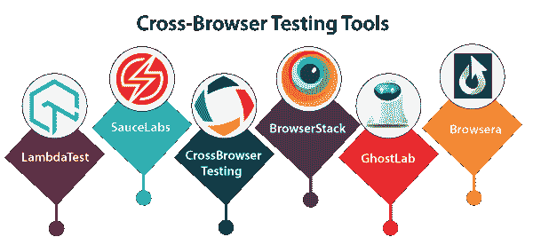
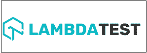
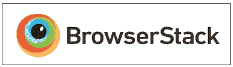
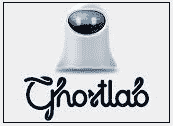
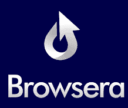

# 跨浏览器测试工具

> 原文：<https://www.javatpoint.com/cross-browser-testing-tools>

当我们必须在多个浏览器上测试我们的应用程序时，我们需要跨浏览器测试工具。这些工具将帮助我们确保我们的 web 应用程序在各种浏览器上运行良好。当服务器端和客户端都在多个 web 浏览器中访问 web 应用程序时，将使用该工具。

在这些工具的帮助下，我们可以通过各种浏览器对我们的应用程序进行兼容性测试。有时候，在单一的网络浏览器中测试一个软件是不够的；这就是为什么我们需要跨浏览器测试工具。

我们在市场上有各种各样的跨浏览器测试工具。

在这里，我们将看到一些跨浏览器测试的基本工具。

*   **LambdaTest**
*   **酱料实验室**
*   **跨浏览器测试**
*   **浏览返回**
*   **幽灵实验室**
*   **浏览器**

## LambdaTest

它是一个基于云的工具。它通过多个 iOS 手机和安卓浏览器使用 selenium 和 Appium 测试脚本。借助 LambdaTest 工具，我们可以在最新的浏览器上测试我们的 web 应用程序。

### LambdaTest 的特性

*   LambdaTest 工具将提供 localhost web 测试，以便在部署 bug 之前保存我们的 web 应用程序。
*   这个工具帮助我们调试实时测试中的问题。
*   在这个工具的帮助下，我们可以从多个位置测试我们的应用程序，并确保我们的用户通过所有位置获得完美的体验。
*   它将提供截图功能，帮助我们跨多个移动和桌面浏览器执行可视化跨浏览器兼容性测试。
*   我们只需单击一下即可验证应用程序的响应性。
*   问题跟踪器已经与 LambdaTest 工具集成在一起，它帮助我们直接从 LambdaTest 平台实现并跟踪我们的 bug。

## 调味汁实验室

这是另一个跨浏览器测试工具，它让我们可以在云中、各种浏览器、设备和操作系统中执行测试。酱实验室是一个基于云的测试工具；这就是为什么我们不需要设置虚拟机。借助这个工具，我们可以在客户端防火墙后测试我们的应用程序，因为它将提供一个安全的测试协议。

它是第一个为微软 Edge 浏览器提供自动化测试并支持火狐浏览器 Firebug 插件的平台。

### 酱类实验室的特点

*   这有助于提高软件的生产率，因为如果我们进行持续的测试，它将在整个开发周期中给出快速的反馈，这使得它们易于快速调试。
*   它将在 sax 测试云上执行多个测试，如集成测试、自动化端到端测试和单元测试。
*   它将确保我们的客户获得无 bug 软件。
*   一些附加功能包括扩展调试、测试分析和酱料性能。
*   对于自动化，它有一个干净的用户界面。

## 跨浏览器测试

交叉浏览器测试是最著名的授权工具。它支持各种操作系统、大量的多种浏览器、移动浏览器及其版本。附加功能包括自动截图、本地主机支持等。

### 跨浏览器测试的特点

以下是跨浏览器测试工具的主要功能:

*   该工具用于在真实的移动设备上测试应用程序。
*   它用于跨各种浏览器验证公共和本地托管的页面，以检查应用程序的兼容性。
*   它用于通过不同的设备和多种浏览器在实时环境中逐步检查测试用例。
*   它将以任何编程语言测试我们的 Appium 和 selenium 测试脚本。
*   运行 selenium 脚本后，执行屏幕截图很有帮助。

## 浏览器返回

它是一个基于云的移动和网络测试平台，使开发人员能够通过不同的操作系统、浏览器和移动设备测试他们的网络和移动应用程序。BrowserStack 有四个主要产品，如 Live、App Live、Automate 和 App Automate。

在这种情况下，我们不需要安装或维护任何设备和虚拟机。这将有助于我们降低成本、减少维护和时间，并提供稳定性来构建合适的优质产品和服务。

### 浏览器堆栈的功能

*   它用于识别错误并直接修复它们。
*   我们可以在大量的浏览器上测试这个应用程序，比如 Safari、谷歌 Chrome、Opera、Internet Explorer、Firefox 等等。
*   它将通过在 1500 多个桌面和移动浏览器上只需点击一下就能创建截图来快速测试我们的布局和设计。
*   它用于在各种屏幕尺寸上测试响应性网页设计，而无需手动尝试每个浏览器组合。
*   它是高度可扩展的，因为它满足了我们的测试需求，这有助于团队的发展，毕竟每个成员都可以访问这些设备。

## 幽灵实验室

GhostLab 工具用于在多个浏览器和移动设备上同时测试我们在任何网站上的应用程序。借助这个工具，我们可以直接打开我们本地安装的浏览器，并连接一个移动设备；我们可以使用附近的二维码。当我们在本地站点工作时，它支持我们开发我们的站点。它适用于 Windows 和 Mac 操作系统，无需额外设置。

### GhostLab 的特性

GhostLab 的一些重要元素如下:

*   它会截取任何连接设备的截图，并在连接的编辑器中进行解释，还会将其拖放到我们的 bug 跟踪器中。
*   它将提供同步浏览。
*   它将帮助我们与任何有联系的客户一起调试 JavaScript。
*   它会在任何设备上验证 CSS 和 DOM，如果 DOM 发生任何变化，它会在所有连接的设备上自动改变。
*   只要我们对本地文件进行任何修改，它就会恢复我们所有的浏览器。
*   只需点击一下，我们就可以构建并打开各种浏览器，并将它们连接到 GhostLab。

## 网络浏览器

这是一个在线工具，用于测试和报告我们网站上的跨浏览器设计修改和脚本问题。它会反复比较每个浏览器的输出，并检查我们页面中的冲突，以便我们可以快速修复它们。它可以立即测试我们网站的各个页面。一旦测试完成，它还将创建一个报告。

### 浏览器工具的特性

*   它用于定位 JavaScript 错误，因为这些类型的错误会导致我们网站功能的丢失，并给用户留下错误的印象。
*   这将有助于我们轻松测试完整的网站。
*   它会自动检测跨浏览器布局问题。
*   它支持 HTTP 基本身份验证以及基于应用程序的登录。为此，我们需要为登录字段提供一个唯一的 Id 并访问它。
*   它测试那些使用 AJAX 和 DHTML 技术的网站。它将等到页面完成加载后再进行测试。
*   在这个工具中，我们不需要任何安装，因为一切都从服务器集群运行。
*   在这个工具中，我们需要一个网络浏览器来使用服务，我们可以从任何地方访问结果。

* * *