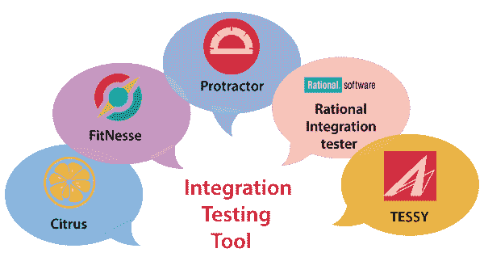

# 集成测试工具

> 原文：<https://www.javatpoint.com/integration-testing-tools>

集成测试工具用于测试模块之间的接口，发现 bugs 由于多模块集成，这些错误可能会发生。这些工具的主要目标是确保特定模块按照客户的需求工作。为了构建集成测试套件，我们将使用这些工具。

一些最常用的集成测试工具如下:

*   **柑橘**
*   **健身**
*   泰西
*   **量角器**
*   **Rational Integration tester**

## 柑橘属果树

它是最常用的集成测试工具，是一个测试框架，用 [Java 编程语言](https://www.javatpoint.com/java-tutorial)编写。它用于接受请求并响应服务器端和客户端。用于认证 [XML](https://www.javatpoint.com/xml-tutorial) 、 [JSON](https://www.javatpoint.com/json-tutorial) 文件。它支持 [HTTP](https://www.javatpoint.com/http-tutorial) 、 [JMS](https://www.javatpoint.com/jms-tutorial) 、 [SOAP](https://www.javatpoint.com/soap-web-services) 等多种协议，实现端到端的用例测试。

### 柑橘的特征

*   它既是开源工具，也是授权工具；这就是它提供低成本解决方案的原因。
*   柑橘被用来发送和接收信息。
*   借助这个工具，我们可以验证数据库。
*   它将描述消息的顺序。
*   复制时出错。
*   它生成消息并验证响应。
*   它将在测试用例中使用高级逻辑。
*   它提供测试计划并记录测试覆盖率。

## 健身吗

它是一个开源工具，不需要单独安装，我们需要下载 java jar 文件，可以直接使用。用 Java 语言编写，支持另一种编程语言如 [Python](https://www.javatpoint.com/python-tutorial) 、 [C++](https://www.javatpoint.com/cpp-tutorial) 、 [C#](https://www.javatpoint.com/c-sharp-tutorial) 、 [Ruby](https://www.javatpoint.com/ruby-tutorial) 等。

借助这个工具，我们可以得到用户的快速响应。

### 契合的特征

*   它用于验证任何软件项目的实际软件应用程序的需求。
*   它用于运行测试，并将实际输出与预期输出进行匹配。
*   在这个工具的帮助下，我们可以很容易地使用维基网络服务器。
*   它还支持黑盒测试、回归测试和验收测试的敏捷风格。

## 泰茜

它是集成测试的重要工具，用于执行嵌入式软件的集成和单元测试。它将负责整个测试组织以及需求、可追溯性、测试管理和覆盖测量。

TESSY 帮助我们找到应用程序的代码覆盖率。在 CTE(分类树编辑器)的帮助下，我们可以设计测试用例。我们可以使用 TDE(测试数据编辑器)编辑测试数据。

### TESSY 的特点

以下是 TESSY 工具的标准功能:

*   它拥有浮动许可证申请权限
*   TESSY 的三个主要功能是 TIE(测试界面编辑器)、TDE(测试数据编辑器)和工作空间。
*   它用于分析函数的接口，并定义该函数使用的变量。
*   TESSY 支持 C++和 C 编程语言。
*   对于测试执行结果，它创建测试报告。

## 量角器

它是一个开源的端到端测试框架，是为 [AngularJS](https://www.javatpoint.com/angularjs-tutorial) 和 Angular 应用程序设计的，用 JavaScript 编写。这是一个 [NodeJS](https://www.javatpoint.com/nodejs-tutorial) 程序，用于在 [AngularJS 应用程序](https://www.javatpoint.com/angularjs-first-application)中查找网页元素。一旦应用程序在真正的浏览器中运行，它将对我们的应用程序执行测试。

### 量角器的特点

*   在量角器的帮助下，我们可以执行应用程序的实例。
*   它用于集成测试。
*   从最终用户的角度来看，它执行测试。
*   它用于编写端到端测试。
*   它用于动态 web 应用程序。

## 理性集成测试器

以前被称为绿帽，现在被 [IBM](https://www.javatpoint.com/ibm-full-form) 收购，被称为 rational integration tester。它为开发业务流程集成项目和测试 [SOA](https://www.javatpoint.com/service-oriented-architecture) 消息传递提供了免费的脚本环境。它属于理性测试工作台。

该工具提供了经济高效的测试环境，使客户能够在开发生命周期的早期测试应用程序。借助这个工具，我们可以通过使用迭代和敏捷开发过程来避免集成问题。

### Rational 集成测试器的特点

*   它将允许我们执行集成、功能和回归测试。
*   如果一些模块缺失，但测试将继续，会生成代码和可重用的存根。
*   它将提供记录便利，从 rational integration tester 上传和导出到 rational test 控制面板。
*   在这种情况下，我们可以根据需求构建测试，也可以生成虚拟服务来删除测试需求。
*   它用于软件生命周期中的持续集成。

* * *