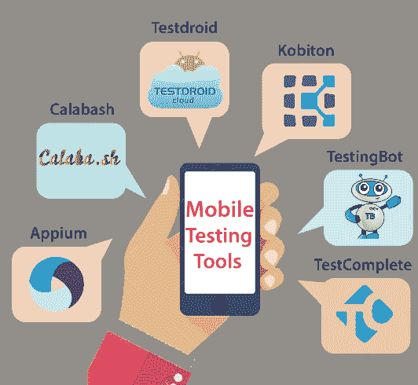
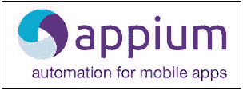

# 移动测试工具

> 原文：<https://www.javatpoint.com/mobile-testing-tools>

为了测试移动应用，我们需要这些类型的工具，它们帮助我们检查应用的可用性、功能性、安全性和一致性。在当前场景下，移动应用广泛应用于安卓和 ios 平台，增强了客户端对应用的可靠性。

因此，在这里我们将了解一些最好的移动测试工具，如下所示:

*   appum
*   **葫芦**
*   **测试码**
*   **【kobiton】**
*   **测试完成**
*   **测试弹**

## 阿皮亚姆

Appium 是由酱料实验室建立的领先的移动测试工具之一，是一个开源工具。它用于测试移动 web 应用、混合应用和本机应用。它支持跨浏览器测试，这就是为什么我们可以借助 WebDriver Protocol 在 Windows、 [Mac](https://www.javatpoint.com/mac-full-form) 、安卓、iOS 等各种平台上执行我们的应用。Appium 的后端是 Selenium，它为我们的测试需求提供对 Selenium 功能的控制。

### Appium 工具的特性

*   Appium 可以在移动设备上控制 Safari 和 Chrome。
*   它支持各种编程语言，如 Java、Python、Ruby 和 C#。
*   它可以与多个框架和其他工具相结合。
*   不需要应用源代码或库。
*   它将提供一个可靠和活跃的社区。
*   我们可以在不同的平台上轻松设置 Appium。

## 葫芦

另一个移动测试工具是葫芦，它是一个开源工具，帮助我们测试[安卓](https://www.javatpoint.com/android-tutorial)和 iOS 应用。对于移动应用，我们可以编写和运行自动化验收测试。由 [Xamarin](https://www.javatpoint.com/xamarin) 云服务开发维护。

### 葫芦工具的特点

*   它用于帮助提高应用的生产率。
*   它将为安卓和 iOS 应用提供独特的自动化库。
*   它用于扩展产品的健壮性。
*   它用于执行本地移动应用的自动化功能测试。

## Testdroid

它是 Bitbar 技术的产物，是一套移动软件开发。它是一个基于云的移动测试工具，用于节省应用进度背后的费用。它将提供对真实设备的远程[手动测试](https://www.javatpoint.com/manual-testing)和[API](https://www.javatpoint.com/api-full-form)访问，这些设备在应用引入之前执行安卓。

在 Testdroid 的帮助下，我们可以轻松地宣布我们的应用，这有助于我们降低运营成本。

### Testdroid 工具的特性

以下是 Testdroid 工具的特性:

*   这将有助于我们降低随机成本和运营成本。
*   它帮助我们根据每天的动态客户端来提高应用的评级。
*   它降低了敏捷测试和真实设备的风险。
*   对于 iOS 和安卓游戏，它将提供强大的移动游戏测试平台。

## kibiton

它是一个移动体验平台，用来测试移动应用，加快产品的交付速度。它允许在真实设备上进行自动化和手动测试。Kobiton 将自动生成活动日志。它用于轻松解决和验证问题，因为它捕获了执行测试时发生的所有操作。它将适用于安卓和 iOS 应用。

### 基顿的特色

*   它将访问 100 多个真实设备。
*   这是一个高度响应的工具。
*   它将为手动和自动化测试提供并行执行。
*   它可以与各种其他工具协作，如 GitHub、JIRA、Jenkins、Travis CI 和 TeamCity。
*   它将集成强大的API，并支持应用工具。
*   它提供了到我们的 Kobiton 云的安全和私有连接。

## 测试完成

它是由智能熊公司建立的自动化用户界面测试工具。它确保高质量软件的交付，增强测试覆盖率。它支持 Windows、 [iOS](https://www.javatpoint.com/ios-full-form) 、Mac、安卓等多个平台。它为我们提供了为 web、移动和桌面应用创建、执行和维护测试脚本的功能。该工具使我们能够完全控制移动设备传感器数据，如[全球定位系统](https://www.javatpoint.com/gps-full-form)、陀螺仪和加速度计。

### 测试完成工具的特性

*   它支持各种 Bugzilla、JIRA等 bug 跟踪工具。
*   它将适用于安卓和 iOS 应用。
*   它内置了关键字驱动的测试编辑器，其中包括与自动化测试操作并行的关键字操作。
*   它包含缺陷跟踪模板，可用于创建或修改存储在缺陷跟踪系统中的项目。
*   它将在记录和回放测试时捕获屏幕截图，我们还可以在测试期间快速评估可能的屏幕和真实的屏幕。
*   它将从单个界面提供我们的网络、桌面或移动用户界面测试的进度和状态的实时信息。
*   它将支持数据驱动测试。

## 测试机器人

它是网络和移动应用的主要基于云的工具。在这个工具的帮助下，我们可以从我们的计算机访问和调试任何浏览器或设备。TestingBot 用户可以在 1500 多个浏览器和设备上运行 Appium、selenium 和 JavaScript 测试。在这个工具中，我们还可以用基于云的Selenium和 Appium 网格来改变内部Selenium网格。它将提高生产率和快速发布。

### 测试机器人工具的特点

以下是测试机器人的一些标准特性:

*   我们可以在云中执行无头测试。
*   它支持最新版本的 Selenium 和 Appium。
*   在这个工具的帮助下，我们可以执行实时网络测试。
*   这将有助于在所有浏览器上拍摄截图，并比较结果。
*   它将提供无代码自动化。

* * *