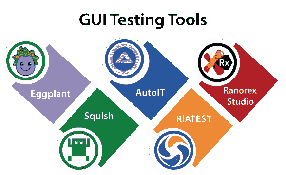

# 图形用户界面测试工具

> 原文：<https://www.javatpoint.com/gui-testing-tools>

图形用户界面测试工具用于发现设计阶段出现的缺陷，从而提高软件质量。借助这些工具，我们可以快速识别漏洞，而不是手动执行 GUI 测试。我们将根据应用性能测试应用，这与鼠标和键盘操作以及一些图形用户界面项目(如按钮、工具栏、对话框、菜单栏和编辑字段)有关。

以下是我们可以在图形用户界面测试中执行的一些基本策略:

导航验证、验证检查屏幕、数据完整性验证、可用性情况验证，以及检查数字、日期字段格式。

以下是一些图形用户界面测试工具:

*   **茄子**
*   **汽车**
*   **拉诺雷克斯工作室**
*   **压扁**
*   **日测试**

## 茄子

茄子是一个 GUI 测试自动化工具，由测试工厂开发。这是一个许可的工具。为了执行端到端的测试过程，茄子可以集成到微焦点质量中心、 [Jenkins](https://www.javatpoint.com/jenkins) 、 [IBM](https://www.javatpoint.com/ibm-full-form) 轮换质量经理中。它将使用双系统模型，其中第一个包含编写和执行脚本的控制器机器，另一个是在 VNC 服务器上运行的 SUT(测试中的系统)。

### 茄子工具的特点

*   它支持各种操作系统，如 Windows、Linux 和 Mac。
*   它包括从最现代的高动态网站和遗留后台系统到销售点和指挥控制系统的一切。
*   它可以测试任何设备，如浏览器、操作系统、从用户界面到API到数据库。

## 你帮了我

这是一种在微软视窗系统中使用的免费脚本语言。它正在创建包含输入框和消息的图形用户界面。

### 自动测试的特点

*   它将在控制台应用上执行，并访问标准流。
*   它将为特定应用提供附加库和模块。
*   它用于操作窗口和进程。
*   它将包含运行时要提取的编译文件中的数据文件。
*   它将支持组件对象模型。

## 拉诺雷克斯工作室

它是最广泛使用的 GUI 测试自动化工具，由 **Ranorex GmbH** 开发，用于测试移动、桌面和基于 web 的应用。它支持自动化测试模块的开发，这些模块是用 VB.NET 和 [C#编程语言](https://www.javatpoint.com/c-sharp-tutorial)编写的。它将为多个浏览器提供跨浏览器测试，如 Safari、 [Chrome](https://www.javatpoint.com/how-to-install-google-chrome-on-mac) 、Firefox、Internet Explorer 和微软 Edge。

### 功能 Ranorex 工作室

*   它可以在视窗服务器和微软视窗上执行。
*   它支持各种网络技术，如 JavaScript、HTML、Flash、Ajax、HTML5 和 Silverlight 等。
*   Ranorex Studio 将支持原生安卓和 iOS 移动应用。
*   它将生成定制的测试报告以及测试执行的视频报告。
*   它将提供一致的对象标识。
*   它将生成可重用的代码模块、可共享的对象存储库，并降低维护成本。

有关 Ranorex Studio 的更多信息，请参考以下链接:

[https://www.ranorex.com/](https://www.ranorex.com/)

## 湿软的

它是一款商用的跨平台 GUI 测试工具，由**froglogogic**生产，基于包含 Flex、Android、 [JavaFX](https://www.javatpoint.com/javafx-tutorial) 、Qt 等多种 GUI 技术的多样性来测试应用。将支持 Windows、 [Linux](https://www.javatpoint.com/linux-tutorial) 、[安卓](https://www.javatpoint.com/android-tutorial)、 [iOS](https://www.javatpoint.com/ios-development-using-swift) 、QNX 等多种操作系统。借助 Squish 工具，我们可以运行脚本集并分析完整的日志记录和性能结果。

### 鱿鱼的特征

*   它将提供测试验证和确认。
*   它具有强大的功能和内置的测试创建环境。
*   Squish 有录音和回放选项。
*   它将支持行为驱动的开发，并与小Cucumber语言兼容。
*   它用于映射和识别对象，帮助我们产生稳定和健壮的测试脚本。
*   它将提供元素和控件组的高级验证选项。

## liatest

这是另一个图形用户界面测试工具，用于测试 adobe Flex 应用，它还支持 Flex 2、Flex 3、Flex 4 和 AIR 应用。这是一个许可的工具，提供修改的错误处理，推翻异常或记录错误。它将突出语法，这使得我们的测试脚本更易于编写和阅读。

### RIATest 的特点

以下是 RIATest 工具的一些标准特性:

*   它将支持 Flex、JavaScript、JQuery、HTML 应用。
*   它将提供先进的自动和手动同步能力，节省我们的时间。
*   它内置的脚本调试器将帮助我们识别并解决测试脚本中的错误。
*   动作记录功能用于在应用处于测试状态时记录最终用户的动作，并生成人类可读的测试脚本。

* * *