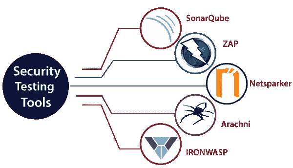
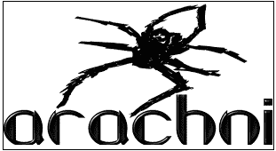
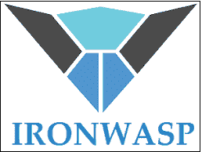

# 安全测试工具

> 原文：<https://www.javatpoint.com/security-testing-tools>

安全测试工具用于确保数据被保存并且不被任何未授权的用户访问。为了保护我们的应用数据免受威胁，我们将使用这些工具。这些工具帮助我们在早期发现系统的缺陷和安全漏洞并进行修复，测试应用是否编码了安全代码，是否被未授权用户访问。

这些最初可能在授权、机密性、身份验证和可用性类型方面起作用。借助这些工具，我们可以避免相关信息的丢失、客户的信任、突然崩溃、攻击后修复网站所需的额外费用以及不可预测的网站性能。

为此，我们在市场上提供了以下工具:

*   **声纳曲**
*   **ZAP**
*   **网络火花**
*   **蜘蛛**
*   **反刍动物**

## 声纳员

这是一个由声纳源建立的开源安全工具。用于测试代码质量，并借助于识别 web 应用的 Java、 [C#](https://www.javatpoint.com/c-sharp-tutorial) 、 [JavaScript](https://www.javatpoint.com/javascript-tutorial) 、 [PHP](https://www.javatpoint.com/php-tutorial) 、Ruby、 [Cobol](https://www.javatpoint.com/cobol) 、 [C](https://www.javatpoint.com/c-programming-language-tutorial) / [C++](https://www.javatpoint.com/cpp-tutorial) 等各种编程语言上的 bug、代码分析和安全暴露来执行自动审查。SonarQube 工具是用 [JAVA 编程语言](https://www.javatpoint.com/java-tutorial)编写的。

它将生成代码覆盖率、代码复杂性、重复代码、安全弱点和错误的报告。它通过多种工具提供完整的分析，如[蚂蚁](https://www.javatpoint.com/apache-ant-tutorial)、[马文](https://www.javatpoint.com/maven-tutorial)、[格拉德](https://www.javatpoint.com/gradle)、[詹金斯](https://www.javatpoint.com/jenkins)等等。

### 声纳管的特点

*   它将通过 SonarLint 插件与多个开发环境集成，如 Visual Studio、Eclipse 和 IntelliJ IDEA。
*   它还支持一些外部工具，如 GitHub、LDAP 和 Active Directory。
*   它可以记录度量历史并提供演化图。
*   它将帮助我们识别复杂的问题。
*   它将提供应用安全性。

## 泽德攻击代理

它是另一个安全测试工具，由 **OWASP** 建立，在这里它代表(开放 Web 应用安全项目)。这是一个用 Java 编程语言编写的开源工具。如果我们将此工具用作代理服务器，它会让用户部署所有通过它的流量。我们可以在守护模式下运行这个工具，这是通过 REST API 实现的。

### ZAP 的特点

*   它将支持高级用户的命令行访问。
*   它可以用作扫描仪。
*   它将提供网络应用的自动扫描。
*   它支持不同的操作系统，如视窗、OS X 和 Linux。
*   它使用强大的老 AJAX 蜘蛛。

## Netsparker

它用于唯一地发现 web 应用的漏洞，并验证应用的弱点是正确的还是不正确的。它可以作为 Windows 软件轻松访问。借助该工具，我们可以进行自动漏洞评估并修复问题，避免资源密集型的手动过程。

### 网络迷你播放器的特点

*   它将自动扫描现代网络应用，如网络 2.0、HTML5 和 SPA(单页应用)以及所有类型的传统应用。
*   出于不同的目的，它将为开发人员和管理人员提供大量现成的报告。
*   我们可以在模板的帮助下生成自定义报告。
*   我们可以将该工具与竹、詹金斯或团队城市等 CI/CD 平台合作，以保护我们的应用。

## 蛛形纲动物

它是另一个开源的安全测试工具，用于发现 web 应用的安全漏洞。它支持集成的浏览器环境，这有助于我们识别高度复杂的 web 应用的安全问题。

### 蛛形纲的特征

*   它将提供漏洞暴露、测试覆盖和 web 应用技术的正确性。
*   它支持各种平台和非常重要的操作系统，如莱纳斯、苹果、OS X 和微软视窗。
*   它将支持不同的技术，如 HTML5、JavaScript、AJAX 和 DOM 操作。

有关蛛形纲动物的更多信息，请参考以下链接:

[https://www.arachni-scanner.com/](https://www.arachni-scanner.com/)

## 铁黄蜂

它是一个开源工具，用于识别 web 应用的漏洞。代表**铁 Web 应用高级安全测试平台**。在这个工具的帮助下，用户可以定制他们的安全扫描仪。它是使用 [Python](https://www.javatpoint.com/python-tutorial) 和 [Ruby 编程语言](https://www.javatpoint.com/ruby-tutorial)开发的。

### 铁黄蜂的特征

*   它将支持录制登录序列。
*   它将产生报告的 RTF 和 HTML 格式。
*   这是一个基于图形用户界面的工具。
*   它将支持误报和漏报检测。

* * *