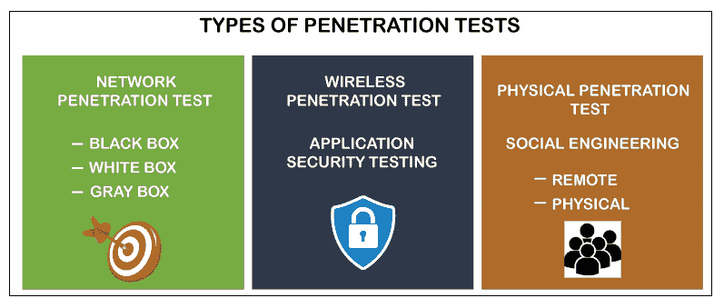

# 渗透测试工具

> 原文：<https://www.javatpoint.com/penetration-testing-tools>

用于搜索网络漏洞的计算机程序是渗透测试技术。

该列表中的每个应用都提供了一些特定的优势。通过简单的比较，您可以决定该计划是否适合您的组织。让我们探索市场上安全应用的最新选择。

## 什么是渗透测试

渗透测试，也称为笔测试，确保信息安全专家使用计算机程序中的安全漏洞来发现和利用它们。这些专家通常被归类为白帽黑客或道德黑客，通过检测现代环境中被称为黑帽黑客的网络攻击者的攻击，使事情变得更简单。

实际上，执行渗透测试相当于雇佣有经验的分析师来实施安全设施安全漏洞，以弄清楚实际的罪犯是如何做到的。企业和公司正在利用这些结果使框架更加稳定。

## 渗透测试的需求

笔测试经常展示系统在哪里以及如何被恶意入侵者滥用。这有助于您在真正的攻击发生之前消除任何漏洞。

根据乐观技术公司最近的一项研究，其他每一项业务都有可能被攻击者滥用的漏洞。笔测试人员已经能够违反公司网络，并在 93%的情况下进入网络。这样做的平均时间是四天。一个未经训练的黑客可以访问 71%公司的内部系统。

## 渗透测试的工作功能

首先，渗透测试人员需要考虑他们将要尝试入侵的操作系统。然后，为了识别漏洞，他们通常使用一组软件工具。渗透监控也可能包括来自社会工程的黑客风险。通过诱使组中的一个成员拥有访问权，测试人员将试图获得对设备的访问权。

[渗透](https://www.javatpoint.com/network-penetration-testing)测试人员还向公司提供他们检查的结果，并负责引入改进，要么修复漏洞，要么最小化漏洞。

## 渗透试验的分类

渗透测试包括下列基本类型。

*   **盲测**
*   **白盒测试**
*   **外部测试**
*   **双盲测试**
*   **内部测试**

让我们详细讨论每一个。

**盲测**

这些公司为渗透测试人员提供了一些关于在盲测中被利用的设备的安全细节，称为黑盒测试。目的是发现永远不会被发现的漏洞。

**白盒测试**

白盒测试是指公司向渗透测试人员提供一系列与其结构相关的安全细节，以帮助他们改进漏洞。

**外部测试**

在全球范围内，外部测试是渗透测试人员旨在识别漏洞的测试。它们是在面向宏观环境的软件上执行的，例如域，因为存在这些类型的测试。

**双盲测试**

也被定义为隐蔽测试的双盲测试是一种敏感数据不仅仅由公司提供给渗透测试人员的测试。他们仍然可能不会让自己的信息安全专家知道这些评估。传统上，这样的实验是由进行实验的人严格控制的。

**内部测试**

内部审查是对实体内部渗透情况的审查。通常，这些检查集中在安全弱点上，组织内部的任何人都可以充分利用这些弱点。

## 最佳渗透测试工具和软件

### 1.Wireshark

通常被命名为 Ethereal 0.2.0，有 600 个贡献者， [Wireshark](https://www.javatpoint.com/wireshark) 是一个获奖的网络映射器。你可以用这个程序轻松地捕捉和分析数据包。该工具是开源的，并且与[视窗](https://www.javatpoint.com/windows)、Solaris、FreeBSD 和 [Linux](https://www.javatpoint.com/linux) 以及其他框架兼容。

**要点**

*   它提供了离线审查和实时捕捉选项。
*   它的定位中间节点帮助您发现新的特征，包括源和目的地的协议。
*   它包括检查网络中最小信息的机会。
*   它包含可选的着色规则，用于快速、直观的分析，并添加到包中。

### 2.Netsparkar

用于渗透测试的常见自动化应用服务器是 Netsparker 漏洞扫描程序。从跨站点请求到 [SQL 注入](https://www.javatpoint.com/sql-injection)，程序可以从中识别任何东西。这个工具可以被博客、网络基础设施和网络服务的设计者使用。

该平台的效率足以同时搜索 500 到 1000 个软件应用。有了攻击工具、验证和[网址](https://www.javatpoint.com/url-full-form)重写指南，你将有能力修改安全扫描。Netsparker 以只读方式动态利用漏洞点。剥削证明已经做好。漏洞的影响可以立即看到。

**要点**

*   它可以在不到一天的时间内搜索 1000 多个基于网络的应用！
*   为了团队合作和容易发现结果，你可以添加几个队友。
*   高级扫描减少了对小型设置的需求。
*   它可以搜索软件应用中可被黑客攻击的 SQL 和 XSS 错误。
*   您可以创建网络法律应用和法规要求报告。
*   它具有基于证据的筛选技术，以确保准确识别。

### 3.牛肉

这是笔测试指南，非常适合搜索引擎测试。应用于对抗网络攻击，可以帮助移动客户。BeEF 指浏览器操作平台，使用 [GitHub](https://www.javatpoint.com/github) 查找问题。BeEF 旨在确定网络客户端和网络范围之外的漏洞。该框架将着眼于可探测性，而不是只有一个参考的背景，即[搜索引擎](https://www.javatpoint.com/search-engines)。

**要点**

*   为了验证安全基础设施，您可能会使用客户端已知的漏洞。
*   它帮助您连接到多个搜索引擎，然后用命令开始特定的包。

### 4.开膛手约翰密码破解者

最常见的缺陷之一是密码。为了获取信息和访问敏感系统，黑客可以使用凭据。因此，开膛手约翰是猜测密码不可或缺的工具，并提供多种系统。钢笔漏洞扫描器是一个免费的软件使用。

*   它会自动检测各种不同的密码。
*   它还发现了数据库内部的密码漏洞。
*   对于 Linux、Mac OS X、哈希套件和哈希套件 Droid，高级版是可用的。
*   包括一个个性化的饼干。
*   它帮助人们发现在线文档。这提供了不同变体之间改进的描述。

### 5.W3af 的

在所有软件开发中，W3af 定制应用入侵和审查平台都是基于识别和利用缺陷。对于攻击、审计和发现，给出了三种插件。然后，软件将这些转移到评估工具上，以评估安全缺陷。

**要点**

*   对于专业人士来说，它很容易使用，并且足够强大，即使对于开发人员来说也是如此。
*   可以实现自动创建 HTTP 请求和现有的 HTTP 请求。
*   它能够配置为充当 MITM 的代理。

### 6.渗透测试指南

Metasploit 是世界上最常用的漏洞评估优化系统。Metasploit 允许技术专家验证和管理安全评估，提高可见性，并武装和激励防守者保持领先优势。

它有助于测试安全性，发现漏洞，建立防御。这个工具，一个开放的标准程序，将使系统管理员能够破解和识别关键的缺陷。为了建立自己的能力，新手黑客使用这个指南。该工具为社会工程师提供了一种复制网站的方法。

**要点**

*   使用可滚动的给定平台和命令行界面很方便。
*   蛮力引导启动绕过城市化和现代化的系统，矛间谍软件和识别，一个 OWASP 漏洞测试应用。
*   它从 1500 多个漏洞的测试中收集数据。
*   网络连通性实验的元模块。
*   这可以在基础设施内部用来发现旧的漏洞。
*   Mac OS X、Linux 和 Windows 也可以访问它。
*   它可以在服务器、软件和通道上使用。

### 7.Acunetix 扫描仪

Acutenix 是一个交互式测试平台，您将使用它来执行渗透测试。该技术能够评估复杂的管理报告和合规性问题。该应用可以解决许多网络漏洞。Acunetix 还能够包含带外的 bug。

该综合工具结合了 WAFs 和价值广泛的错误检测器。Acunetix 是该领域专业的跨站点请求和 SQLi 测试之一，准确率高，包括复杂的自动 XSS 检测。

**要点**

*   该工具保护了超过 4500 个漏洞，涉及 SQL 注入和 XSS。
*   登录模式记录器易于实现，并且测试由密码覆盖的部分。
*   AcuSensor 技术、用于自动渗透的工具和内置功能为了加强和减少漏洞，漏洞评估简化了黑盒和白盒测试。
*   数亿个网站可以不间断地被洗劫一空。
*   它可以在本地运行，也可以通过云中的解决方案运行。

### 8.破解软件

Aircrack NG 被配置为通过捕获传入的数据包来攻击无线连接内部的漏洞，以便通过 word 文档导出有效的协议进行分析。尽管该计划在 2010 年似乎已经停止，但在 2019 年，Aircrack 再次进行了修改。

该工具在多个操作系统和基于 WEP 字典的攻击支持框架上启用。特别是与许多其他渗透工具相比，它提供了更高的检测性能，并支持多种设备和驱动程序。该套件负责在获得 WPA 握手后，使用凭证字典和数学技术破解 WEP。

**要点**

*   它兼容 Solaris、Linux、Windows、OS X、FreeBSD、NetBSD 和 OpenBSD。
*   要检索包和导出数据，您将使用此方法。
*   它旨在用于 wi-fi 系统测试以及驾驶员熟练程度。
*   它关注各种安全领域，如攻击、监视、测试和破解。
*   在入侵方面，你可以去认证，建立一个假的无线网络和重放攻击。

### 9.打嗝套件笔测试仪

针对程序员的 Burp 套件有两个独立的版本。免费版本为测试所需的操作提供了合适且必要的工具。或者，当您需要广泛的渗透测试时，您可以选择第二个版本。对于测试基于网络的应用，这个工具是完美的。可以使用工具来映射标签基底和分析浏览器和端点服务器之间的事务。

**要点**

*   它适用于基于网络的软件自动滚动。
*   在这个工具中可以访问 Mac OS X、Linux 和 Windows。

### 10.Kali Linux

用于漏洞评估的 Linux 操作系统是 [Kali Linux](https://www.javatpoint.com/kali-linux) 专业渗透测试程序。许多分析师声称，这是提取和截取密码的完美工具。然而，为了获得最大的优势，您可能需要在两种 [TCP / IP](https://www.javatpoint.com/computer-network-tcp-ip-model) 协议方面的经验。开源项目 Kali Linux 支持工具描述、版本管理和元包。

**要点**

*   在 64 位协助下，您将使用这种技术进行暴力攻击密码破解。
*   为了评估网络安全专业人员的安全技能，Kali 使用了一个配置到内存中的实时图像。
*   Kali Linux 包含 600 种合乎道德的黑客方法。
*   可获得多种漏洞评估安全工具、网络应用、数据收集、wi-fi 攻击、逆向工程、破解密码、取证工具、网络服务、模仿、嗅探、贩运工具和黑客设备。
*   它与用于渗透测试的其他工具(包括 Wireshark 和 Metasploit)具有快速兼容性。
*   回溯为无线局域网和局域网漏洞分析提供测试、取证分析和嗅探工具。

### 11.伊特怪

Ettercap 软件旨在避免中心人员的攻击。您将能够使用此工具生成所需的包并执行某些任务。该程序可以通过其他更复杂的选项提交非法帧和整个技术。

**要点**

*   该方法适用于数据包的深度嗅探以及局域网跟踪和检查。
*   被动和主动防御解构由 Ettercap 提供。
*   内部控制系统可以在运行中完成。
*   对于渠道和客户评估，该工具还提供配置。

### 12.涅索斯

二十多年来，Nessus 经常被用作隐私漏洞扫描工具。两万七千个主要组织使用这个项目。该应用包括超过 45，000 个消费电子产品和 100，000 个扩展，是最强大的测试工具和服务之一。最适合分析 [IP](https://www.javatpoint.com/ip) 地址、域和进行关键数据搜索。您将有资格在框架中使用它来识别“弱点”

该工具易于使用，提供了可靠的测试，并在点击鼠标时显示网络漏洞分析。通过笔测试程序搜索已知漏洞、不良密码和数据损坏错误。

**要点**

*   该工具最适合于故障补丁和漏洞的定位和检测。
*   每 100 万次测试中，该设备只有 0.32 个错误。
*   该工具帮助您定制包含漏洞表单的文件，这些文件可以由插件或服务器生成。
*   该工具除了确保软件、设备扫描和云基础设施之外，还提供了偏好缓解。

### 13.Zed 攻击代理

OWASP ZAP 是 OWASP 组的一个工具。它适合熟悉渗透测试的架构师和程序员。该运动始于 2010 年，每天都在加强。ZAP 以多平台策略执行，支持域和服务器之间的代理。

**要点**

*   有四种模式可供定制选项。
*   JAVA 8 +是 Windows 或 Linux 平台访问 ZAP 所必需的。
*   入门(PDF)、简介、在线帮助、专业协会和 StackOverflow 是广泛支持的页面。
*   人们通过程序代码、维基、开发者社区、Crowdin、OpenHub 和 BountySource 将探索 Zap 增长的更多信息。

### 14.sqlcmap

是一个数据库 SQL 注入控制工具。它还支持 [MySQL](https://www.javatpoint.com/mysql-tutorial) 、 [SQLite](https://www.javatpoint.com/sqlite-tutorial) 、Sybase、DB2、Access、 [MSSQL](https://www.javatpoint.com/mysql-vs-ms-sql-server) 、 [PostgreSQL](https://www.javatpoint.com/postgresql-tutorial) 数据库平台。SQLmap 是开源的，简化了操作应用服务器的机制和攻击向量的 bug。

**要点**

*   该工具允许您检测和监控漏洞。
*   它为注入的所有方面提供帮助:联合、时间、堆栈、错误、布尔。
*   它执行命令行界面，可以为 Linux、Mac OS 和 Windows 操作系统进行配置。

### 15.该隐和亚伯

Cain & Abel 适用于获取网络控制和凭证的渗透。为了检测漏洞，该工具利用了网络嗅探。

**要点**

*   利用网络嗅探器、加密算法威胁和暴力，基于 Windows 的框架可以恢复密码。
*   它对于丢失的密码恢复是极好的。

### 16.麋鹿

马鹿是一款程序安全工具，支持[黑盒测试](https://www.javatpoint.com/black-box-testing)。检查黑盒测试基于网络的应用是否有可能暴露。在黑盒测试过程中，会检查网站，并植入测试数据，以搜索保护中的任何故障。

**要点**

*   借助命令行应用界面，专业人士可能会发现易用性。
*   马皮检测文件暴露故障、XSS 入侵、数据库输血、XXE 注射、命令执行缓解和易受攻击。容易规避的 htaccess 设置。

### 17.社会工程工具

工具和技术的主要目标是社会工程。生物不是渗透测试超越目的和重点的目标。

**要点**

*   该工具出现在著名的网络安全活动中，包括 ShmooCon、Defcon、DerbyCon，是漏洞评估行业规范。
*   Package 的下载量已经超过了 200 万。
*   为了防止社会工程，开发了一个开源测试系统。

### 18.水螅

当你需要破解一个加密密码时，包括 [SSH](https://www.javatpoint.com/ssh-linux) 或 [FTP](https://www.javatpoint.com/computer-network-ftp) 账户、 [IMAP](https://www.javatpoint.com/imap-protocol) 、IRC、RDP 和其他几个人，开膛手约翰的帮凶九头蛇就扮演了一个角色。把九头蛇放在你想黑的系统上，传递一组单词，扣动扳机。像 Hydra 这样的服务展示了为什么在几次密码尝试期间，限速密码尝试和拔掉用户的插头可以成为针对攻击者的有效防范措施。

### 19\. Hashcat

自称“世界上最快、最复杂的密码保护工具”的人可能并不总是谦逊的，但 hashcat 的人肯定知道它的价值。哈斯卡特向开膛手约翰提出挑战，要求他交出钱来。这是破解哈希的完美解决方案，hashcat 通过密码破解实现了几种形式的暴力攻击，比如字典攻击和伪装攻击。

检测通常需要对散列的凭证进行过滤，而操作这些密码需要让 hashcat 之类的软件离线运行，这样至少会有几个密码被猜到或被暴力破解。

在一个标准的 [GPU](https://www.javatpoint.com/gpu) 上，Hashcat 表现完美(对不起，Kali VM 用户)。遗留 hashcat 也促进了 [CPU](https://www.javatpoint.com/central-processing-unit) 哈希黑客攻击，但是它警告用户它比集成显卡的计算能力稍微慢一点。

## 渗透测试工具的优势

下面定义了笔测试工具的一些优点。

**1。安全威胁的安排和检测**

渗透测试计算组织保护其应用、服务器、用户和数据源免受国际和国内企图规避其安全措施的能力，以获得对安全财产的受限或未经批准的访问。待定测试结果确认了特定安全问题或有缺陷的系统所带来的危险，从而使 IT 管理层和情报分析师能够安排减排计划。

**2。颠覆渠道失效强度**

从安全漏洞中恢复代价高昂。信息技术救助站、保留措施、消费者安全、商业级、销售减少、员工生产率下降和受挫的贸易代表都可以包括在恢复中。渗透测试通过在数据泄露或攻击发生之前建设性地识别和解决风险，帮助公司防止这些财务困难。

**3。满足跟踪和减轻处罚的需要**

信息技术机构讨论了 HIPAA、萨班斯-奥克斯利法案和 GLBA 法案等活动的最终监控/实施方面，以及联邦 NIST / FISMA 和 PCI-DSS 指令中需要确认的监控。漏洞扫描程序提供的详细报告将帮助组织避免严重的不遵守后果，并通过为审计员保留适当的安全控制，使他们能够证明评估员持续尽职。

**4。服务延迟和安全问题代价高昂**

服务提供商的安全漏洞和相应的性能干扰会导致严重的经济损失，损害企业的信誉，破坏客户忠诚度，引起负面关注，并施加意想不到的经济处罚。公司在渗透测试中的频繁招聘阻止了这些费用。

检查渗透使公司能够防止基础设施的入侵者。无论是从品牌价值还是财务稳定性来看，对该公司来说，及时保护自己的利益都比遭受重大失败更安全。

**5。安全的品牌识别和企业形象**

只有一次被盗的消费者数据可能会损害企业的声誉，并对其最终结果产生负面影响。渗透测试可以帮助实体消除可能危及业务完整性和可靠性的数据事故。

* * *