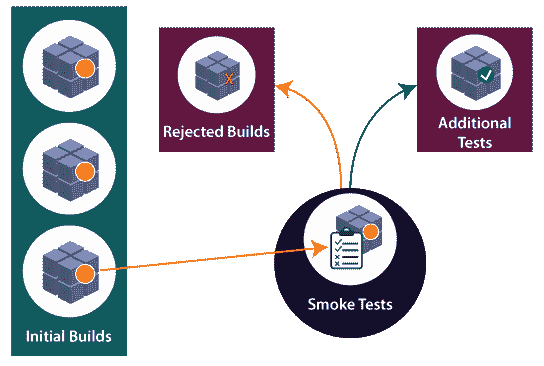
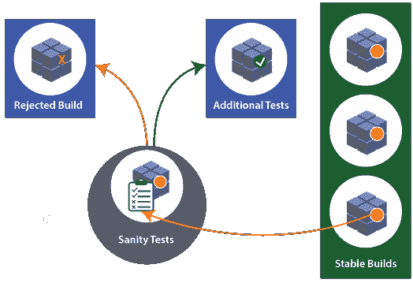
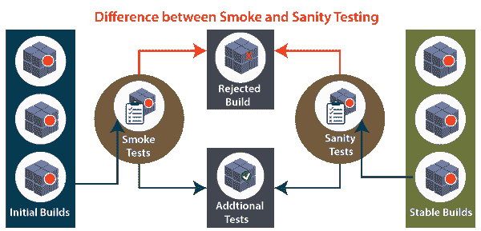

# 烟雾测试和健全性测试的区别

> 原文：<https://www.javatpoint.com/smoke-testing-vs-sanity-testing>

在本节中，我们将讨论什么是**软件测试中的**冒烟和健全性测试**；**看看它们之间的主要区别。

在[软件测试](https://www.javatpoint.com/software-testing-tutorial)中，我们会了解到在 [**SDLC(软件开发生命周期)**](https://www.javatpoint.com/software-development-life-cycle) 初始阶段所做的任何测试都被确定为一个节省成本和时间的过程。

**冒烟测试**和**健全性测试**是**测试的几个重要类型，**确保 bug 和缺陷在开发周期的初始阶段暴露出来。

通常，我们都会在**健全性测试和烟雾测试**的定义之间混淆。首先，两个测试是不同的**方式**，并在测试周期的不同阶段执行。

在了解烟雾和理智测试之前，建议先了解**构建**和**发布**以及这些术语与烟雾和理智测试的关系。

## 什么是构建？

在手动测试中，build 是包含一些特性/错误集的软件，它安装在需要测试产品稳定性的**测试服务器**上。

换句话说，我们可以说构建是用来将代码更改为应用程序格式的。每个新版本都将是新版本的改进版本。

有关软件构建和构建过程的更多信息，请参考以下链接:[https://www.javatpoint.com/manual-testing](https://www.javatpoint.com/manual-testing)。

## 什么是发布？

在**软件测试**中，这是日常使用的非常常见的术语。**发布**是交付给客户的最终产品或项目。

它包括从**需求、设计、开发和测试阶段**直到移交给客户的完整活动。

换句话说，我们可以说一个版本是一个完全开发的应用程序，而构建是应用程序或软件的一部分。

#### 注意:每当测试团队对一个构建进行测试和专门化时，它都会作为 Release 交给客户。

现在，让我们来看一下**烟雾测试和理智测试**程序的简要介绍。

## 什么是烟雾测试？

这是一种测试类型，在进行详尽的测试或严格的测试之前，保证应用程序的基本和关键特性正常工作。

烟雾测试也被称为 [**验收测试**](https://www.javatpoint.com/acceptance-testing) 或**建造验证测试的一个子类。**

换句话说，我们可以说冒烟测试是用来测试软件产品**或**的所有功能，检查构建是否被破坏。

在烟雾测试中，我们只执行阳性测试，这意味着我们只能输入有效数据，不能输入无效数据。

每当一个新的构建出现时，我们总是从冒烟测试开始，因为一些变化可能已经破坏了新构建的一个主要特性。

有关烟雾测试的详细信息，请参考以下链接:[https://www.javatpoint.com/smoke-testing](https://www.javatpoint.com/smoke-testing)。

## 什么是理智测试？

它被执行来检查在构建之后 bug 是否已经被修复。通常，健全性测试是在稳定的构建上执行的。它也被称为回归测试的变体。

执行健全性测试的最初目的是确定计划的特性大致按预期工作。如果健全性测试失败，构建将被拒绝，以节省在更严格的测试中复杂的成本和时间。

有关健全性测试的更多详细信息，请参考以下链接:[https://www.javatpoint.com/sanity-testing](https://www.javatpoint.com/sanity-testing)。

#### 注意:试运行是一个测试过程，在此过程中，有目的地减轻可能的故障后果。

每当我们谈到**冒烟和神智测试**时，我们都知道这两种类型的测试是相似的，但是冒烟测试和神智测试都有它们的目的和意义。

因此，在本文中，我们试图通过看到它们之间的关键区别来克服冒烟测试和健全测试的混乱。

## 烟雾测试和健全性测试的主要区别

以下事实解释了**烟和理智测试**的区别:

*   烟雾测试是**脚本化的**，这意味着它可以被记录，而理智测试是**非脚本化的**，这意味着它不能被记录。
*   烟雾测试被认为是**浅而宽的**测试，另一方面，理智测试被认为是**窄而深的**测试。
*   烟雾测试采用**所有重要特性并执行高级测试**，而健全性测试采用**一些非常重要的特性并执行深度测试。**
*   一旦安装了构建，就执行冒烟测试**，另一方面，一旦错误修复完成，就执行健全性测试**。****

## 烟雾测试与健全性测试

下表以快速的方式揭示了烟雾测试和健全性测试之间的重要区别:

| 没有。 | 比较基础 | 烟雾测试 | 健全性测试 |
| one | 测试覆盖率 | 这是一种广泛的测试方法，测试应用程序的所有部分。 | 这是一种测试应用程序特定部分的狭窄方法。 |
| Two | 措施 | 它通过执行严格的测试来衡量系统的稳定性。 | 它通过执行严格的测试来衡量系统的合理性。 |
| three | 技术 | 烟雾测试可以是手动的，也可以是自动的。 | 健全性测试可以在没有测试用例或脚本的情况下完成。 |
| four | 执行人 | 它由测试人员和开发人员共同执行。 | 它仅由测试人员执行。 |
| five | 目的 | 测试是在不深入的情况下完成的，但是无论何时需要，测试人员都必须深入。 | 健全性测试不需要深入应用程序。 |
| 6. | 演出时间 | 烟雾测试是在初始构建时执行的第一个测试。 | 健全性测试是在构建相对稳定时执行的。 |
| seven | 文件 | 烟雾测试有记录。 | 健全性测试没有记录。 |
| eight | 习惯 | 它用于测试应用程序的端到端功能。 | 它仅用于测试修改的或缺陷修复的功能。 |
| nine | 子集 | 它被认为是验收测试的一个子集。 | 它被认为是回归测试的子集。 |

## 结论

在本教程中，我们对**烟雾测试和**健全性测试进行了比较。这里我们已经得出结论，测试软件或应用程序需要执行冒烟和健全性测试。

这些是大多数**质量保证和项目团队**在各种软件开发项目中遵循的基本测试概念。

测试的初学者需要了解冒烟和健全测试的基本原理，以获得有效和良好的质量保证结果。

冒烟测试和健全性测试都可以手动或者用一些自动化工具来实现。当使用自动化工具时，测试开始重复创建构建。

根据软件的需要，我们可以在类似的软件构建中执行冒烟或健全性测试。在这种情况下，我们将首先进行**烟雾测试**，然后进行**理智测试**。

在软件行业中，用于健全性测试的测试用例通常与冒烟测试共享，以加速测试执行过程。

理智测试和冒烟测试都是避免延迟和能量的不同方法，它们通过快速定义一个应用程序是否被破坏到无法进行任何严格的测试。

* * *