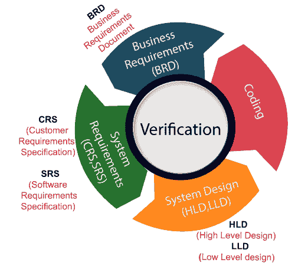
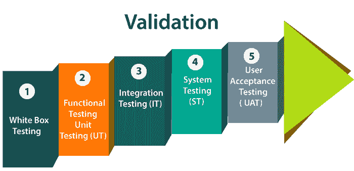

# 验证和确认测试

> 原文：<https://www.javatpoint.com/verification-and-validation-testing>

在本节中，我们将了解验证和确认测试及其主要区别。

## 验证测试

验证测试包括不同的活动，如开发产品时的业务需求、系统需求、设计评审和代码演练。

它也被称为静态测试，在这里我们确保“**我们正在开发正确的产品或者没有开发正确的产品**”。它还检查开发的应用是否满足客户给出的所有要求。

## 验证测试

验证测试是测试人员执行功能性和非功能性测试的测试。这里**功能测试**包括[单元测试](https://www.javatpoint.com/unit-testing)(UT)[集成测试](https://www.javatpoint.com/integration-testing) (IT)和系统测试(ST)**非功能**测试包括用户验收测试(UAT)。

验证测试也称为动态测试，我们确保**“我们已经开发了正确的产品。”**还检查软件是否满足客户端的业务需求。

#### 注意:验证和确认过程是在软件开发生命周期的 V 模型下完成的。

## 验证和确认测试的区别

| 确认 | 确认 |
| 我们检查我们是否正在开发正确的产品。 | 我们检查开发的产品是否正确。 |
| 验证也称为**静态测试**。 | 验证也称为**动态测试**。 |
| 验证包括不同的方法，如检查、评审和演练。 | 验证包括测试，如[功能测试](https://www.javatpoint.com/functional-testing)、系统测试、[集成](https://www.javatpoint.com/integration-testing)和用户验收测试。 |
| 这是一个检查开发周期的工作产品(不是最终产品)以决定产品是否满足指定需求的过程。 | 它是在开发周期期间或结束时检查软件的过程，以决定软件是否遵循指定的业务需求。 |
| **质量保证**接受验证测试。 | **质量控制**正在进行验证测试。 |
| 代码的执行不会发生在验证测试中。 | 在验证测试中，执行代码。 |
| 在验证测试中，我们可以在产品开发阶段的早期发现缺陷。 | 在验证测试中，我们可以发现那些在验证过程中没有捕捉到的 bug。 |
| 验证测试由质量保证团队执行，以确保产品是根据客户的要求开发的。 | 验证测试由测试团队执行，以测试应用。 |
| 验证是在验证测试之前完成的。 | 在验证测试之后，进行验证测试。 |
| 在这种类型的测试中，我们可以验证输入是否跟随输出。 | 在这种类型的测试中，我们可以验证用户是否接受产品。 |

* * *