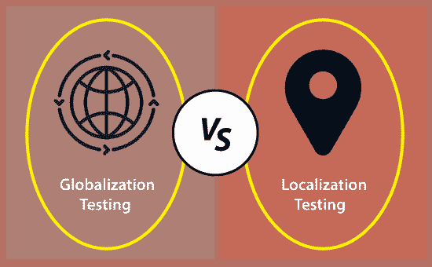

# 全球化测试和本地化测试的区别

> 原文：<https://www.javatpoint.com/globalization-testing-vs-localization-testing>

在本节中，我们将了解全球化测试和本地化测试之间的主要区别。

**全球化测试和本地化测试**是许多大小企业广泛使用的软件测试类型。

## 什么是全球化测试？

它是另一种用于测试为多种语言开发的软件的软件测试类型，称为 **[全球化测试](https://www.javatpoint.com/globalization-testing)** ，为多种语言改进应用或软件称为**全球化**。

全球化测试确保应用程序将支持多种语言和多种功能，因为在当前的场景中，随着应用程序计划在全球范围内使用，我们可以看到几种技术的增强。

## 什么是本地化测试？

这不过是软件测试的一种格式。我们根据国家、地区等测试特定的应用程序。正如我们所知，本地化产品仅支持仅在特定地区可用的精确类型的语言。

又称 **L10N** 测试，这里 **10** 是**L**ocalization**N**字中 **L** 和 **N** 之间的数字。

## 全球化测试与本地化测试

让我们看看全球化测试和本地化测试之间的一些本质区别。

| S.NO | 全球化测试 | 本地化测试 |
| 1. | 执行全球化测试是为了确保软件应用程序支持各种语言和多种功能。 | 执行本地化测试是为了验证软件应用程序支持一种只能在特定区域使用的精确语言。 |
| 2. | 在全球化的产品中，代码与消息或信息是分开的。通过使用全球化测试，我们可以使软件能够与不同的语言一起使用，而无需重新设计完整的软件。 | 本地化测试不需要本地化产品。 |
| 3. | 它主要强调用户作为通用用户群。 | 它主要强调给定文化或语言环境中的一小群用户。 |
| 4. | 全球化测试将帮助我们识别软件中潜在的问题和缺陷，阻止其预期的性能。 | 本地化测试将帮助我们检测印刷错误。 |
| 5. | 它在所有可能的国际输入的帮助下验证软件产品的所有功能。 | 本地化测试将帮助我们验证所有应用程序资源。 |
| 6. | 在执行全球化测试时，测试工程师假设软件产品正在全球范围内进行测试和使用。 | 在执行本地化测试时，测试工程师假设软件产品正在被测试，并且将被特定地区的特定用户群使用。 |
| 7. | 全球化测试验证了不同的货币格式，如地址、手机号码格式是由软件应用程序维护的。 | 本地化测试验证了特定的地址格式、货币格式和手机号码格式是否正常工作。 |
| 8. | 它有助于将测试工程师与翻译和工程师分开，并确保详细和独立的方法。 | 它有助于减少测试时间；随后，它只在现场完成。 |
| 9. | 全球化测试需要相对较长的时间来实现测试。 | 本地化测试将花费更少的时间来实现测试。 |
| 10. | 在全球化测试中，我们已经正式化了错误报告。 | 本地化测试有助于我们降低整体测试和支持成本。 |
| 11. | **比如**，www.google.com 支持多种语言，不同国家的人都可以访问；因此，它是一个全球化的产品。 | **比如**，QQ.com 只支持中文，只有少数国家可以访问。 |

## 结论

使用**全球化测试和本地化测试**，我们可以测试一些最重要的软件特性，例如**语言相关性、文化敏感性以及软件的全球和地区吸引力。**在这些组件的帮助下，软件可以被全球和本地的受众使用，增加软件的普及度。

**全球化测试和本地化测试**将帮助测试团队采取必要的程序来提高**软件产品的性能、质量、功能**和其他重要的基础知识。

最后，我们可以说，如果我们不执行**全球化测试和本地化测试**技术，软件工程师就不能开发出满足最终用户和市场需求的高质量软件产品。

* * *