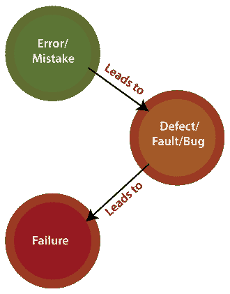

# 错误、缺陷、错误、故障和失败之间的区别

> 原文：<https://www.javatpoint.com/bug-vs-defect-vs-error-vs-fault-vs-failure>

在本节中，我们将讨论**错误、缺陷、错误、故障&故障**之间的区别，因为我们知道，只要系统或应用程序出现异常，就会使用所有术语。

有时我们称之为**错误**，有时称之为 bug 或**缺陷**等等。在软件测试中，许多新的测试工程师在使用这些术语时会感到困惑。

通常，我们在基于阶段的[软件开发生命周期(SDLC)](https://www.javatpoint.com/software-development-life-cycle) 中使用这些术语。但是这些术语的用法有冲突。

换句话说，我们可以说在**软件测试时代，**术语**bug、缺陷、错误、故障和失败**每天都在出现。

但是对于这个领域的初学者或者没有经验的人来说，所有这些术语看起来都是同义词。如果软件不能像预期的那样工作，独立理解这些术语就变得非常重要。

## 什么是 bug？

在[软件测试](https://www.javatpoint.com/software-testing-tutorial)中， [bug](https://www.javatpoint.com/bug-in-software-testing) 是缺陷的非正式名称，意思是软件或应用程序没有按照要求工作。当我们有一些编码错误时，它会导致程序崩溃，这就是所谓的**bug**。**测试工程师**使用术语 **Bug** 。

如果 [**【质量分析师】**](https://www.javatpoint.com/quality-assurance) 检测到 bug，他们可以在 **bug 报告模板**的帮助下重现 bug 并记录下来。

## 什么是缺陷？

当应用程序没有按照要求工作时，被称为**缺陷**。它被指定为与应用程序或软件的**实际和预期结果**的偏差。

换句话说，我们可以说这个由**程序员**宣布的 bug，在代码里面叫做一个 **[缺陷](https://www.javatpoint.com/defect-or-bug-tracking-tool)。**

## 什么是错误？

代码中的问题会导致错误，这意味着由于开发人员对需求的误解或需求定义不正确，开发人员的编码错误会导致错误。**开发者**使用术语**错误**。

## 什么是故障？

故障可能发生在软件中，因为它没有添加容错代码，导致应用程序出错。

程序中可能会出现故障，原因如下:

*   缺乏资源
*   无效步骤
*   不适当的数据定义

## 什么是失败？

许多缺陷导致**软件的故障**，这意味着一个损失指定了软件/应用程序或其模块中的致命问题，这使得系统无响应或崩溃。

换句话说，我们可以说，如果最终用户检测到产品中的问题，那么该特定问题被称为**故障**。

可能性有一个缺陷可能导致一次或多次失败。

**例如**，在银行应用中，如果**金额转账**模块对终端用户不起作用，当终端用户尝试**转账**时，提交按钮不起作用。因此，这是一个**故障**。

下图显示了上述术语的流程:

## 错误与缺陷、错误与故障、故障

我们在下表中列出了 **bug、缺陷、错误、故障和失败之间的一些重要区别。**

| 比较基础 | 病菌 | 缺点 | 错误 | 故障 | 失败 |
| **定义** | 这是为缺陷指定的非正式名称。 | **缺陷**是实际结果和预期输出之间的差异。 | 一个**错误**是代码中的一个错误；这就是为什么我们不能执行或编译代码。 | **故障**是导致软件无法完成其基本功能的状态。 | 如果软件有很多缺陷，就会导致失败或导致失败。 |
| **由**升起 | **测试工程师**提交 bug。 | **测试人员**识别缺陷。开发人员也在开发阶段解决了这个问题。 | **开发人员和自动化测试工程师**提出了错误。 | **人为失误**造成故障。 | 手动测试工程师通过**开发周期**发现故障。 |
| **不同类型** | 不同类型的 bug 如下:

*   Logic bug
*   Algorithm bug
*   Resource bug

 | 不同类型的缺陷如下:
基于**优先级**:

*   tall
*   middle
*   low

基于严重程度:

*   serious
*   great
*   slight
*   slight

 | 不同类型的错误如下:

*   grammer mistake
*   User interface error
*   Flow control error
*   Error handling error
*   miscalculation
*   hardware error
*   Test error

 | 不同类型的故障如下:

*   Business failure
*   And logic failure.
*   Fault GUI
*   Performance failure
*   Safety failure
*   Software/hardware failure

 | - |
| **背后的原因** | 以下是可能导致**错误的原因:**
编码缺失
编码错误
额外编码 | 以下原因导致**缺陷** :
输入不正确和错误。
外部行为和内部结构和设计的困境和错误。
编码或逻辑中的错误会影响软件，导致软件崩溃或失败。 | 出现**错误**的原因如下:
代码错误。
某些价值观的错误。
如果开发人员无法成功编译或运行程序**。**
编程中的困惑和问题。
无效的登录、循环和语法。
实际结果和预期结果不一致。
设计或需求行动中的失误。
理解应用程序需求时的误解。 | **故障**背后的原因如下:
故障可能是由于初始阶段、过程或数据定义中的不当步骤而发生的。
程序中的不一致或问题。
软件中导致软件运行不正常的不规则或漏洞。 | 以下是**故障背后最重要的一些原因:**
环境条件
系统使用
用户
人为错误 |
| **防止原因的方法** | 以下是停止**bug**的方法:
测试驱动开发。
提供编程语言支持。
调整、改进和可操作的开发程序。
系统评估代码。 | 借助以下内容，我们可以防止**缺陷**:实现几种创新的编程方法。
使用主要和正确的软件开发技术。
同行评审
它正在执行一致的代码评审，以评估其质量和正确性。 | 以下是防止**错误**的方法:
通过系统评审和编程提高软件质量。
发现问题并准备合适的缓解计划。
验证修复并验证其质量和精度。 | **故障**可以通过以下方式预防:
同行评议。
评估软件的功能需求。
执行详细的代码分析。
验证软件设计和编程的正确性。 | 防止**故障**的方法如下:
确认复试。
回顾需求，重新审视规范。
实施现行防护技术。
对错误和问题进行分类和评估。 |

## 结论

在看到 **bug、缺陷、错误、故障和故障**之间的所有显著差异后，我们可以说整个软件中发现的几个问题和不一致是相互联系和依赖的。

所有上述术语都会影响和改变软件的不同部分，并且彼此之间存在很大差异。然而， **bug、缺陷、错误、故障和失败**之间的所有这些差异都会降低软件的优秀性和性能。

* * *