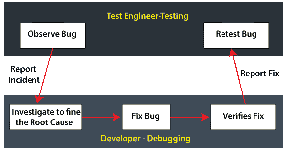
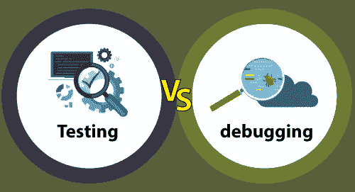

# 测试和调试的区别

> 原文：<https://www.javatpoint.com/testing-vs-debugging>

在本节中，我们将了解**测试**和**调试**的区别。这两个术语都是软件开发生命周期的组成部分，因为它们都用于**软件开发生命周期**的不同阶段，并给出不同类型的结果。

在开发时以及任何应用或以任何编程语言建立的软件产品的结果出来后，**测试和调试**在发现和消除错误方面都起着至关重要的作用。

#### 注意:测试和调试这两个词看起来有着相似的含义，但却有着很大的不同。

它们具有相当等同的功能，但在**设计、要求、优势和性能方面各不相同。**

因此，我们需要正确理解测试和调试之间的**差异，这将支持我们获得更好的软件开发结果。**

在看到**测试和调试**的区别之前，我们先来详细讨论一下**对**测试和调试**的**评价，这将有助于我们恰当区分两者。

## 什么是软件测试？

[**软件测试**](https://www.javatpoint.com/software-testing-tutorial) 是识别软件产品缺陷的过程。它的执行是为了验证软件或应用相对于需求的行为。

换句话说，我们可以说测试是在预定义的规范下确定应用准确性的技术的集合，但是它不能识别软件的所有缺陷。

每个软件或应用都需要在交付给客户之前进行测试，并检查特定的软件或应用是否按照给定的要求正常工作。

## 什么是调试？

与测试相反，调试是开发团队或开发人员在从测试团队收到与软件中的错误相关的测试报告后实施的操作。

在软件开发过程中，调试包括检测和修改软件程序中的代码错误。

在调试过程中，开发人员需要识别特定**bug 或缺陷背后的原因，这是通过严格分析编码来实现的。**

 **开发人员更改代码，然后每当发现错误或错误时，重新检查缺陷是否已被删除。

一旦调试成功完成，应用将再次发送回测试工程师，测试工程师仍在测试过程中。

调试过程使我们能够更早地发现错误，并使软件开发轻松无压力。

现在，根据实践的特点和技术，我们可以区分**测试和**调试。

## 测试与调试

在下表中，我们列出了测试和调试之间的一些显著区别:

| S.NO | 测试 | 排除故障 |
| 1. | 它是以识别缺陷为目的的软件实现 | 修复和解决缺陷的过程称为调试。 |
| 2. | 测试可以手动执行，也可以借助一些自动化工具来执行。 | 调试过程无法自动化。 |
| 3. | 一组测试工程师执行测试，有时可以由开发人员来执行。 | 调试由开发人员或程序员完成。 |
| 4. | 测试工程师在应用上执行手动和自动测试用例，如果他们检测到任何错误，他们可以向开发团队报告进行修复。 | 开发人员将发现、评估并消除软件错误。 |
| 5. | 执行测试过程不需要编程知识。 | 如果不了解编程语言，我们就无法继续调试过程。 |
| 6. | 一旦编码阶段完成，我们就继续测试过程。 | 在测试用例实现之后，我们可以开始调试过程。 |
| 7. | 软件测试包括两个或多个活动，如软件的验证和确认。 | 调试试图使指示与原因相匹配，从而导致纠错。 |
| 8. | 它建立在不同的测试层次上，如单元测试、集成测试、系统测试等。 | 它是建立在不同种类的 bug 上的，因为没有这种级别的调试是可能的。 |
| 9. | 软件测试是缺陷的呈现。 | 这是一个合乎逻辑的程序。 |
| 10. | 软件测试是软件开发生命周期的重要阶段。 | 它不是 SDLC 的一部分，因为它是测试的一个子集。 |
| 11. | 软件测试的一些优势如下:

*   It is easy for new test engineers or beginners to understand.
*   Test engineers can interact with software as **real end users** to check usability and user interface problems.
*   Used to test dynamically changing graphical user interface design.
*   Testing is a process of saving cost and time.
*   Software testing delivers a **compliant software.**
*   It will help us to perform root cause analysis, which will improve the productivity of software.
*   The testing process also helps to detect and fix bugs before the software is activated, significantly reducing the risk of failure.

 | 调试过程的一些优势如下:

*   Support developers to minimize data.
*   If debugging is performed, we can report the error directly.
*   During debugging, developers can **avoid complicated one-time test code** and help developers save time and energy.
*   Debugging provides the most useful information of data structure and allows informal understanding of it.

 |
| 12. | 软件测试包含各种类型的测试方法，具体如下:

*   Black box test
*   White box test
*   grey box testing

其他一些类型的测试类型如下:

*   unit testing
*   integration testing
*   system test
*   stress testing
*   performance test
*   Compatibility test
*   Beta test

 | 调试涉及多种方式，具体如下:

*   [induction]
*   [brute force]
*   [deduction]

 |
| 13. | 测试团队也可以分包给外部团队。 | 调试不能分包给外部团队，因为内部开发团队只做调试。 |
| 14. | 我们可以计划、设计和实现测试过程。 | 与测试过程相比，调试过程是不可强迫的。 |

## 结论

在本文中，我们了解到**测试和调试**是**软件测试生命周期**中必不可少的部分，两者在检测软件中的 bug 和错误方面都起着至关重要的作用。

在看到测试和调试之间的关键区别后，我们可以说这两个术语是相互依赖的，这意味着没有另一个术语就无法实现。

实现调试过程的结果是问题得到了修复，可以重新测试。测试工程师没有修复缺陷；相对而言，他们会验证这些 bug，这是由开发人员解决的。

最后，我们可以得出结论，开发人员执行调试，他们修复了测试工程师在调试阶段报告的问题。

执行测试和调试过程是为了使特定的软件产品更好和改进。

而且不取决于我们属于哪个团队(测试和调试团队)。

* * ***