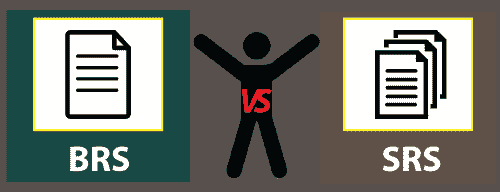

# BRS 与 SRS

> 原文：<https://www.javatpoint.com/brs-vs-srs>

在本节中，我们将讨论 BRS 和 SRS 之间的区别，并简要介绍它们。

**BRS 和 SRS** 是开发任何项目或软件最重要的文件。这些类型的文档包含特定软件的深入细节。

在[软件测试](https://www.javatpoint.com/software-testing-tutorial)中，BRS 和 SRS 类型的文档需求取决于业务类型、它们的标准、公司如何处理以及要开发什么类型的软件。

在了解 BRS 和 SRS 的区别之前，我们先来看看**需求和规范**的区别。

## 需求与规格

在下表中，我们对需求和规范进行了比较。

| 要求 | 规格 |
| 他们从最终用户、业务和利益相关者的角度来规划软件。 | 他们从技术团队的角度准备软件。 |
| 需求定义了软件必须做什么。 | 该规范定义了软件将如何开发。 |
| 需求文档常用的一些术语如下:

*   SRD: **System Requirements Document**

**业务需求文档**

 | 规范文档中使用的一些常见术语如下:

*   FRS: **Functional requirement specification**

**系统需求规范**

*   CRS: **Configuration requirement specification**
*   PRS: **Performance requirement specification**
*   Rrs: **reliability requirement specification**

**兼容性需求规范**

 |

现在，我们来看一下 **BRS 和 SRS** 文档的简要介绍。

## 什么是 BRS？

BRS 文档代表**业务需求规范**。为了创建 BRS 文档，**业务分析师**将与客户进行互动。BRS 文档包括业务规则、项目范围和详细的客户需求。

在这种类型的文档中，客户描述了他们的业务如何运作或者他们需要的软件。

对于 CRS，细节将由 BA(业务分析师)用简单的业务(英语)语言编写，这是开发人员和测试工程师无法理解的。

## 什么是 SRS？

SRS 文件代表**软件需求规格说明**。

在本文档中，业务分析师将从客户那里收集客户需求规格，并将其转化为软件需求规格。

战略成果报告包含业务分析师应该如何开发和提供软件。

换句话说，我们可以说，SRS 文档用于将客户信息转换成开发人员和测试工程师容易理解的详细文档。

### 软件需求规格说明的特点

战略成果文件的一些重要特点如下:

*   SRS 文档用于确定软件产品的早期成本。
*   连接开发者和用户之间的鸿沟是有帮助的。
*   软件需求规格说明作为通信双方之间的协议工作。

## BRS 和 SRS 文档之间的主要区别

以下事实解释了 **BRS 和**SRS 文件之间的重要区别:

*   **SRS** 表示为**系统需求规范**，而 **BRS** 表示为**业务需求规范**。
*   SRS 定义了软件的**功能性和非功能性**需求；另一方面， **BRS** 是正式文件，规定了客户给出的需求。
*   **SRS** 文档由 **SA(系统架构师)**开发；另一方面， **BRS** 一般由 **BA(业务分析师)**开发。
*   **SRS** 来自 **BRS，**而 BRS 来自客户报表及其业务需求。

## BRS 与 SRS 的区别

下表以快速的方式揭示了 SRS 和 BRS 之间的显著差异:

| 没有 | 业务需求规范 | 软件需求规范 |
| 1. | 它是一个使用非技术表达描述客户需求的文档。 | 它更正式地决定了软件产品的规格。 |
| 2. | 它准备用户连接的报告。 | 它指定了客户端如何在用例的帮助下与系统通信。 |
| 3. | 在 BRS 文档中，包含图表参考并不重要。 | 它总是包括插图和表格的参考。 |
| 4. | BRS 文件是通过与客户要求相关并对其负责获得的。 | 软件需求规范从业务需求规范中获得。 |
| 5. | BRS 文档涉及产品的未来范围，牢记组织的发展计划战略。 | SRS 文件不涉及产品的范围。 |
| 6. | 在 BRS 文档中，客户的所有要求在所有细节中都是完整的，并且可以访问。 | SRS 文件描述了每个模块和子模块的所有操作特征的逐步顺序。 |
| 7. | BRS 文档由与客户互动的业务分析师团队准备。 | SRS 文档由技术专家系统分析师团队创建。 |
| 8. | 它在很高的层次上定义了应用程序的功能条件。 | 它在高层次上规定了应用程序的功能和技术要求。 |
| 9. | BRS 文档涵盖了所有类型的需求。 | SRS 文件涵盖所有功能性和非功能性要求。 |
| 10. | BRS 文档列出了用户群以及客户端类似的利益相关者。 | SRS 文档没有列出来自客户或用户群的任何人。 |

## 结论

在本节中，我们对 BRS 和 SRS 文档进行了比较。

最后，我们可以得出结论，程序员在开发过程和测试过程中都使用了文档。

**业务需求规格说明(BRS)** 是一份正式文件，详细说明了客户的书面或口头需求。

同时，**软件需求规范(SRS)** 文档定义了要建立的软件的功能性和非功能性需求。

* * *