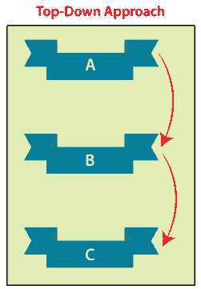
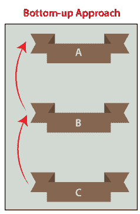
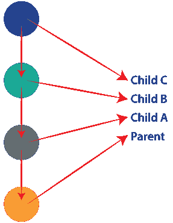
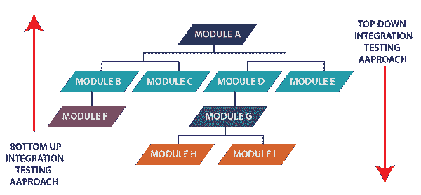
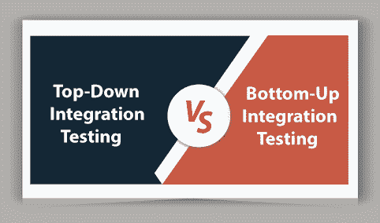

# 自顶向下和自底向上集成测试的区别

> 原文：<https://www.javatpoint.com/top-down-vs-bottom-up-integration-testing>

本节我们将讨论**自顶向下和自底向上集成测试**的区别；并查看对它们的简要介绍。

正如我们在软件测试的前面部分所理解的，每个软件或应用程序都包含通过接口彼此相反的各种模块。

当每个组件或模块独立于应用程序工作时，我们需要检查相关模块的数据流，称为 [**集成测试**](https://www.javatpoint.com/integration-testing) 。这是功能测试的一个重要部分。

在详细了解自顶向下和自底向上的集成测试方法之前，我们需要了解**增量集成测试**，因为自顶向下和自底向上的集成测试是其中不可分割的一部分。

## 增量集成测试方法

*   **增量测试**是集成测试最关键的部分。根据客户的需要，模块按升序逐一添加。并且所选择的模块需要在逻辑上相互关联。
*   通常，添加两个或更多模块并进行测试，以确定功能的精度。并且，该过程将继续，直到所有模块或组件都被成功测试。
*   简单来说，我们可以说当依赖模块之间有很强的关系时，我们会执行**增量集成测试**。

现在，让我们来看看**自顶向下和自底向上增量集成测试的定义和基本工作。**

## 什么是自顶向下集成测试？

*   在自上而下的增量集成测试中，我们将增量或逐个添加模块，并按照类似的顺序测试数据流，如下图所示:
    
*   这种测试技术处理如何用低级模块测试高级模块，直到所有模块都测试成功。
*   在自上而下的方法中，我们还将确保我们添加的模块是前一个模块的**子模块，就像子模块 C 一样，是子模块 B** 的子模块。
    T3】
*   执行自上而下的集成测试的目的是检测重大的设计缺陷，并尽早修复它们，因为需要的模块首先被测试。

## 什么是自下而上的集成测试？

我们讨论的下一个测试方法是**自下而上的集成测试**。

*   这种类型的测试方法处理如何用高级模块测试低级模块，直到所有模块都被成功测试。
*   在自底向上测试中，对顶层关键模块进行测试。因此，它可能会导致缺陷。
*   简而言之，我们可以说，我们将从底部**到顶部**添加模块，并按照类似于下图所示的顺序测试数据流:
    
*   在自下而上的方法中，我们将确保我们正在添加的模块**是上一个模块**的父模块，如下图所示:
    

## 自顶向下和自底向上增量集成测试的主要区别

下面的事实解释了**自顶向下和自底向上集成测试**之间的关键区别，这将允许测试工程师就他们想要为不同的测试过程选择哪种类型的集成测试方法做出明智的决定。

1.  **自上而下的集成测试**方法简单，不需要大量数据；另一方面，**自下而上的集成测试**方法复杂且数据密集。
2.  与自下而上的集成测试相比，自上而下的集成测试过程要简单得多。
3.  自上而下的方法是**向后看**；另一方面，自下而上的方法是**前瞻**。
4.  自上而下的集成测试通过对次要组件重要的**工作，而自下而上的方法通过小到基本组件或模块的**工作。****
5.  自上而下的方法通过收集内部操作失败的影响来分析风险，而自下而上的方法在模型的帮助下分析单个流程中的风险。
6.  在自顶向下的方法中，存根用于模拟子模块，这意味着存根作为一个暂时的替代。另一方面，在自下而上的测试方法中，驱动程序模拟主模块，这意味着驱动程序作为一个暂时的替代品工作。

## 自顶向下集成测试与自底向上集成测试

我们在下表中讨论了**自顶向下集成测试和自底向上集成测试**之间的一些重要比较:

| 没有 | 比较基础 | 自顶向下的集成测试 | 自下而上的集成测试 |
| **1。** | **定义** | 我们将逐步或逐个添加模块，并以类似的顺序测试数据流。 | 较低级别的模块用较高级别的模块进行测试，直到所有模块都测试成功。 |
| **2。** | **于**执行 | 自顶向下的集成测试方法将在面向结构或过程的编程语言上执行。 | 自下而上的集成测试方法将在面向对象的编程语言上执行。 |
| **3。** | **观察** | 在自顶向下的方法中，测试输出的观察更加复杂。 | 在自下而上的方法中，测试输出的观察更容易获得。 |
| **4。** | **风险分析** | 我们正在合作应对内部运营失败的影响。 | 为了分析单个过程，我们可以使用模型。 |
| **5。** | **在**上工作 | 自顶向下的集成测试方法将适用于主要到次要的组件。 | 自下而上的集成测试方法将适用于重要组件的矿工。 |
| **6。** | **复杂性** | 自上而下方法的复杂性很简单。 | 自下而上方法的复杂性是复杂的，并且是高度数据密集型的。 |
| **7。** | **存根/驱动程序创建** | 存根模块必须以自顶向下的测试方法创建。 | 驱动程序模块必须以自下而上的测试方法创建。 |
| **8。** | **从**开始管理 | 从主模块到子模块执行。 | 从子模块到主模块执行。 |
| **9。** | **优势** | 以下是使用自顶向下集成测试的一些显著好处:

*   In this case, early prototype is possible.
*   Fault location is easier.

 | 以下是使用自下而上集成测试的一些基本优势:

*   We don't have to wait for the development of all modules, because it can save time.
*   Defect identification is easy.

 |
| **10。** | **劣势** | 自顶向下方法的一些最常见的缺点如下:

*   The lower level module test is invalid.
*   Because of the large number of stubs, things become quite complicated.
*   Key modules are tested first, so that the probability of defects is less.

 | 自下而上方法的缺点如下:

*   The final test of the module is forced, so defects will occur.
*   There is no possibility of early prototype.

 |

## 结论

在本教程中，我们对**自顶向下和自底向上的增量集成测试进行了比较。**

在这里，我们已经得出结论，需要执行自顶向下和自底向上的方法来测试软件或应用程序。

自上而下的测试技术是最常用的**集成测试类型**。这是一种集成测试技术，用于模拟尚未集成的较低级模块。

**自下而上的测试技术**是一种增量集成测试方法，用于评估软件中的风险。执行这种方法最显著的优点是它的用户友好性，这在软件开发中提供了高部署覆盖率。

在这两种方法中，**自上而下和自下而上的集成测试**，自上而下会产生更多的冗余结果，并导致额外的开销。同样，自下而上的方法具有挑战性，但比自上而下的方法更有效。

* * *