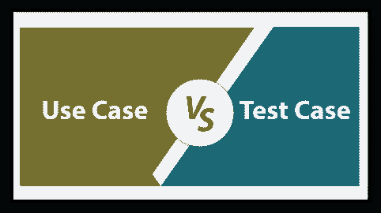

# 用例和测试用例的区别

> 原文：<https://www.javatpoint.com/use-case-vs-test-case>

在这一节中，我们将讨论**用例和测试用例**的区别；并查看对它们的简要介绍。

在[软件测试](https://www.javatpoint.com/software-testing-tutorial)领域中，术语**用例和测试用例**是最重要的，也是最密切相关的，但是又有很大的不同。

现在，让我们来看看 **[用例](https://www.javatpoint.com/use-case-technique-in-black-box-testing)和[测试用例](https://www.javatpoint.com/test-case)的定义和基本工作。**

## 什么是用例？

*   在软件测试中，用例是业务需求的图形表示，解释最终用户将如何与软件或应用合作。用例允许我们掌握最终用户如何使用应用的所有可能的技术。
*   简单来说，我们可以借助用例来表达；我们可以定义如何使用系统来执行精确的任务。
*   用例不是执行的一部分，这意味着它只是解释如何实现特定任务的文档的图形演示。
*   在用例的帮助下，我们知道了产品应该如何工作。

关于用例技术的更多信息，请参考下面的链接:[https://www . javatpoint . com/黑盒测试用例技术](https://www.javatpoint.com/use-case-technique-in-black-box-testing)。

## 什么是测试用例？

*   一个**测试用例**被定义为一组条件，在这些条件下，测试工程师断定一个软件应用是否按照客户的要求工作。
*   测试用例设计包括**前提条件、用例名称、输入条件和预期结果。**
*   这些都是从测试场景中派生出来的，是一个一级动作。
*   测试用例主要是测试工程师用来验证开发的软件是否按照需求运行。
*   一个**测试用例**被描述为一组不同的测试活动，如**测试输入、执行条件和预期结果**，它们额外导致特定测试目标的进化。
*   编写测试用例是一次性的尝试，可以在将来的回归测试中使用。

有关测试用例技术的更多信息，请参考下面的链接:[https://www.javatpoint.com/test-case](https://www.javatpoint.com/test-case)。

## 用例和测试用例的主要区别

以下事实解释了**用例和测试用例之间的主要区别。**

*   **用例**无法实现，暗示**只是设计。**另一方面，**测试用例**是**设计的，后来我们实现了。**
*   **用例**从 **BRS(业务需求规范)**获得，而**测试用例**从**用例**获得。
*   **用例**是客户需求的**图形表示，而**测试用例**不是**图解表示的**；它只记录在 excel 表格中。**
*   **用例**是一个文档，它总是描述**应用的事件流。**相比之下，**测试用例**是一个文档，它总是**包含应用特定特性的动作、事件和预期输出。**
*   **用例依赖于软件需求**；另一方面，**测试用例依赖于用例。**
*   **用例**收集需求，另一方面，**测试用例**将分析那些需求。
*   在**用例**中，**结果未通过**验证。相反，**测试用例**的结果被验证，这意味着测试用例**检查用例中显示的结果是否正常运行。**

## 用例 VS 测试用例

我们在下表中讨论了**用例和测试用例**之间的一些重要比较。

| 没有 | 比较基础 | 用例 | 判例案件 |
| **1。** | **定义** | 它是软件及其多种功能的图形表示。 | 它是一个详细文档，包含所有**可能的输入**(正和负)和用于测试执行过程的**导航步骤**。 |
| **2。** | **由**管理 | **图**管理**用例。** | **功能测试**管理**测试用例**。 |
| **3。** | **来源** | 这些是根据要求准备的。 | 这些是根据用例准备的。 |
| **4。** | **必需** | **创建用例需要文档和研究**。 | 它需要**前提条件、案例名称、输入条件和预期结果**，以便创建测试案例。 |
| **5。** | **用户** | 业务用户执行用例。 | 测试工程师执行测试用例。 |
| **6。** | **目的** | **用例**的主要目的是到达跟随所有顺序过程的最后一个操作。 | **测试用例**的目的是验证软件是否正常工作。 |
| **7。** | **完成** | 用例将一次完成所有步骤。 | 在测试案例中，为了结束这个过程，测试被一次又一次地执行。 |
| **8。** | **输出** | 在用例中，结果很重要，所有的步骤都要一起实现。 | 在测试案例中，所有步骤都很重要，可能会有不同的结果。 |
| **9。** | **迭代** | 用例支持不同的路径。 | 测试用例支持单个测试用例。 |
| **10。** | **由**设计 | **业务分析师**设计用例。 | **测试工程师**设计测试用例。 |
| **11 时。** | **与**的互动 | 用例与用户交互。 | 测试用例取决于结果。 |
| **12 时。** | **作品** | 用例是遵循软件的逐步功能能力的过程。 | 在设计测试用例时，可以遵循用例步骤。 |
| **13。** | **优势** | 在我们开发产品时，使用用例技术的一些显著优势如下:

*   Use case is a classification of steps to explain the relationship between users and their actions.
*   Used to get the functional requirements of the system.
*   It starts from a basic point of view, that is, the system is first created and mainly used by its users.
*   Used to control the complete analysis.

 | 如果我们适当地设计一个测试用例，我们将获得以下优势:

*   We can make more efficient use of organizational resources.
*   The creation of test cases ensures the development and delivery of higher quality projects.
*   It is easier and more likely to identify bugs.
*   Can strictly follow the test schedule and project budget.

 |

## 结论

在本教程中，我们已经看到了**用例和测试用例之间的主要区别。**

在软件行业中， ***用例和*** 用例互换使用，含义不同。

在看到用例和测试用例之间的所有差异后，我们可以得出结论:**用例和测试用例**在**软件开发生命周期的各个阶段都同等重要。**

用例主要用在 SDLC 的**需求和设计阶段**，引领开发向精准方向发展。另一方面，测试用例主要用在[**【SDLC】**](https://www.javatpoint.com/software-development-life-cycle)的**测试阶段**，显示精确执行，区分软件中的故障。

* * *