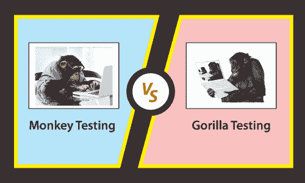

# 猴子测试 VS 大猩猩测试

> 原文：<https://www.javatpoint.com/monkey-testing-vs-gorilla-testing>

这一节我们要讨论**猴子测试和大猩猩测试**的区别；并查看对它们的简要介绍。

两种不同类型的[软件测试](https://www.javatpoint.com/software-testing-tutorial)，也就是众所周知的**猴子测试和大猩猩测试**。这些类型的测试是在市场上发布之前对一个软件进行的。

在进入猴子和大猩猩测试的区别之前，我们将简要介绍[猴子](monkey-testing)和大猩猩测试。

## 什么是猴子测试？

*   在软件测试中，我们有一些彻底的测试，Monkey 测试就是其中之一。
*   在没有任何测试用例的情况下，基于一些随机输入检查软件或应用的性能，并验证其是否崩溃，这被称为**猴子测试**。
*   它也被称为**模糊测试、随机测试和随机测试。**
*   我们不能在执行猴子测试时使用测试用例，因为它是随机测试的一种形式。
*   在这个测试中，**最终用户或测试工程师或开发人员**可以测试系统，以验证它是否完成了首选的一组动作。

## 什么是大猩猩测试？

*   另一种特殊类型的**软件测试**是**大猩猩测试。**
*   对应用的所有软件模块进行测试被称为大猩猩测试。
*   大猩猩测试也被称为**沮丧测试、折磨测试和容错测试。**
*   简而言之，我们可以说软件的每个次要代码都经过测试，直到它开始单独下降或者无法提供首选的结果。
*   为了持续测试一个模块的功能，测试工程师和开发人员在大猩猩测试中一起工作。

## 猴子测试和大猩猩测试的区别

我们在下表中讨论了猴子测试和大猩猩测试之间的一些重要比较。

| 没有 | 猴子测试 | 大猩猩测试 |
| **1。** | 在 Monkey Testing 中，没有测试用例用于测试应用，因为它是随机测试的一部分。 | 由于它是手动测试的一部分，因此会重复执行。 |
| **2。** | 猴子测试方法主要用于系统测试。 | 大猩猩测试方法主要用于单元测试。 |
| **3。** | 它是一种特殊类型的软件测试，基于特定的随机输入实现，没有任何测试用例，测试系统的性能并验证它是否失败。 | ，测试模块的功能，并验证特定模块中不存在任何错误。 |
| **4。** | 它进一步称之为模糊测试、随机测试和随机测试。 | 它进一步称之为容错测试、折磨测试和令人沮丧的测试。 |
| **5。** | 猴子测试是在整个系统上实现的。 | 大猩猩测试是在系统的少数选择性组件上实现的。 |
| **6。** | 最终用户、测试工程师和开发人员可以执行 Monkey Testing，以便测试系统并验证它是否执行了所需的一组活动。 | 通常，大猩猩测试由测试工程师和开发人员一起或分别执行，以便反复检查组件的特性。 |
| **7。** | 执行猴子测试不需要软件知识。 | 执行大猩猩测试需要最低限度的软件知识。 |
| **8。** | 执行猴子测试的基本目的是测试系统是否崩溃。 | 执行大猩猩测试的基本目的是验证组件或模块是否正常工作。 |
| **9。** | 一旦猴子测试被执行，它就抑制了系统故障。 | 另一方面，大猩猩测试的执行检查单个模块特性的能力。 |
| **10。** | 猴子测试分为三种类型的测试，即哑巴猴子测试、聪明猴子测试和聪明猴子测试。 | 与猴子测试相比，大猩猩测试没有分为不同类型的测试。 |
| **11 时。** | Monkey 测试的实施不需要任何计划或准备。 | 没有任何准备或计划，大猩猩测试无法实施。 |

## 结论

在上面的文章中，我们已经讨论了**猴子测试和大猩猩测试之间的关键区别。**

在看到所有的本质区别之后，我们可以得出结论，这两个测试是相同的，因为重点是随机测试一个给定的被测软件。

因此，所有可能的区域都是在与需求规格相矛盾的情况下进行测试的。

猴子**和大猩猩**的测试方法都是以行动为中心的软件测试策略，目的是破坏应用或被测软件。

此外，我们可以说猴子测试和大猩猩测试都是其他严格和精确的测试程序。

* * *