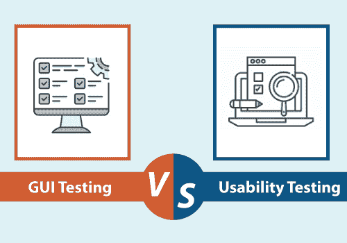

# 图形用户界面测试和可用性测试的区别

> 原文：<https://www.javatpoint.com/gui-testing-vs-usability-testing>

在本文中，我们将基于各种参数讨论 **GUI 测试和**可用性测试的区别。

在进入 **GUI 测试和可用性测试**的区别之前，我们先简单介绍一下 **GUI 测试和可用性测试**。

## 什么是图形用户界面测试？

它是一种独特的[类型的软件测试](https://www.javatpoint.com/types-of-software-testing)，主要用于测试/检查应用或软件的图形用户界面。

图形用户界面测试的主要目标是确保软件或应用的功能按照给定的要求/规范运行。

在图形用户界面测试中，规范可以被指定为检查屏幕和各种控件，如窗口、菜单、点击按钮、图标、滚动条和对话框等。

换句话说，我们可以说 [**图形用户界面**测试](gui-testing)本质上允许用户和软件产品之间的一致通信。

## 什么是可用性测试？

可用性测试也是属于**黑盒测试**的**非功能测试**的特殊测试技术之一。

可用性测试用于测试软件或产品的最终用户沟通中的缺陷。它确保开发的软件在使用系统时简单明了，不会遇到任何问题，并使最终用户的生活更加轻松。

简而言之，我们可以说检查**应用的用户友好性、效率和准确性**被称为**可用性测试**。

执行可用性测试的主要目标是测试应用对于想要使用它的最终用户来说应该是易于使用的，同时维持客户指定的功能和业务需求。

基本上，可用性测试从用户的角度评估软件的完全可行性。

关于可用性测试的更多信息，请参考以下链接:[https://www.javatpoint.com/usability-testing](https://www.javatpoint.com/usability-testing)。

## 图形用户界面测试与可用性测试

让我们根据下面的比较基准表来理解图形用户界面测试和可用性测试之间的区别:

| S.NO | 比较基础 | 图形用户界面测试 | 可用性测试 |
| **1。** | **定义** | 用于验证创建产品设计的功能属性是否按照**用户的前景**工作。 | 它用于从最终用户的角度测试产品的简单性和可用性。 |
| **2。** | **强调** | 图形用户界面测试强调应用的外观和感觉，并涉及软件的界面部分。 | 另一方面，可用性测试强调应用的用户友好性和产品质量。 |
| **3。** | **测试** | 通常，在图形用户界面测试中，不测试应用的功能。 | 而在可用性测试中，测试应用的功能是为了验证它是否对用户友好。 |
| **4。** | **验证** | 在图形用户界面测试中，我们验证产品的设计规范。 | 可用性测试测试用户界面的创建是否已经被很好地创建并且是用户友好的。 |
| **5。** | **目标** | 当开发人员瞄准像**残疾人**这样的精确用户群时，图形用户界面测试是必不可少的。 | 另一方面，在为独特的用户群开发应用时，可用性测试并没有什么好处。 |
| **6。** | **确保** | 图形用户界面测试的执行通过满足给定的用户需求和标准来确保应用的外观和感觉。 | 而可用性测试的执行确保了用户在使用任何应用时都不会感到舒适。 |
| **7。** | **确定** | 图形用户界面测试用于确定任何应用的**前端部分。** | 可用性测试决定了软件的**用户友好界面**以及**整体功能**的程度。 |
| **8。** | **平台依赖** | 图形用户界面测试在多个平台上实现，以确保应用的完美外观。 | 可用性测试测试应用的难度。 |
| **9。** | **重要性** | 与可用性测试相比，它是有益的，但不那么重要。 | 与图形用户界面测试相比，可用性测试的重要性更大。 |
| **10。** | **系统流程** | 图形用户界面测试没有触及产品的系统流程。 | 在这种情况下，产品内不同模块之间的系统流程得到测试。 |
| **11 时。** | **优势** | 我们在执行图形用户界面测试后收到的输出有助于我们吸引更多的重要用户，因为它的吸引力增强了。 | 另一方面，通过实现可用性测试获得输出也将有利于在市场上吸引更多的用户。 |
| **12 时。** | **覆盖范围** | 图形用户界面测试涵盖了应用的外观和开发。 | 另一方面，可用性测试涵盖了产品的特性和功能。 |
| **13。** | **例** | 图形用户界面测试测试所有对象，如**图标的大小，设置字体、对话框、对比度、**属性的正确组合，如果它们在整个屏幕上适当显示的话。 | 可用性测试特别用于**为用户测试文本输入框。**可用性测试的另一个例子是**滚动条，**，它可以轻松导航网站页面。 |

## 结论

在看到图形用户界面测试和可用性测试之间的所有显著差异后，我们可以得出结论，图形用户界面测试和可用性测试的执行都可以测试一些关键的软件功能，例如**应用的用户友好性、效率和准确性。**

**图形用户界面测试和可用性测试**将帮助测试团队采取必要的程序来提高**软件产品的性能、质量、用户友好性、功能性**和其他重要要素。

最后，我们可以说，如果不执行 **GUI 测试和可用性测试**技术，开发和测试可能无法交付高质量的软件或应用。

* * *