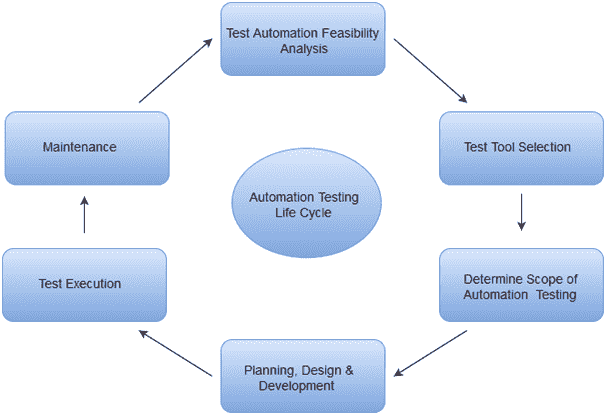
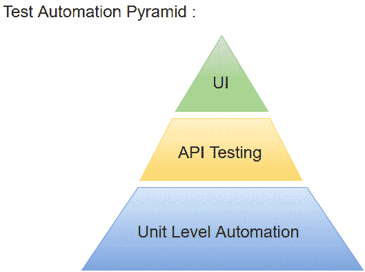

# Selenium基本术语

> 原文：<https://www.javatpoint.com/selenium-basic-terminology>

在继续学习本教程之前，让我们先了解一些与应用自动化测试相关的关键概念。

随着对高效软件产品需求的不断增长，每个软件开发团队都需要在将最终产品推向市场之前进行一系列测试。测试工程师努力在软件产品发布之前发现错误或 bug，然而交付的软件总是有缺陷的。即使有最好的手动测试过程，最终的软件产品仍然有可能存在缺陷或者不能满足最终用户的需求。自动化测试是提高软件测试的有效性、效率和覆盖面的最佳方式。

## 自动化测试

自动化测试使用专门的工具来自动执行手动设计的测试用例，而无需任何人工干预。自动化测试工具可以访问测试数据，控制测试的执行，并将实际结果与预期结果进行比较。因此，生成被测系统的详细测试报告。

自动化测试涵盖了应用的功能和性能测试。

*   功能自动化用于功能测试用例的自动化。例如，本质上是重复的回归测试是自动化的。
*   性能自动化用于非功能性性能测试用例的自动化。例如，在相当大的负载(比如 100 个用户)下测量应用的响应时间。

用于功能自动化的自动化测试工具:

*   快速测试专业版，由惠普提供。
*   理性机器人，由 IBM 提供。
*   编码 UI，微软提供。
*   Selenium，开源。
*   自动信息技术，开源。

用于非功能自动化的自动化测试工具:

*   负载转轮，由惠普提供。
*   JMeter，由 Apache 提供。
*   Burp 套件，由 PortSwigger 提供。
*   Acunetix，由 Acunetix 提供。

## 自动化测试生命周期

## 为什么是自动化测试

自动化测试对于提高任何软件的长期效率都有特定的优势。测试自动化的主要好处是:

*   自动化测试长期以来被认为对大型软件组织是有益的。虽然，它通常被认为太昂贵或对较小的公司来说难以实施。
*   自动化测试工具可以被编程为在特定时间构建和执行测试脚本，而无需任何人工干预。例如，自动化测试可以在一夜之间自动开始，测试人员可以在第二天早上分析自动化测试的结果。
*   自动化测试工具能够回放预先录制和预先定义的动作。
*   自动化测试支持频繁的回归测试。
*   它向开发人员提供快速反馈。
*   它提供了测试用例执行的无限迭代。
*   它提供了测试用例的规范文档。
*   自动化测试生成定制的缺陷报告。
*   与手动测试相比，不容易出错。

## 网络应用的测试自动化

如果我们看一下当前市场场景中流行的软件应用类型，大多数软件应用都是作为基于 web 的应用编写的，可以在互联网浏览器中运行。基于网络的应用的测试策略在公司和组织之间有很大的不同。在一个高度交互和响应的软件过程时代，许多组织都在使用某种形式的敏捷方法，测试自动化经常成为软件项目的需求。

实现 web 应用测试自动化的最有效方式是采用金字塔测试策略。这个金字塔测试策略包括三个不同级别的自动化测试。单元测试代表了这个测试自动化金字塔的基础和最大的百分比。接下来是服务层，或者说 API 测试。最后，图形用户界面测试位于顶部。金字塔看起来像这样:

