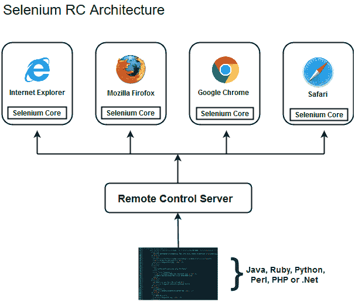

# Selenium工具套件

> 原文：<https://www.javatpoint.com/selenium-tool-suite>

Selenium 不仅仅是一个单一的工具，而是一套软件，每个软件都有不同的方法来支持自动化测试。它由四个主要部分组成，包括:

1.  SeleniumIDE
2.  Selenium遥控器(现已弃用)
3.  web 驱动程序
4.  Selenium网格

### 1.SeleniumIDE

Selenium IDE 是作为火狐扩展实现的，它在测试脚本上提供记录和回放功能。它允许测试人员以多种语言导出记录的脚本，如 HTML、Java、Ruby、RSpec、Python、C#、JUnit 和 TestNG。您可以在Selenium RC 或WebDriver中使用这些导出的脚本。

> Selenium IDE 的范围有限，生成的测试脚本不是很健壮和可移植。

### 2.Selenium遥控器

selenium RC(selenium 正式弃用)允许测试人员用任何支持的编程语言编写自动化的 web 应用 UI 测试。它还包括一个 HTTP 代理服务器，使浏览器能够相信正在测试的 web 应用来自代理服务器提供的域。

Selenium RC 有两个组件。

1.  Selenium钢筋混凝土服务器(作为网页请求的 HTTP 代理)。

2.  Selenium RC 客户端(包含您的编程语言代码的库)。

下图显示了 Selenium RC 的架构表示。

Selenium RC 被认为在持续集成系统下测试复杂的基于 AJAX 的网络用户界面非常有效。

### 3.Selenium WebDriver

Selenium WebDriver (Selenium 2)是 Selenium RC 的继承者，也是迄今为止 Selenium Suite 最重要的组件。Selenium WebDriverprovides 提供一个编程接口来创建和执行测试用例。编写测试脚本是为了识别网页上的 web 元素，然后对这些元素执行所需的操作。

与 Selenium RC 相比，Selenium WebDriver 的执行速度要快得多，因为它可以直接调用网络浏览器。另一方面，RC 需要一个 RC 服务器来与网络浏览器交互。

因为，WebDriver直接调用不同浏览器的方法，所以我们对每个浏览器都有单独的驱动程序。一些最广泛使用的WebDriver包括:

*   Mozilla 火狐驱动(壁虎驱动)
*   谷歌 Chrome 驱动
*   Internet Explorer 驱动程序
*   歌剧司机
*   狩猎驱动程序
*   HTML 单元驱动程序(一种特殊的无头驱动程序)

#### 注意:Selenium 版本 2 将 Selenium RC 和 Selenium WebDriver 的最佳特性合并到 Selenium WebDriver 中。最新版本的 Selenium 3 具有新的附加特性和功能

### 4.Selenium网格

Selenium Grid 也是 Selenium Suite 的一个重要组件，它允许我们在不同的机器上针对不同的浏览器并行运行我们的测试。简单地说，我们可以在运行不同浏览器和操作系统的不同机器上同时运行我们的测试。

Selenium网格遵循**中枢节点架构**实现测试脚本的并行执行。集线器被认为是网络的主人，另一个将是节点。Hub 控制测试脚本在网络不同节点上的执行。