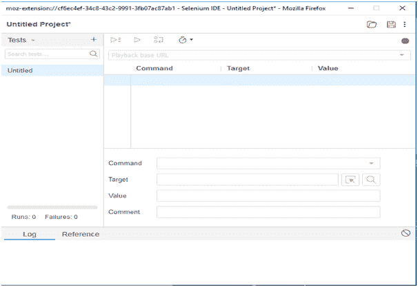

# SeleniumIDE

> 原文：<https://www.javatpoint.com/selenium-ide>

Selenium IDE(IDE)是 Selenium 套件下的一个开源 web 自动化测试工具。与 Selenium WebDriver 和 RC 不同，它不需要任何编程逻辑来编写测试脚本，相反，您可以简单地记录您与浏览器的交互来创建测试用例。随后，您可以使用回放选项来重新运行测试用例。

也许，在 Selenium IDE 上创建测试用例不需要任何编程语言，但是当您开始使用像 **runScript** 这样的 selenize 命令时，JavaScript 之前的一点知识将证明对您更清楚地理解概念是有益的。您也可以参考我们在以下网址下提供的 JavaScript 教程:

[https://www.javatpoint.com/javascript-tutorial](https://www.javatpoint.com/javascript-tutorial)

#### 注意:Selenium IDE 仅作为 Mozilla Firefox 和 Chrome 插件提供，这意味着您不能在 Firefox 和 Chrome 以外的浏览器上记录您的测试用例。记录的测试脚本也可以导出为编程语言，如 C#、Java、Ruby 或 Python。

下图显示了SeleniumIDE的默认界面:

