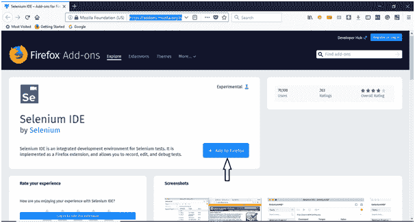
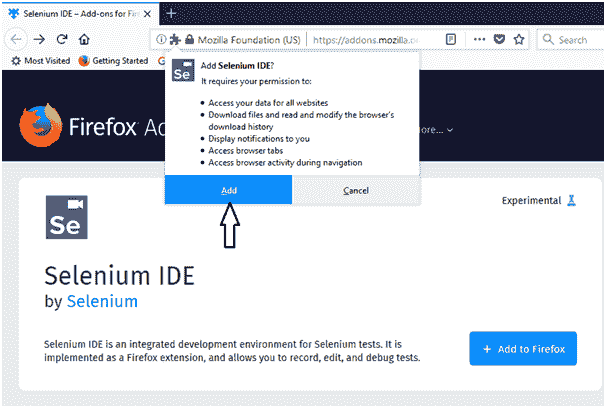
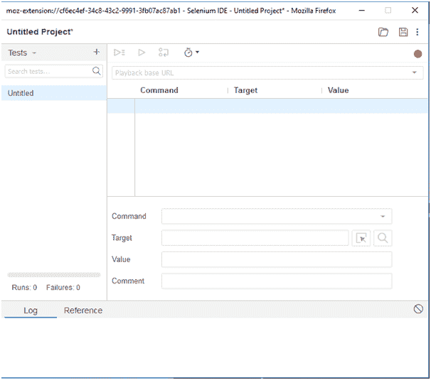

# SeleniumIDE-安装

> 原文：<https://www.javatpoint.com/selenium-ide-installation>

由于 Selenium IDE 仅作为火狐和 Chrome 插件提供，我们假设您已经在系统中安装了 Mozilla 火狐浏览器。但是，您可以通过他们的官方网站下载火狐的最新版本，该网站在下面给出的链接下提供。

[https://www.mozilla.org/en-US/firefox/new/](https://www.mozilla.org/en-US/firefox/new/)

## SeleniumIDE 下载和安装

*   启动 Mozilla Firefox 浏览器。
*   打开网址[https://addons . Mozilla . org/en-us/firefox/addon/selenium-ide/](https://addons.mozilla.org/en-us/firefox/addon/selenium-ide/)它会将你重定向到 Firefox 的官方插件页面。
*   点击“添加到火狐”按钮。

*   将出现一个弹出对话框，要求您将 SeleniumIDE 作为扩展添加到火狐浏览器中。
*   点击“添加”按钮。

*   重启你的火狐浏览器。
*   转到火狐浏览器的右上角，寻找 SeleniumIDE 图标。

*   单击该图标启动 SeleniumIDE。

