# SeleniumIDE-特点

> 原文：<https://www.javatpoint.com/selenium-ide-features>

SeleniumIDE分为不同的组件，每个组件都有自己的特点和功能。我们对SeleniumIDE的七个不同组件进行了分类，包括:

1.  酒吧菜单
2.  刀杆
3.  地址栏
4.  测试用例窗格
5.  测试脚本编辑器框
6.  开始/停止录制按钮
7.  日志，参考窗格

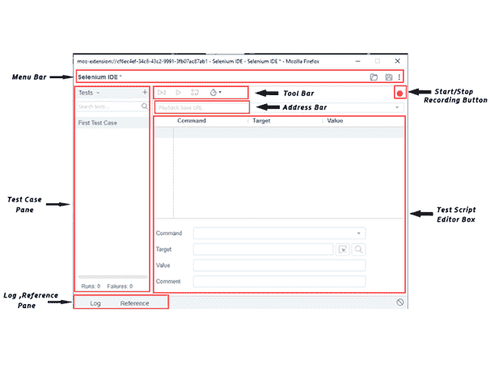

#### 现在，我们将详细了解每个组件的特性和功能。

### 1.酒吧菜单

菜单栏位于SeleniumIDE界面的最顶部。菜单栏最常用的模块包括:

*   项目名称
    它允许你重命名你的整个项目。

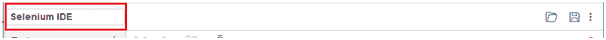

*   打开项目
    它允许你从你的个人驱动器加载任何现有的项目。

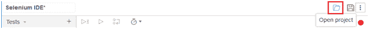

*   保存项目
    它允许您保存当前正在处理的整个项目。

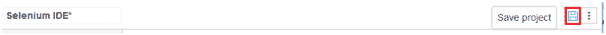

### 2.工具栏

工具栏包含用于控制测试用例执行的模块。此外，它还为您提供了调试测试用例的分步功能。工具栏菜单最常用的模块包括:

*   速度控制选项
    它允许你控制测试用例的执行速度。

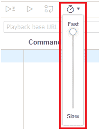

*   Step Feature
    它允许您通过一次运行一个命令来“单步执行”测试用例。用于调试测试用例。

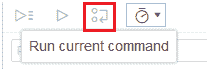

*   运行测试
    它允许您运行当前选择的测试。当只加载一个测试时，“运行测试”按钮和“全部运行”按钮具有相同的效果。

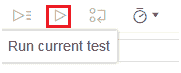

*   全部运行
    它允许你在加载一个包含多个测试用例的测试套件时运行整个测试套件。

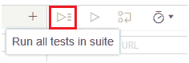

### 3.地址栏

该模块为您提供了一个下拉菜单，可以记住所有以前的基本网址值。简单地说，基本网址地址栏记住了以前访问过的网站，这样以后导航就变得容易了。

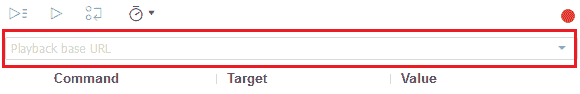

### 4.测试用例窗格

这个模块包含了 IDE 记录的所有测试用例。简单地说，它在测试用例窗格下同时提供了所有记录的测试用例的列表，这样用户就可以轻松地在测试用例之间切换。

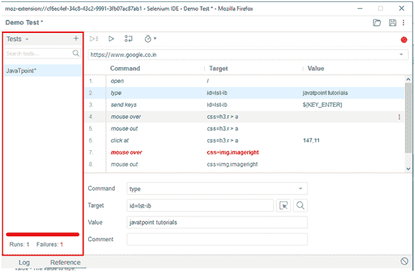

在测试用例窗格的底部，您可以看到测试执行结果摘要，其中包括各种测试用例的通过/失败状态。

测试用例窗格还包括像导航面板这样的功能，它允许用户在测试用例和测试套件之间导航。

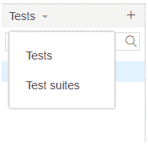

### 5.测试脚本编辑器框

测试脚本编辑器框显示IDE记录的所有测试脚本和用户交互。每个用户交互都以相同的执行顺序显示。编辑器框分为三列:命令、目标和值。

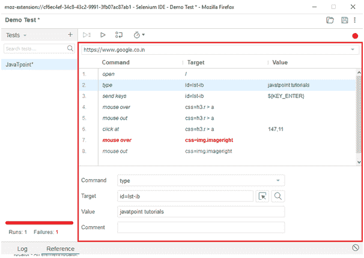

*   命令:
    命令可以认为是在浏览器元素上执行的实际操作/动作。例如，如果您正在打开一个新的网址，命令将是“打开”；如果您正在点击网页上的链接或按钮，则该命令将被“点击”。

*   目标:
    目标指定必须对其执行操作的网络元素以及定位器属性。例如，如果您正在点击一个名为“JavaPoint”的按钮，那么目标链接将是“JavaPoint”。

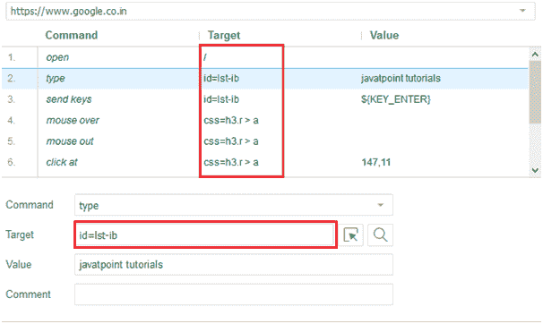

*   Value:
    Value 被视为可选字段，当我们需要发送一些实际参数时可以使用。例如，如果您在文本框中输入电子邮件地址或密码，则该值将包含实际的凭据。

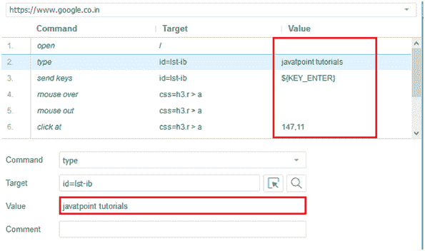

### 6.开始/停止录制按钮

记录按钮记录浏览器的所有用户操作。

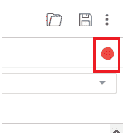

### 7.日志，参考窗格

日志窗格显示执行期间的运行时消息。它提供由IDE执行的动作的实时更新。它可以分为四种类型:信息，错误，调试和警告。

参考窗格在编辑器中显示当前选定的 selenese 命令的完整细节。

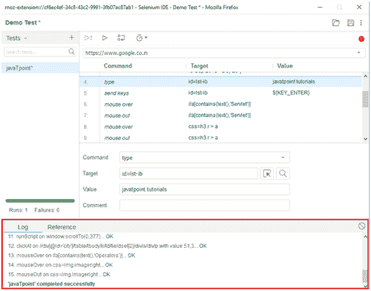
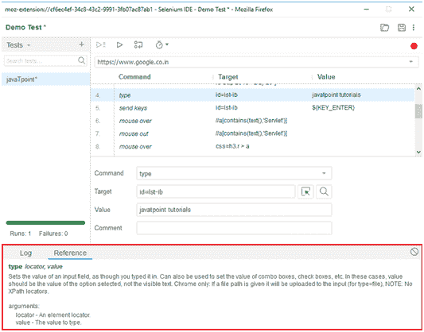