# SeleniumIDE-第一个测试案例

> 原文：<https://www.javatpoint.com/selenium-ide-first-test-case>

在本节中，您将学习如何在 Selenium ide 中创建基本测试用例。

Selenium IDE 中的整个测试脚本创建过程可以分为三个步骤:

1.  记录(记录用户与浏览器的交互)
2.  回放(执行录制的脚本)
3.  保存测试套件

现在，我们将看到上述三个步骤的实现。

### 1.录音

*   启动 Firefox 浏览器。
*   点击浏览器右上角的Selenium图标。

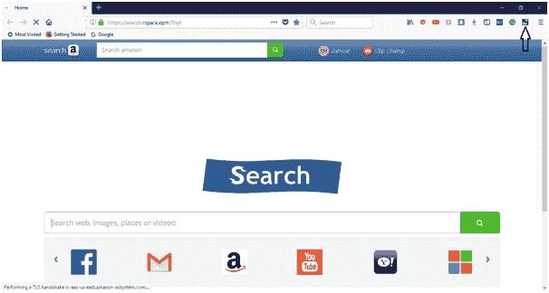

*   它将启动SeleniumIDE的默认界面。

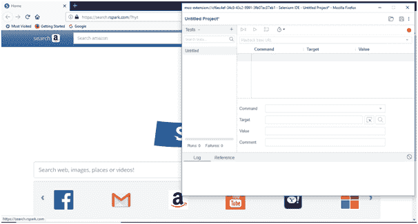

*   将项目重命名为“演示测试”。
*   将测试用例重命名为“javaTpoint _ test”。

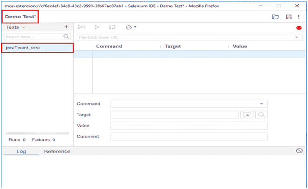

*   单击IDE右上角的“开始记录”按钮，开始记录测试用例。

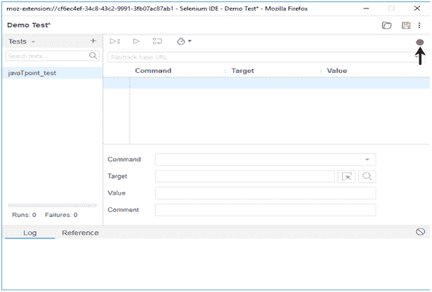

*   进入你的火狐浏览器，打开网址:[www.google.com](www.google.com)
*   它会将你重定向到谷歌搜索引擎页面。
*   在谷歌搜索框中输入“Java 教程”。

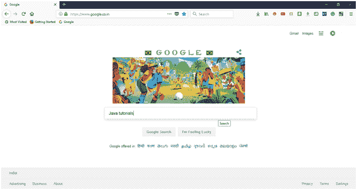

*   点击回车获取搜索结果。
*   点击网址[https://www.javatpoint.com/java-tutorial](https://www.javatpoint.com/java-tutorial)下提供的链接“Java 教程”

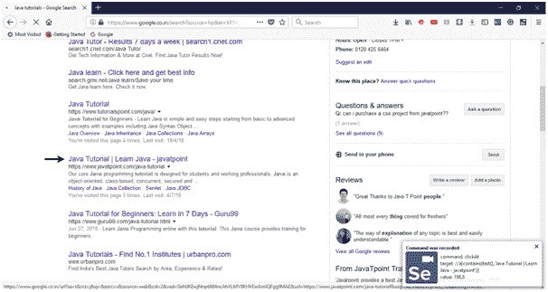

*   它会将您重定向到 javaTpoint 的 Java 教程网页。与此同时，您将在网络浏览器的最右边获得由IDE执行的操作的通知。
*   现在，进入IDE，点击“停止录制”按钮，停止进一步录制您的动作。

*   测试编辑器框现在包含您与浏览器的所有交互的列表。

现在，我们将进行下一步，包括执行记录的脚本。

## 2.回放

*   单击IDE工具栏菜单上的“运行当前测试”按钮。
    它将执行您与浏览器的所有交互，并为您提供已执行测试脚本的总体摘要。

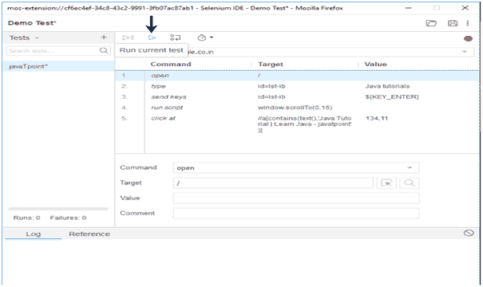

*   “日志”窗格显示已执行测试脚本的总体摘要。

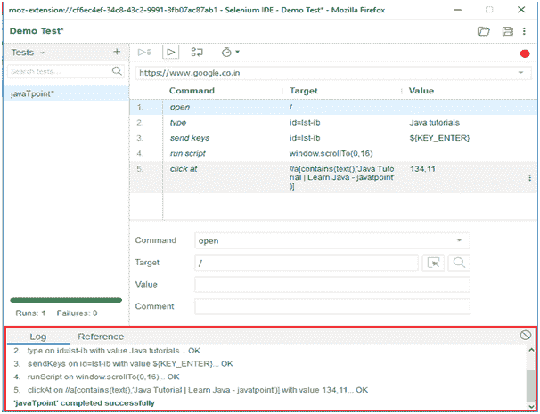

## 3.保存测试套件

*   点击菜单栏最右边的保存按钮。

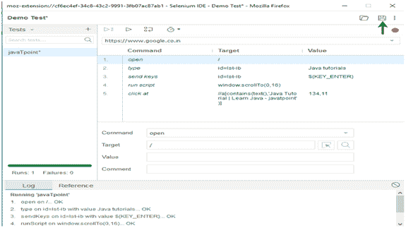

*   将整个测试套件保存为“演示测试”。

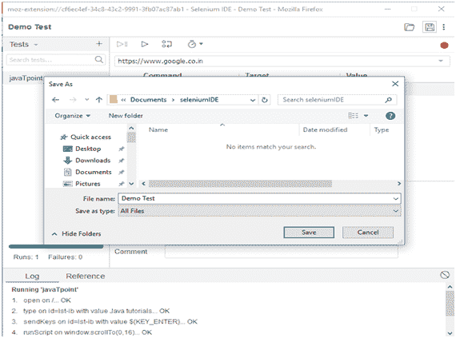

*   测试套件可以在上述步骤中提供的位置找到。请注意，测试脚本保存在。侧面格式。

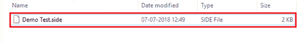