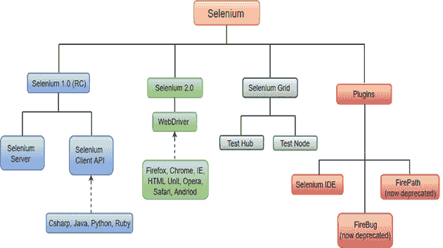
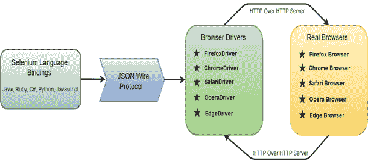
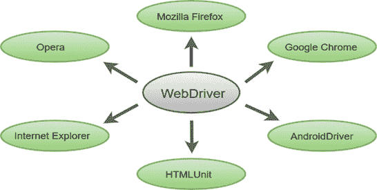
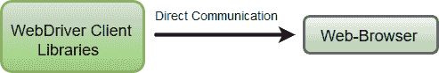
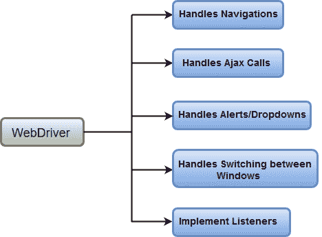

# Selenium WebDriver

> 原文：<https://www.javatpoint.com/selenium-webdriver>

Selenium WebDriver是Selenium工具套件最重要的组成部分。最新版本“Selenium 2.0”集成了 WebDriver API，提供了更简单、更简洁的编程界面。

下图将让您对 Selenium 组件和测试自动化工具有一个大致的了解。

Selenium WebDriver 最初是作为 Selenium 2.0 的一部分推出的。Selenium 的初始版本，即 Selenium v1 仅由 IDE、RC 和 Grid 组成。但是，随着 Selenium v3 的发布，RC 已被弃用，并被转移到旧版包中。

在WebDriver中，测试脚本可以使用任何支持的编程语言来开发，并且可以直接在大多数现代网络浏览器中运行。WebDriver 支持的语言包括 C#、Java、Perl、PHP、Python 和 Ruby。

在学习 Selenium WebDriver的概念之前，您应该精通任何支持的编程语言。目前，Selenium Web 驱动程序最受 Java 和 C#的欢迎。在本教程中，我们将 Selenium 与 java 一起使用。您可以参考下面给出的链接来学习 Java 和 C#的基本和高级概念:

Java 教程:[https://www.javatpoint.com/java-tutorial](https://www.javatpoint.com/java-tutorial)

C#教程:[https://www.javatpoint.com/c-sharp-tutorial](https://www.javatpoint.com/c-sharp-tutorial )

与 Selenium RC 相比，Selenium WebDriver 的执行速度要快得多，因为它可以直接调用网络浏览器。另一方面，RC 需要一个 RC 服务器来与浏览器交互。

WebDriver 内置了火狐驱动程序(Gecko Driver)的实现。对于其他浏览器，您需要插入其浏览器特定的驱动程序来进行通信和运行测试。最常用的WebDriver包括:

*   谷歌 Chrome 驱动
*   Internet Explorer 驱动程序
*   歌剧司机
*   狩猎驱动程序
*   HTML 单元驱动程序(一种特殊的无头驱动程序)

## Selenium WebDriver-架构

Selenium WebDriver接口提供了语言和浏览器之间的通信工具。

下图显示了 Selenium WebDriver的架构表示。

WebDriver架构有四个基本组件:

*   Selenium语言绑定
*   有线协议
*   浏览器驱动程序
*   真实浏览器

### Selenium语言绑定/Selenium客户端库

Selenium开发人员已经建立了语言绑定/Selenium客户端库，以支持多种语言。例如，如果您想在 java 中使用浏览器驱动程序，请使用 java 绑定。所有支持的语言绑定都可以从 Selenium 官网[(https://www.seleniumhq.org/download/#client-drivers)](https://www.seleniumhq.org/download/#client-drivers)下载。

### 有线协议

JSON 是一个在网络上交换数据的开放标准。它支持像对象和数组这样的数据结构。所以，从 JSON 中读写数据很容易。要了解更多关于 JSON 的信息，请访问[https://www.javatpoint.com/json-tutorial](https://www.javatpoint.com/json-tutorial)

JSON Wire 协议提供了一种在服务器和客户端之间传输数据的传输机制。JSON Wire 协议作为各种 REST 网络服务的行业标准。要了解更多关于网络服务的信息，请访问[https://www.javatpoint.com/web-services-tutorial](https://www.javatpoint.com/web-services-tutorial)

### 浏览器驱动程序

Selenium 使用特定于每个浏览器的驱动程序，以便在不泄露浏览器功能内部逻辑的情况下与浏览器建立安全连接。浏览器驱动程序也特定于用于自动化的语言，如 Java、C#等。

当我们使用 WebDriver 执行测试脚本时，以下操作在内部执行。

*   为每个 Selenium 命令生成一个 HTTP 请求并将其发送给浏览器驱动程序。
*   驱动程序通过 HTTP 服务器接收 HTTP 请求。
*   HTTP 服务器决定执行在浏览器上执行的指令的所有步骤。
*   执行状态被发送回 HTTP 服务器，该服务器随后被发送回自动化脚本。

### 浏览器

Selenium WebDriver支持的浏览器:

*   微软公司出品的 web 浏览器
*   Mozilla Firefox
*   谷歌 Chrome
*   旅行队

## Selenium WebDriver-功能

Selenium WebDriver的一些最重要的特性是:

*   **多浏览器支持** : Selenium WebDriver 支持多种多样的网页浏览器，如 Firefox、Chrome、Internet Explorer、Opera 等。它还支持一些非常规或罕见的浏览器，如 HTMLUnit。

*   **支持多种语言** : WebDriver 还支持 Java、C#、JavaScript、PHP、Ruby、Pearl、Python 等大多数常用的编程语言。因此，用户可以基于他/她的能力选择任何一种支持的编程语言，并开始构建测试脚本。
*   **速度**:与 Selenium Suite 的其他工具相比，WebDriver 的性能更快。与 RC 不同，它不需要任何中间服务器与浏览器通信；相反，该工具直接与浏览器通信。

*   **简单命令**:Selenium WebDriver 中使用的大多数命令都很容易实现。例如，要在WebDriver中启动浏览器，可以使用以下命令:
    **WebDriver** = **新火狐驱动程序()；**(火狐浏览器)
    **WebDriver 驱动** = **新增 chrome driver()；** (Chrome 浏览器)
    **WebDriver 驱动程序** = **新增 InternetExplorerDriver()；**(互联网浏览器)
*   **WebDriver-方法和类** : WebDriver 提供了多种解决方案来应对自动化测试中的一些潜在挑战。
    WebDriver 还允许测试人员通过动态查找器处理复杂类型的 web 元素，如复选框、下拉列表和警报。

* * *

## Selenium WebDriver教程索引

* * *

**Selenium WebDriver教程**

*   [Selenium WebDriver教程](selenium-webdriver)
*   [webriver vs RC](selenium-webdriver-vs-selenium-rc)
*   [webriver 安装](selenium-webdriver-installation)
*   [WebDriver第一测试用例](selenium-webdriver-first-test-case)
*   [WebDriver命令](selenium-webdriver-commands)
*   [镀铬运行测试](selenium-webdriver-running-test-on-chrome-browser)
*   [火狐上运行测试](selenium-webdriver-running-test-on-firefox-browser-gecko-driver)
*   [IE 上的运行测试](selenium-webdriver-running-test-on-ie-browser)
*   [在 Safari 上运行测试](selenium-webdriver-running-test-on-safari-browser)

*   [定位策略](selenium-webdriver-locating-strategies)
*   [按标识定位策略](selenium-webdriver-locating-strategies-by-id)
*   [按名称定位策略](selenium-webdriver-locating-strategies-by-name)
*   [按类名定位策略](selenium-webdriver-locating-strategies-by-class-name)
*   [通过标签名称定位策略](selenium-webdriver-locating-strategies-by-tag-name)
*   [通过链接文本定位策略](selenium-webdriver-locating-strategies-by-link-text)
*   [通过部分链接文本定位策略](selenium-webdriver-locating-strategies-by-partial-link-text)
*   [CSS 定位策略](selenium-webdriver-locating-strategies-by-css)
*   [通过 XPath 定位策略](selenium-webdriver-locating-strategies-by-xpath)
*   [处理下拉菜单](selenium-webdriver-handling-drop-downs)

*   [WebDriver-拖放](selenium-webdriver-drag-and-drop)
*   [WebDriver-处理警报](selenium-webdriver-handling-alerts)
*   [滚动网页](selenium-webdriver-scrolling-web-page)
*   [WebDriver-浏览器命令](selenium-webdriver-browser-commands)
*   [WebDriver-导航命令](selenium-webdriver-navigation-commands)
*   [WebDriver-网络元素命令](selenium-webdriver-webelement-commands)
*   [操作单选按钮](selenium-webdriver-handling-radio-buttons)
*   [处理复选框](selenium-webdriver-handling-checkbox)
*   [Selenium断言](selenium-assertions)
*   [Selenium栅](selenium-grid)

* * *