# 硒网络驱动程序-安装

> 原文：<https://www.javatpoint.com/selenium-webdriver-installation>

Selenium WebDriver 安装过程分四个基本步骤完成:

1.  下载并安装 Java 8 或更高版本。
2.  下载并配置 Eclipse 或您选择的任何 Java IDE。
3.  下载硒网络驱动 Java 客户端
4.  配置硒网络驱动程序

## 1.下载并安装 Java

我们假设您已经在机器上安装了 Java 8 或更高版本，并成功配置了运行和编译 Java 程序所需的环境变量。

#### 注意:您需要安装 Java 8 才能使用 Selenium 3。

但是，您可以从下面给出的链接下载最新版本的 Java 开发工具包(JDK)。

[http://www . Oracle . com/tech network/Java/javase/downloads/index . html](http://www.oracle.com/technetwork/java/javase/downloads/index.html)

一旦下载并安装了最新版本的 Java，就需要在系统中设置路径或配置环境变量。参考下面给出的链接，了解我们如何在 Java 中设置路径和配置环境变量。

[https://www.javatpoint.com/how-to-set-path-in-java](https://www.javatpoint.com/how-to-set-path-in-java)

## 2.下载并配置 Eclipse IDE

*   打开网址:[https://www.eclipse.org/downloads/。](https://www.eclipse.org/downloads/)
*   点击“下载包”链接(您也可以直接从 Eclipse 官方网站的“下载页面”下载 IDE，但我们将建议您浏览下载包部分，并获得“面向 Java 开发人员的 Eclipse IDE”)。

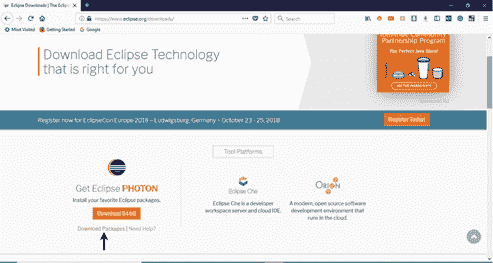

*   它会将您重定向到“下载软件包”部分。向下滚动网页，点击“面向 Java 开发人员的 Eclipse IDE”。

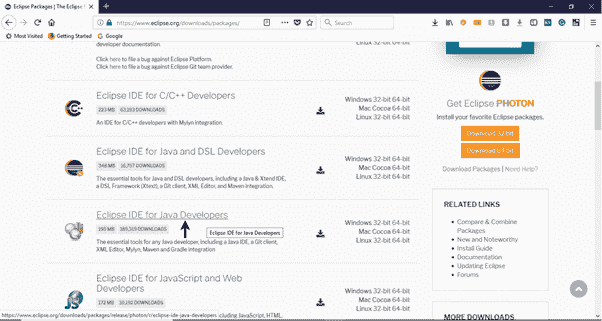

*   转到下载链接部分，并点击“视窗 64 位”。您还可以根据当前使用的操作系统选择其他选项进行下载。

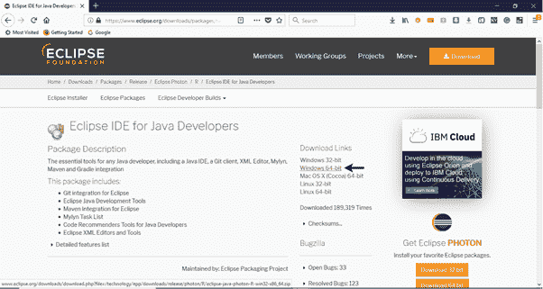

*   下载的文件将是压缩格式。将内容解压到一个方便的目录中。

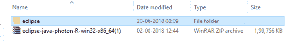

*   双击“eclipse”(。exe 文件)。

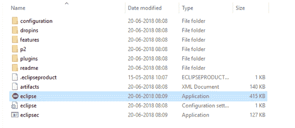

*   要配置工作区，请选择一个方便的目录来保存您所有的硒轨迹，然后单击启动按钮。

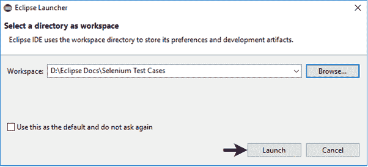

*   它将启动 Eclipse IDE 的默认界面。

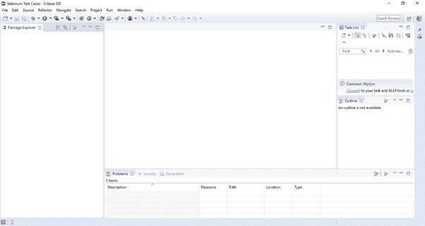

## 3.下载硒网络驱动 Java 客户端

*   打开网址:[https://docs.seleniumhq.org/download/](https://docs.seleniumhq.org/download/)
    它会把你重定向到 Selenium 官网的“下载页面”。
*   向下滚动浏览网页，找到**硒客户端&网络驱动程序语言绑定**。
*   点击 Java 客户端驱动程序的“下载”链接，如下图所示。

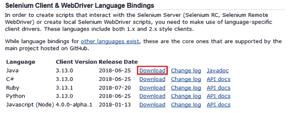

*   下载的文件将采用压缩格式。将内容解压到一个方便的目录中。它包含在 Eclipse IDE 中配置 Selenium WebDriver 所需的基本 jar 文件。

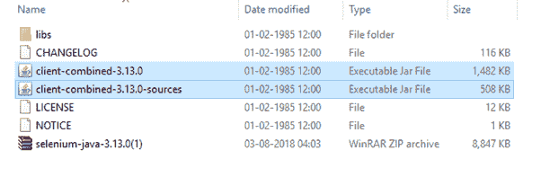

## 4.配置硒网络驱动程序

现在我们将使用硒网络驱动程序配置我们的 Eclipse 集成开发环境。简单来说，我们将在 Eclipse 中创建一个新的 Java 项目，并加载所有必要的 jar 文件，以便创建 Selenium 测试脚本。

*   启动 Eclipse 集成开发环境
*   从**文件>新建> Java 项目**新建一个 Java 项目。

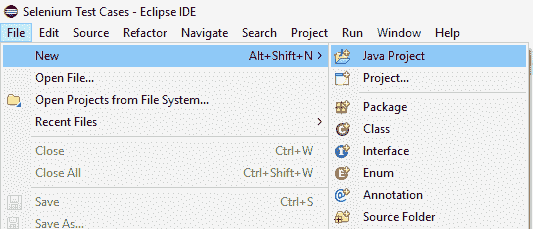

*   将您的项目名称命名为“演示 _ 测试”，保持其他字段不变，然后单击“完成”按钮。
*   它将使用以下目录创建一个新的 Java 项目。

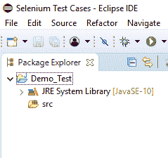

#### 注意:硒测试脚本总是写在”。Java 中的“类”文件。在这里，项目“Demo_Test”充当一个测试套件，它可能包含一个或多个 Selenium 测试用例/测试脚本。

*   右键单击“src”文件夹，从**新建>类**创建一个新的类文件。

*   将您的班级名称设为“第一名”，然后点击“完成”按钮。

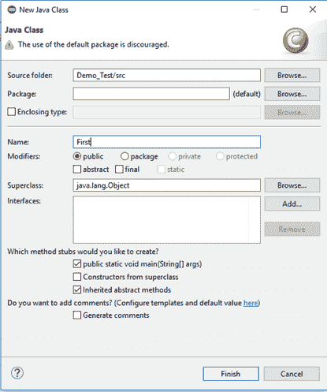

现在，我们将在测试套件(Demo_Test)中添加 Selenium jar 文件。

*   右键单击“演示 _ 测试”文件夹并选择属性。

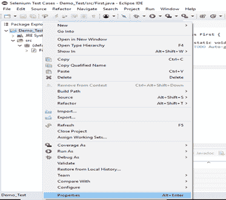

*   它将启动我们的“演示测试”测试套件的属性窗口。
*   单击左侧面板中的“Java 构建路径”选项。

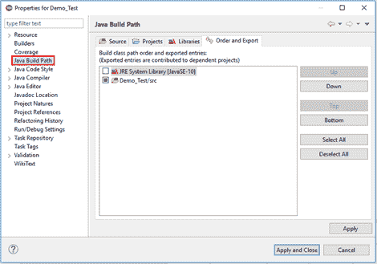

*   切换到库选项卡，点击“添加外部 JARs”按钮。

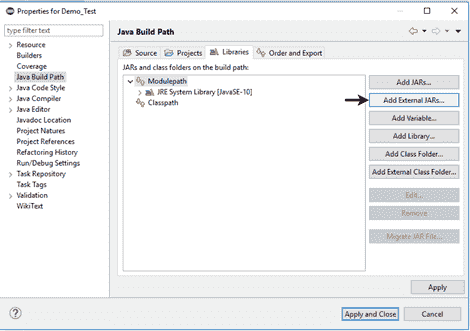

*   找到您下载硒罐子文件的目录，选择相应的罐子，然后点击“打开”按钮。

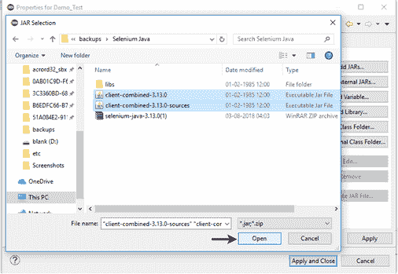

*   对“libs”文件夹下的罐子重复相同的步骤。
*   打开“libs”文件夹，选择所有相应的 jar 文件，然后点击“打开”按钮。

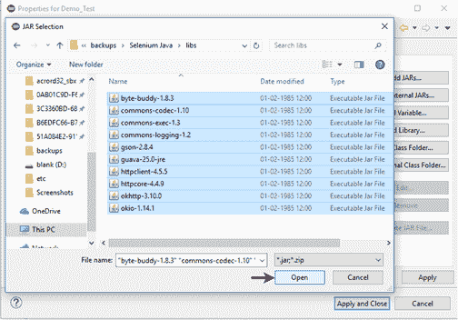

*   一旦你在你的库标签中得到所有的硒罐子文件，点击应用和关闭按钮。
*   下图显示了添加硒罐后我们的“演示测试”测试套件的目录结构。

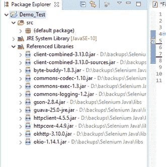

因此，我们已经成功地用 Eclipse IDE 配置了 Selenium 网络驱动程序。现在，我们准备在 Eclipse 中编写测试脚本，并在网络驱动程序中运行它。