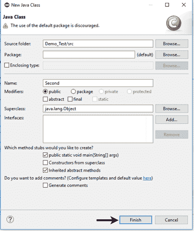
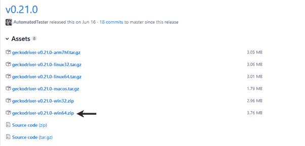
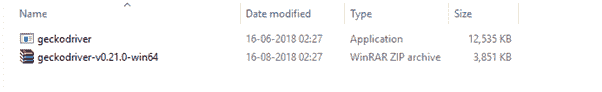
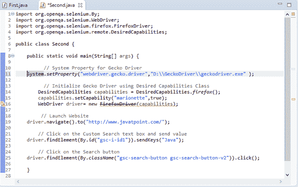
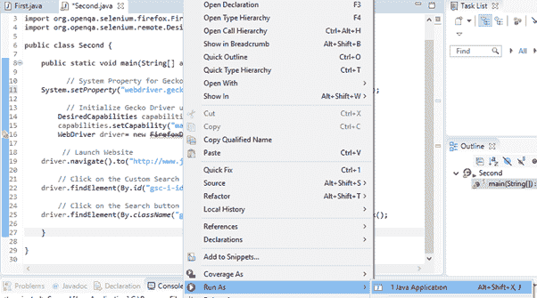
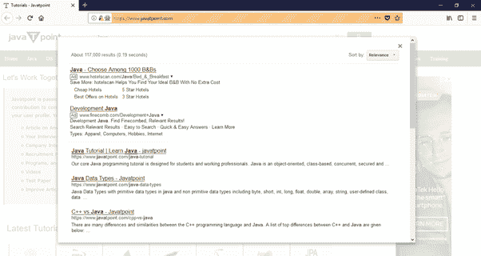

# Selenium 网络驱动——在火狐浏览器上运行测试——壁虎(提线木偶)驱动

> 原文：<https://www.javatpoint.com/selenium-webdriver-running-test-on-firefox-browser-gecko-driver>

在本节中，我们将学习如何在火狐浏览器上运行您的硒测试脚本。

在继续本节之前，让我们先了解一下 Gecko 驱动程序的基础知识。

## 什么是壁虎驱动程序？

Gecko 这个术语指的是 Gecko 浏览器引擎，它是由 Mozilla 基金会作为 Mozilla 浏览器的一部分开发的。

Gecko 驱动程序作为你在 Selenium 和 Firefox 浏览器中的测试之间的链接。它充当 W3C 网络驱动程序兼容客户端(Eclipse、Netbeans 等)之间的代理。)与基于 Gecko 的浏览器(Mozilla Firefox)进行交互。

提线木偶(下一代 FirefoxDriver)从 Selenium 3 默认开启。Selenium 使用 W3C Webdriver 协议向 GeckoDriver 发送请求，GeckoDriver 将请求翻译成名为提线木偶的协议。即使您使用的是旧版火狐浏览器，Selenium 3 也希望您设置可由 **webdriver.gecko.driver** 执行的驱动程序的路径。

#### 注意:Selenium 3 已经自我升级，现在使用提线木偶驱动程序启动火狐驱动程序，而不是之前支持的默认初始化。

让我们考虑一个测试案例，其中我们将尝试在 Firefox 浏览器中自动化以下场景。

*   启动 Firefox 浏览器。
*   打开网址:[www.javatpoint.com](https://www.javatpoint.com/)
*   单击自定义搜索文本框
*   键入值“Java”
*   点击搜索按钮。

我们将在同一个测试套件(Demo_Test)中创建第二个测试用例。

**第一步**。右键单击“src”文件夹，从新建>类创建一个新的类文件。

将您的班级名称设为“第二”，然后点击“完成”按钮。




**第二步**。在浏览器中打开网址:[https://github.com/mozilla/geckodriver/releases](https://github.com/mozilla/geckodriver/releases)，根据您当前使用的操作系统，点击相应版本下载壁虎河。在这里，我们正在为 windows 下载 64 位版本的 GeckoDriver。



下载的文件将是压缩格式。将内容解压到一个方便的目录中。



在编写测试脚本之前，让我们先了解如何在 Selenium 中初始化 GeckoDriver。有三种方法可以初始化壁虎河:

## 1.使用所需的功能

首先，我们必须为 Gecko Driver 设置系统属性。

```

System.setProperty("webdriver.gecko.driver","D:\\GeckoDriver\\geckodriver.exe" );

```

下面是使用 DesiredCapabilities 类设置 gecko 驱动程序的代码。

```

DesiredCapabilities capabilities = DesiredCapabilities.firefox();
		capabilities.setCapability("marionette",true);

```

下面是完整的代码:

```

System.setProperty("webdriver.gecko.driver","D:\\GeckoDriver\\geckodriver.exe" );
		DesiredCapabilities capabilities = DesiredCapabilities.firefox();
		capabilities.setCapability("marionette",true);
		WebDriver driver= new FirefoxDriver(capabilities);

```

## 2.使用提线木偶属性:

壁虎驱动程序也可以使用提线木偶属性初始化。

```

System.setProperty("webdriver.firefox.marionette","D:\\GeckoDriver\\geckodriver.exe");

```

此方法不需要所需功能的代码。

## 3.使用火狐选项:

Firefox 47 或更高版本将提线木偶驱动程序作为遗留系统。因此，可以使用火狐选项调用提线木偶驱动程序，如下所示。

```

FirefoxOptions options = new FirefoxOptions();
	options.setLegacy(true);

```

**第三步**。现在是时候编码了。我们为每个代码块嵌入了注释，以清楚地解释这些步骤。

```

import org.openqa.selenium.By;
import org.openqa.selenium.WebDriver;
import org.openqa.selenium.firefox.FirefoxDriver;
import org.openqa.selenium.remote.DesiredCapabilities;

public class Second {

	public static void main(String[] args) {

		  // System Property for Gecko Driver 
System.setProperty("webdriver.gecko.driver","D:\\GeckoDriver\\geckodriver.exe" );

		  // Initialize Gecko Driver using Desired Capabilities Class
	DesiredCapabilities capabilities = DesiredCapabilities.firefox();
	capabilities.setCapability("marionette",true);
	WebDriver driver= new FirefoxDriver(capabilities);

		 // Launch Website
	driver.navigate().to("http://www.javatpoint.com/");

		// Click on the Custom Search text box and send value
	driver.findElement(By.id("gsc-i-id1")).sendKeys("Java");

		// Click on the Search button
driver.findElement(By.className("gsc-search-button gsc-search-buttonv2")).click();	
		}

}

```

Eclipse 代码窗口如下所示:



**第四步**。右键单击 Eclipse 代码并选择**运行为> Java 应用程序**。



**第五步**。上述测试脚本的输出将显示在火狐浏览器中。

 Next Topic[Selenium webdriver Running Test on IE Browser](selenium-webdriver-running-test-on-ie-browser)