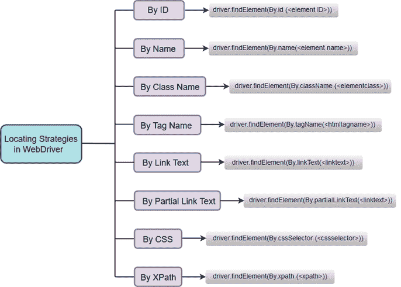

# Selenium WebDriver-定位策略

> 原文：<https://www.javatpoint.com/selenium-webdriver-locating-strategies>

就像 SeleniumIDE 一样，WebDriver 使用相同的定位策略来指定特定网络元素的位置。

因为，我们在 java 中使用 WebDriver 每个定位策略在 Java 中都有自己的命令来定位 web 元素。

#### 注意:在 WebDriver 中定位网络元素是在 findElement()和 findElements()方法的帮助下进行的。

WebDriver 中使用的定位策略列表:

*   [按标识定位策略](selenium-webdriver-locating-strategies-by-id)
*   [按名称定位策略](selenium-webdriver-locating-strategies-by-name)
*   [按类名定位策略](selenium-webdriver-locating-strategies-by-class-name)
*   [通过标签名称定位策略](selenium-webdriver-locating-strategies-by-tag-name)
*   [通过链接文本定位策略](selenium-webdriver-locating-strategies-by-link-text)
*   [通过部分链接文本定位策略](selenium-webdriver-locating-strategies-by-partial-link-text)
*   [CSS 定位策略](selenium-webdriver-locating-strategies-by-css)
*   [通过 XPath 定位策略](selenium-webdriver-locating-strategies-by-xpath)