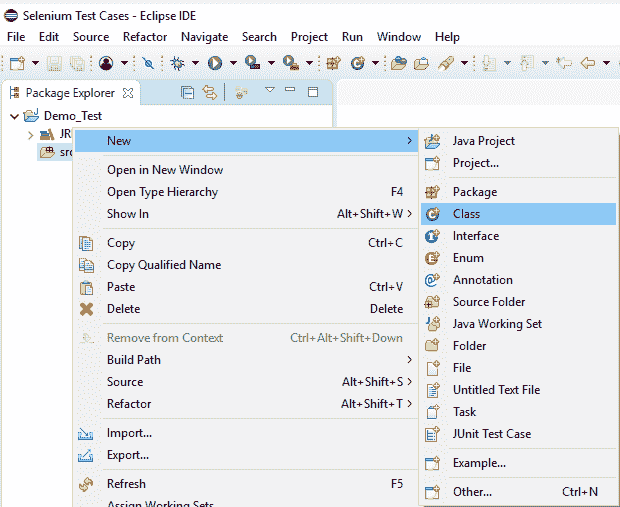
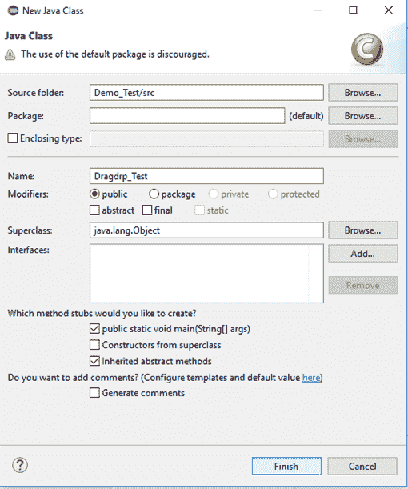
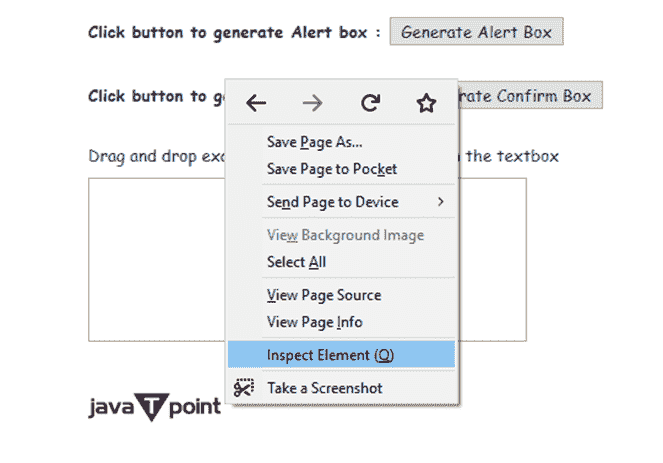
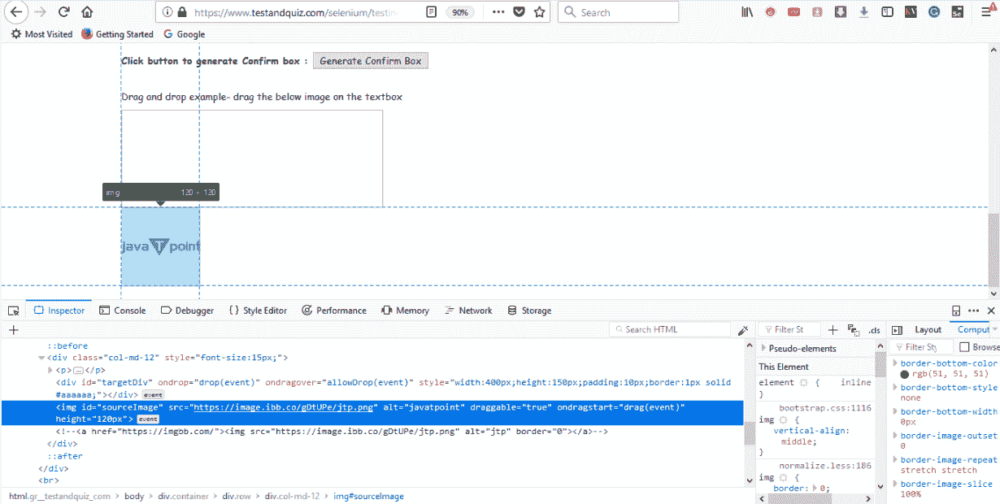
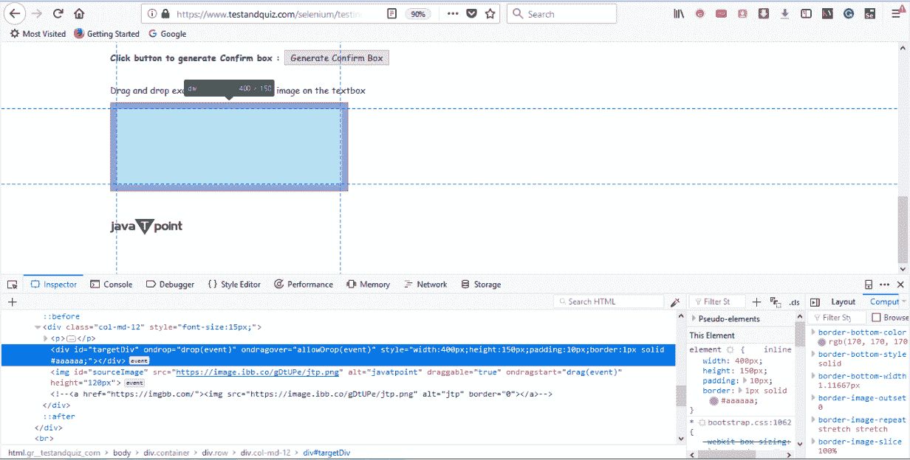
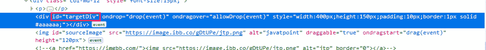
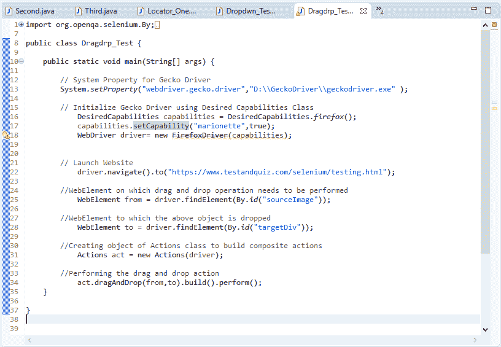
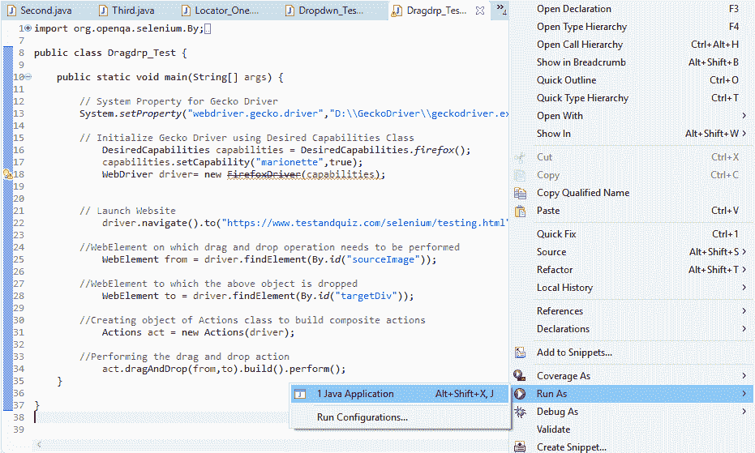
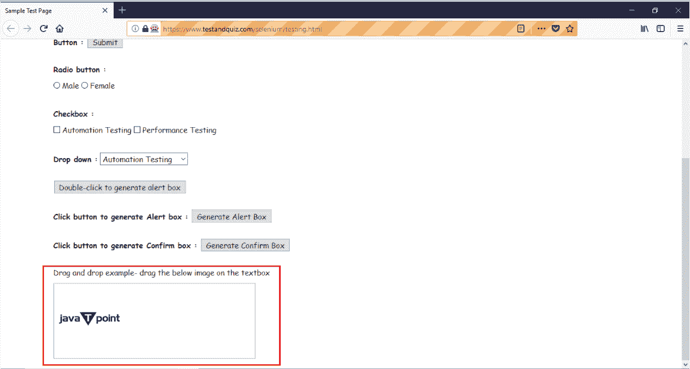

# 硒网络驱动程序-拖放

> 原文：<https://www.javatpoint.com/selenium-webdriver-drag-and-drop>

在本节中，您将学习如何在硒网络驱动程序中执行复杂的操作，如拖放。

在继续本节之前，让我们先了解一些关于拖放操作的概念。

### 硒网络驱动程序中的操作

为了执行复杂的用户交互，比如拖放，我们在 Selenium 网络驱动程序中有一个 Actions 类。使用 Actions 类，我们首先构建一系列复合事件，然后使用 Action(一个表示单个用户交互的接口)执行它。我们将在这里使用的动作类的不同方法是-

*   **点击并按住(WebElement 元素)** -点击中间的一个 web 元素(不释放)。
*   **moveToElement(WebElement 元素)** -将鼠标指针移动到 web 元素的中间，无需单击。
*   **释放(WebElement 元素)** -释放左键(处于按下状态)。
*   **构建()** -生成复合动作

让我们考虑一个测试案例，其中我们将自动化以下场景:

*   调用火狐浏览器
*   打开网址:[https://www.testandquiz.com/selenium/testing.html](https://www.testandquiz.com/selenium/testing.html)
*   拖放文本框上的 JavaTpoint 图标

我们将逐步创建我们的测试用例，以便让您完全理解如何在网络驱动程序中处理拖放。

**第一步**。启动 Eclipse IDE 并打开现有的测试套件“Demo_Test”，它是我们在本教程的前几节中创建的。

**第二步**。右键单击“src”文件夹，从**新建>类**创建一个新的类文件。



将您的班级名称命名为“Dragdrp_Test”，然后单击“完成”按钮。



**第三步**。让我们进入编码领域。

*   要调用火狐浏览器，我们需要下载 Gecko 驱动，并为 Gecko 驱动设置系统属性。我们已经在本教程的前几节讨论过这个问题。可以参考[“火狐浏览器上运行测试”](selenium-webdriver-running-test-on-firefox-browser-gecko-driver)了解火狐驱动程序如何下载和设置 System 属性。

下面是为 Gecko 驱动程序设置系统属性的示例代码:

```

  // System Property for Gecko Driver 
	System.setProperty("webdriver.gecko.driver","D:\\GeckoDriver\\geckodriver.exe" );

```

*   之后，我们必须使用期望能力类初始化壁虎驱动程序。

下面是使用 DesiredCapabilities 类初始化 gecko 驱动程序的示例代码。

```

  // Initialize Gecko Driver using Desired Capabilities Class
		DesiredCapabilities capabilities = DesiredCapabilities.firefox();
		capabilities.setCapability("marionette",true);
		WebDriver driver= new FirefoxDriver(capabilities);

```

结合以上两个代码块，我们将获得启动 Firefox 浏览器的代码片段。

```

	  // System Property for Gecko Driver 
	System.setProperty("webdriver.gecko.driver","D:\\GeckoDriver\\geckodriver.exe" );

	 // Initialize Gecko Driver using Desired Capabilities Class
	DesiredCapabilities capabilities = DesiredCapabilities.firefox();
	capabilities.setCapability("marionette",true);
	WebDriver driver= new FirefoxDriver(capabilities);

```

之后，我们需要编写代码来自动化我们的第二个测试场景(导航到所需的 URL)

以下是导航到所需网址的示例代码:

```

// Launch Website
driver.navigate().to("https://www.testandquiz.com/selenium/testing.html");

```

到目前为止，完整的代码如下所示:

```

import org.openqa.selenium.WebDriver;
import org.openqa.selenium.firefox.FirefoxDriver;
import org.openqa.selenium.remote.DesiredCapabilities;

public class Dragdrp_Test {

	public static void main(String[] args) {

	// System Property for Gecko Driver 
		System.setProperty("webdriver.gecko.driver","D:\\GeckoDriver\\geckodriver.exe" );

	// Initialize Gecko Driver using Desired Capabilities Class
			DesiredCapabilities capabilities = DesiredCapabilities.firefox();
			capabilities.setCapability("marionette",true);
			WebDriver driver= new FirefoxDriver(capabilities);

      // Launch Website
driver.navigate().to("https://www.testandquiz.com/selenium/testing.html"); 

	}

}

```

**第四步**。现在我们将尝试定位 JavaTpoint 图标和文本框，以便执行拖放操作。正如我们所知，定位一个元素需要检查它的 HTML 代码。

按照下面给出的步骤在示例网页上找到下拉菜单。

*   打开网址:[https://www.testandquiz.com/selenium/testing.html](https://www.testandquiz.com/selenium/testing.html)
*   右键单击“点”图标，然后选择“检查元素”。



*   它将启动一个窗口，包含开发 JavaTpoint 徽标所涉及的所有特定代码。



*   记下它的 id 属性，即 sourceImage


同样，我们将检查我们必须放置徽标的文本框。



*   记下它的 id 属性，即 targetDiv



**第五步。**为了自动化我们的第三个和第四个测试场景，我们需要编写代码来对 JavaTpoint 徽标执行拖放操作。

下面给出的是执行拖放操作的代码片段。

```

//WebElement on which drag and drop operation needs to be performed
WebElement from = driver.findElement(By.id("sourceImage"));

//WebElement to which the above object is dropped
WebElement to = driver.findElement(By.id("targetDiv");

//Creating object of Actions class to build composite actions
Actions act = new Actions(driver);

//Performing the drag and drop action
act.dragAndDrop(from,to).build().perform(); 

```

因此，我们的最终测试脚本将如下所示:

```

import org.openqa.selenium.By;
import org.openqa.selenium.WebDriver;
import org.openqa.selenium.WebElement;
import org.openqa.selenium.firefox.FirefoxDriver;
import org.openqa.selenium.interactions.Actions;
import org.openqa.selenium.remote.DesiredCapabilities;

public class Dragdrp_Test {

	public static void main(String[] args) {

		// System Property for Gecko Driver 
		System.setProperty("webdriver.gecko.driver","D:\\GeckoDriver\\geckodriver.exe" );

		// Initialize Gecko Driver using Desired Capabilities Class
			DesiredCapabilities capabilities = DesiredCapabilities.firefox();
			capabilities.setCapability("marionette",true);
			WebDriver driver= new FirefoxDriver(capabilities);

		// Launch Website
			driver.navigate().to("https://www.testandquiz.com/selenium/testing.html"); 

		//WebElement on which drag and drop operation needs to be performed
			WebElement from = driver.findElement(By.id("sourceImage"));

		//WebElement to which the above object is dropped
			WebElement to = driver.findElement(By.id("targetDiv"));

		//Creating object of Actions class to build composite actions
			Actions act = new Actions(driver);

		//Performing the drag and drop action
			act.dragAndDrop(from,to).build().perform(); 
	}

}

```

下面的截图显示了我们测试脚本的 Eclipse 窗口。



**第六步**。右键单击 Eclipse 代码并选择**运行为> Java 应用程序**。



执行后，上述测试脚本将启动火狐浏览器，并自动执行所有测试场景。

您可以看到 JavaTpoint 徽标会自动放入文本框中。

