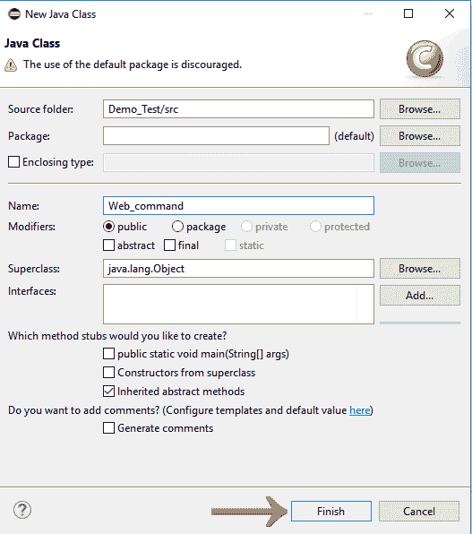
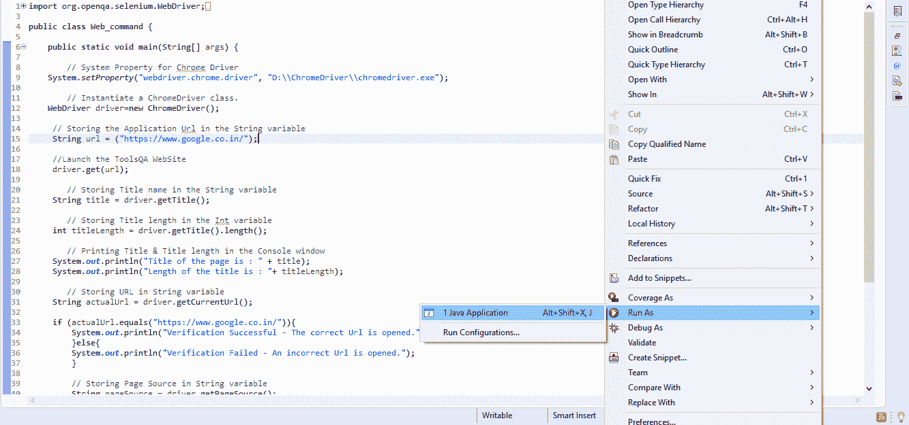
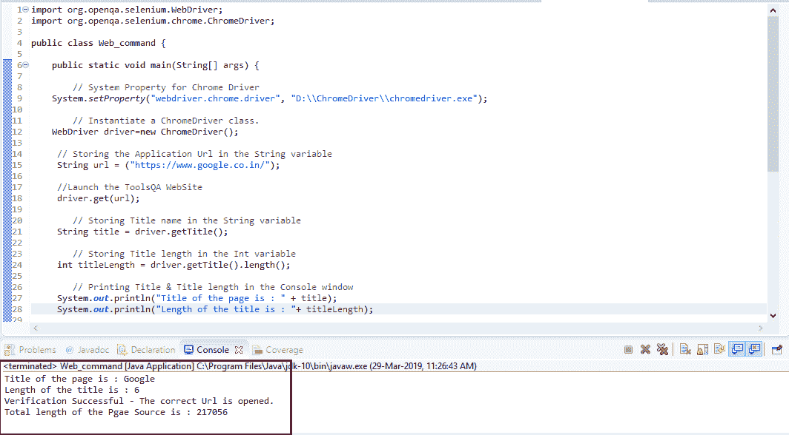

# Selenium WebDriver-浏览器命令

> 原文：<https://www.javatpoint.com/selenium-webdriver-browser-commands>

WebDriver 最基本的浏览器操作包括**打开浏览器**；执行一些任务，然后**关闭浏览器**。

给出了 Selenium WebDriver最常用的一些浏览器命令。

### 1.获取命令

**方法:**

```

get(String arg0) : void

```

在 WebDriver 中，这个方法在现有的浏览器窗口中加载一个新的网页。接受*字符串*作为参数，返回 *void* 。

**加载新网页的相应命令可以写成:**

```

driver.get(URL);   

// Or can be written as

String URL = "URL";
driver.get(URL);

```

**例:**比如加载 javaTpoint 官网的命令可以写成:

```

driver.get("www.javatpoint.com")

```

### 2.获取标题命令

**方法:**

```

getTitle(): String

```

在WebDriver中，这个方法获取当前网页的标题。它不接受任何参数，并返回一个字符串。

获取当前页面标题的相应命令可以写成:

```

driver.getTitle();  

	// Or can be written as

 String Title = driver.getTitle();

```

### 3.获取当前网址命令

**方法:**

```

getCurrentUrl(): String

```

在WebDriver中，这个方法获取代表当前网页的当前网址的字符串。它不接受任何参数，并返回一个字符串值。

获取代表当前网址的字符串的相应命令可以写成:

```

driver.getCurrentUrl();

	//Or can be written as

	String CurrentUrl = driver.getCurrentUrl();	

```

### 4.获取页面源命令

**方法:**

```

getPageSource(): String

```

在 WebDriver 中，此方法返回当前浏览器上加载的当前网页的源代码。它不接受任何参数，并返回一个*字符串*值。

获取当前网页源代码的相应命令可以写成:

```

driver.getPageSource();

	//Or can be written as 
	String PageSource = driver.getPageSource();

```

### 5.关闭命令

**方法:**

```

close(): void

```

此方法在当前时间终止由WebDriver操作的当前浏览器窗口。如果当前窗口是唯一由WebDriver操作的窗口，它也会终止浏览器。该方法不接受任何参数，返回 *void* 。

终止浏览器窗口的相应命令可以写成:

```

driver.close();

```

### 6.退出命令

**方法:**

```

quit(): void

```

此方法终止所有由 WebDriver 操作的窗口。它会终止所有选项卡以及浏览器本身。它不接受任何参数并返回 void。

终止所有窗口的相应命令可以写成:

```

driver.quit();

```

让我们考虑一个示例测试脚本，其中将涵盖WebDriver提供的大多数浏览器命令。

在这个示例测试中，我们将自动化以下测试场景:

*   调用浏览器
*   打开网址:[https://www.google.co.in/](https://www.google.co.in/)
*   获取页面标题名称和标题长度
*   在 Eclipse 控制台上打印页面标题和标题长度
*   获取页面网址，并验证它是否是所需的页面
*   获取页面源和页面源长度
*   在 Eclipse 控制台上打印页面长度。
*   关闭浏览器

为了我们的测试目的，我们正在使用“谷歌”搜索引擎的主页。

我们将一步一步地创建我们的测试用例，让您完全理解如何在WebDriver中使用浏览器命令。

*   **第一步。**启动 Eclipse IDE，打开我们在WebDriver教程[WebDriver安装](selenium-webdriver-installation)部分创建的现有测试套件“Demo_Test”。
*   **第二步。**右键点击“src”文件夹，从**新建>类**新建一个类文件。


给出你的班级名称作为“导航命令”，点击“完成”按钮。



**第三步。**让我们进入编码领域。

为了自动化我们的测试场景，首先你需要知道“如何在WebDriver中调用/启动网络浏览器？”

#### 注意:要调用 Selenium 中的浏览器，我们必须下载特定于该浏览器的可执行文件。例如，Chrome 浏览器使用一个名为 ChromeDriver.exe 的可执行文件来实现WebDriver协议。这些可执行文件在您的系统上启动一个服务器，该服务器又负责在 Selenium 中运行您的测试脚本。

在本教程的后面部分，我们已经陈述了在不同浏览器上运行测试的过程和方法。作为参考，在进行实际编码之前，您可以逐一查看。

1.  [火狐上运行测试](selenium-webdriver-running-test-on-firefox-browser-gecko-driver)
2.  [在镀铬上运行测试](selenium-webdriver-running-test-on-chrome-browser)
3.  [在 Internet Explorer 上运行测试](selenium-webdriver-running-test-on-ie-browser)
4.  [在 Safari 上运行测试](selenium-webdriver-running-test-on-safari-browser)

*   要调用谷歌浏览器，我们需要下载 ChromeDriver.exe 文件，并将系统属性设置为您的 ChromeDriver.exe 文件的路径。我们已经在本教程的前几节讨论过这个问题。也可以参考[在 Chrome 浏览器](selenium-webdriver-running-test-on-chrome-browser)上运行测试，了解如何下载和设置 Chrome 驱动的 System 属性。

下面是为 Chrome 驱动程序设置系统属性的示例代码:

```

// System Property for Chrome Driver 
System.setProperty("webdriver.chrome.driver","D:\\ChromeDriver\\chromedriver.exe");

```

之后，我们必须使用 Chrome driver 类初始化 Chrome 驱动程序。

下面是使用 Chrome driver 类初始化 Chrome 驱动程序的示例代码:

```

// Instantiate a ChromeDriver class. 	
WebDriver driver=new ChromeDriver();

```

结合上述两个代码块，我们将获得启动谷歌浏览器的代码片段。

```

// System Property for Chrome Driver 
System.setProperty("webdriver.chrome.driver","D:\\ChromeDriver\\chromedriver.exe");

// Instantiate a ChromeDriver class. 	
WebDriver driver=new ChromeDriver();

```

*   为了自动化我们的第二个测试场景，即“获取页面标题名称和标题长度”，我们必须将标题名称和长度分别存储在字符串和 int 变量中。

下面是实现这一点的示例代码:

```

// Storing Title name in the String variable
String title = driver.getTitle();

// Storing Title length in the Int variable
int titleLength = driver.getTitle().length();

```

要在控制台窗口中打印页面标题名称和标题长度，请遵循给定的代码片段:

```

// Printing Title & Title length in the Console window
System.out.println("Title of the page is : " + title);
System.out.println("Length of the title is : "+ titleLength);

```

*   下一个测试场景需要获取网址，并根据实际网址进行验证。

首先，我们将当前网址存储在一个字符串变量中:

```

// Storing URL in String variable
String actualUrl = driver.getCurrentUrl();

```

验证当前网址是否为实际网址:

```

if (actualUrl.equals("https://www.google.co.in"))
{
System.out.println("Verification Successful - The correct Url is opened.");
}
Else
{
System.out.println("Verification Failed - An incorrect Url is opened.");
}

```

*   为了自动化我们的第 6 个<sup>测试场景(获取页面源和页面源长度)，我们将把页面源和页面源长度分别存储在*字符串*和 *int* 变量中。</sup>

```

// Storing Page Source in String variable
String pageSource = driver.getPageSource();

// Storing Page Source length in Int variable
int pageSourceLength = pageSource.length();

```

要在控制台窗口上打印页面源的长度，请遵循给定的代码片段:

```

// Printing length of the Page Source on console
System.out.println("Total length of the Page Source is : " + pageSourceLength);

```

*   最后，给定的代码片段将终止进程并关闭浏览器。

```

driver.close(); 

```

将上述所有代码块组合在一起，我们将获得执行测试脚本“Web_command”所需的源代码。

最终的测试脚本将如下所示:

(我们在每个部分都嵌入了注释，以清楚地解释步骤)

```

import org.openqa.selenium.WebDriver;
import org.openqa.selenium.chrome.ChromeDriver;

public class Web_command {

public static void main(String[] args) {

// System Property for Chrome Driver 
System.setProperty("webdriver.chrome.driver","D:\\ChromeDriver\\chromedriver.exe");

// Instantiate a ChromeDriver class. 	
WebDriver driver=new ChromeDriver();

// Storing the Application Url in the String variable
String url = ("https://www.google.co.in/");

//Launch the ToolsQA WebSite
driver.get(url);

// Storing Title name in the String variable
String title = driver.getTitle();

// Storing Title length in the Int variable
int titleLength = driver.getTitle().length();

// Printing Title & Title length in the Console window
System.out.println("Title of the page is : " + title);
System.out.println("Length of the title is : "+ titleLength);

// Storing URL in String variable
String actualUrl = driver.getCurrentUrl();

if (actualUrl.equals("https://www.google.co.in/")){
System.out.println("Verification Successful - The correct Url is opened.");
}
else{

System.out.println("Verification Failed - An incorrect Url is opened.");
		 }

// Storing Page Source in String variable
String pageSource = driver.getPageSource();

// Storing Page Source length in Int variable
int pageSourceLength = pageSource.length();

// Printing length of the Page Source on console
System.out.println("Total length of the Pgae Source is : " + pageSourceLength);

//Closing browser
 driver.close(); 
}
}

```

要在 Eclipse 窗口上运行测试脚本，右键单击屏幕，然后单击

**运行方式→ Java 应用**



执行后，测试脚本将启动 chrome 浏览器并自动执行所有测试场景。控制台窗口将显示打印命令的结果。

