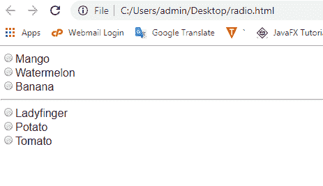
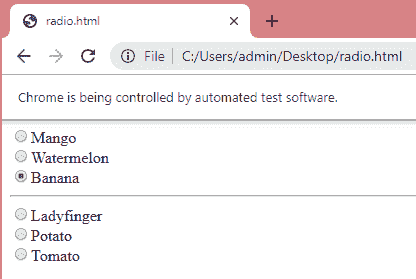
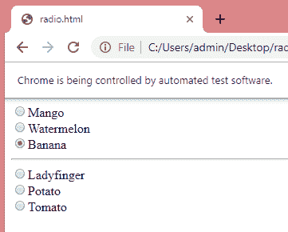

# 处理单选按钮

> 原文：<https://www.javatpoint.com/selenium-webdriver-handling-radio-buttons>

在本节中，您将学习如何在 selenium web 驱动程序中处理单选按钮。

**处理单选按钮的步骤如下:**

**第一步:**调用谷歌 Chrome 浏览器。

调用谷歌浏览器的代码如下:

```

package mypack;
import org.openqa.selenium.WebDriver;
import org.openqa.selenium.chrome.ChromeDriver;
public class Class1 
{
    public static void main(String[] args) 
    {

    	System.setProperty("webdriver.chrome.driver", "C:\\work\\chromedriver.exe");
    	WebDriver driver = new ChromeDriver();

    }

}

```

**第二步:**第二步是导航到我们需要处理单选按钮的网站。

**我创建了包含单选按钮的 html 文件。代码如下:**

```

Mango

Mango

Mango

Ladyfinger

Potato

Tomato

```

**导航到上述 html 文件的代码如下:**

```

package mypack;
import org.openqa.selenium.WebDriver;
import org.openqa.selenium.chrome.ChromeDriver;

public class Class1 {
    public static void main(String[] args) {

    	System.setProperty("webdriver.chrome.driver", "C:\\work\\chromedriver.exe");
    	WebDriver driver = new ChromeDriver();
    	driver.get("file:///C:/Users/admin/Desktop/radio.html");
        }

}

```

**上述代码的输出:**



**第 3 步:**选择香蕉选项。我们将通过检查香蕉的 HTML 代码来找到它的单选按钮。

有两种处理单选按钮的方法:

*   **使用自定义路径:**

**下面显示的代码使用自定义路径处理单选按钮。**

```

package mypack;
import org.openqa.selenium.By;
import org.openqa.selenium.WebDriver;
import org.openqa.selenium.chrome.ChromeDriver;

public class Class1 {
    public static void main(String[] args) {

    	System.setProperty("webdriver.chrome.driver", "C:\\work\\chromedriver.exe");
    	WebDriver driver = new ChromeDriver();
    	driver.get("file:///C:/Users/admin/Desktop/radio.html");
    	driver.findElement(By.xpath("//input[@value='Banana']")).click();
        }

}

```

在上面的例子中，我们使用了自定义的 Xpath。单选按钮包含一个唯一的属性，即值，因此我们使用值属性来处理单选按钮。

**输出**



*   **通过动态处理单选按钮。**
    *   我们将首先计算单选按钮的数量。以下是计算单选按钮数量的代码行。

        **int a = driver . find elements(by . XPath("//input[@ name = ' group 1 ']")。size()；**

        上面一行代码计算了名称为 group1 的单选按钮的数量。
    *   现在，我们将通过使用特定单选按钮的索引来处理单选按钮。

        **driver . find elements(by . XPath("//input[@ name = ' group 1 ']")。get(2)。单击()；**

**源代码**

```

package mypack;
import org.openqa.selenium.By;
import org.openqa.selenium.WebDriver;
import org.openqa.selenium.chrome.ChromeDriver;

public class Class1 {
    public static void main(String[] args) {

    	System.setProperty("webdriver.chrome.driver", "C:\\work\\chromedriver.exe");
    	WebDriver driver = new ChromeDriver();
    	driver.get("file:///C:/Users/admin/Desktop/radio.html");
    	int a = driver.findElements(By.xpath("//input [@name='group1']")).size();
        System.out.println(a);
        for(int i=1;i<=a;i++)
        {
        	driver.findElements(By.xpath("//input[@name='group1']")).get(2).click();
        }
    }}

```

在上面的代码中，我们使用了' for '循环。在“for”循环中，我们使用 get(2)方法找到 group1 的第三个单选按钮。

**输出**

