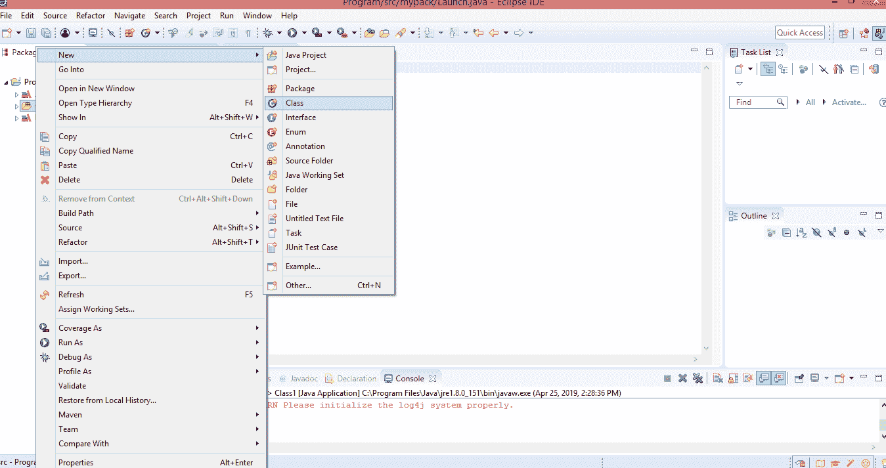
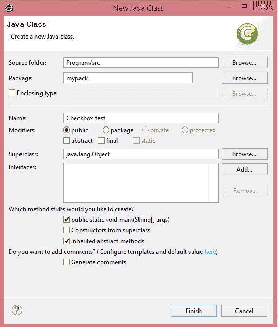
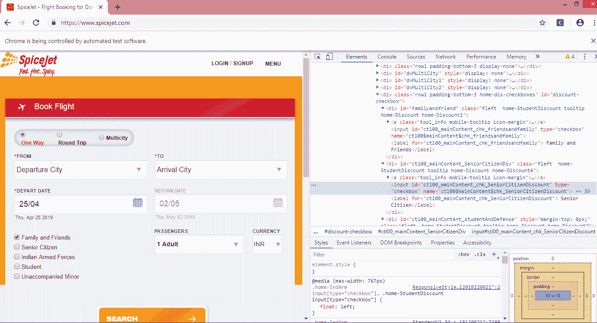
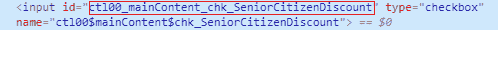
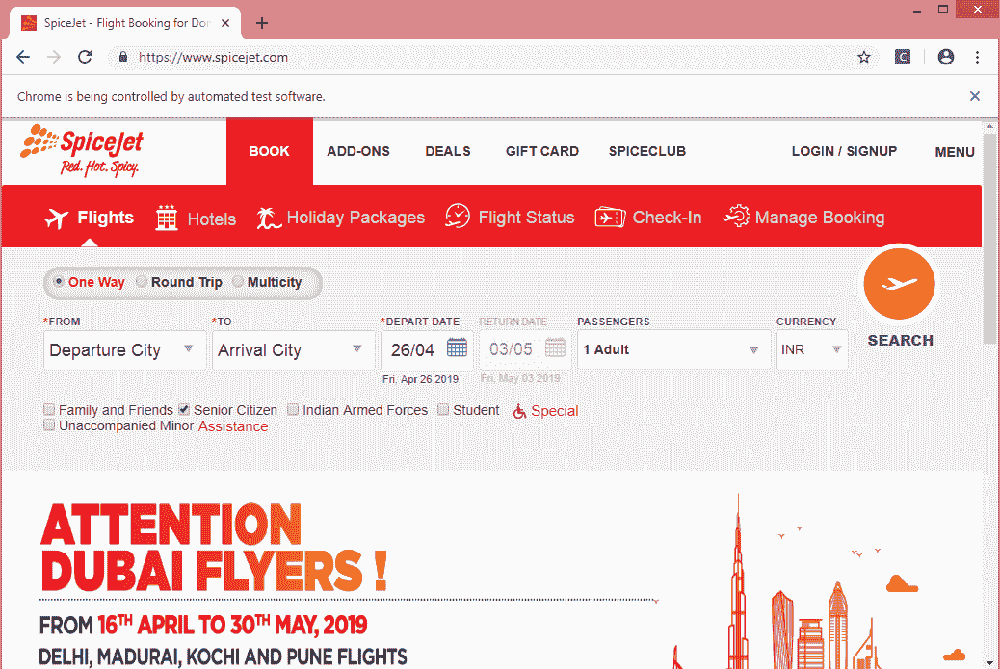
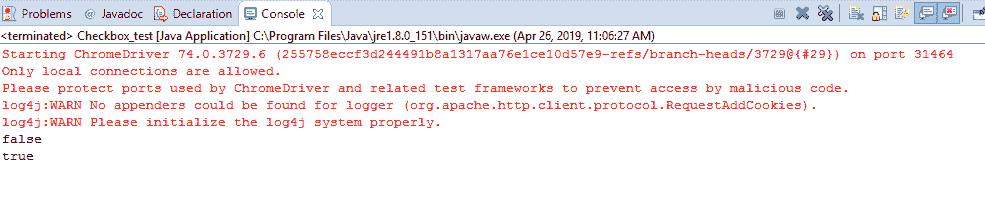

# 处理复选框

> 原文：<https://www.javatpoint.com/selenium-webdriver-handling-checkbox>

在本节中，您将学习如何在 selenium webdriver 中处理 checkbox。

让我们创建一个测试用例，在其中我们将自动化以下场景:

*   调用谷歌浏览器。
*   导航到您处理复选框的网站。
*   从 spicejet 网站选择“**老年人**”复选框。
*   关闭驱动程序。

现在，我们将逐步创建一个测试用例，以便让您正确理解如何处理 checkbox。

**第一步:**启动 Eclipse IDE。

**第二步:**右键点击 src 文件夹，然后点击新建>类。



*   输入类名。我提供的类名是 Checkbox_test。



**第三步:**现在，我们将调用谷歌 Chrome 浏览器。我们将下载 chromedriver.exe 文件并将系统属性设置为您的 chromedriver.exe 文件的路径。

下面是将系统属性设置为 chromedriver.exe 文件路径的示例代码。

```

System.setProperty("webdriver.chrome.driver","C:\\\\work\\\\chromedriver.exe);

```

下面是调用谷歌浏览器的示例代码。

```

WebDriver driver = new ChromeDriver();

```

结合以上两个代码块，我们将获得启动谷歌 chrome 浏览器的代码片段。

```

// Set the system property
System.setProperty("webdriver.chrome.driver","C:\\\\work\\\\chromedriver.exe);

// Launch the Google Chrome browser.
WebDriver driver = new ChromeDriver();

```

**第四步:**我们完成了第一个测试用例，即调用一个 Google chrome 浏览器。现在我们将编写代码来自动化测试用例。我们的第二个测试案例是导航到“spicejet”网站。

下面是导航到“spicejet”网站的示例代码。

```

	driver.navigate().to("https://www.spicejet.com/");

```

下面是完整的代码:

```

package mypack;

import org.openqa.selenium.WebDriver;
import org.openqa.selenium.chrome.ChromeDriver;

public class Checkbox_test {

	public static void main(String[] args) {
		// TODO Auto-generated method stub
		System.setProperty("webdriver.chrome.driver","C:\\\\work\\\\chromedriver.exe");
		WebDriver driver = new ChromeDriver();
		driver.navigate().to("https://www.spicejet.com/");

	}}

```

**第五步:**现在我们通过检查“老年人”复选框的 HTML 代码来定位它。



**注意复选框的 id 属性。**



在上面的例子中，我们观察到“id”是一个唯一的属性，所以我们通过使用 **id 属性**来定位复选框。

**第 6 步:**要自动化第三个测试用例，我们需要编写代码来定位“**老年公民**”复选框。

下面是处理“老年人”复选框的代码。

```

package mypack;
import org.openqa.selenium.By;
import org.openqa.selenium.WebDriver;
import org.openqa.selenium.chrome.ChromeDriver;
public class Checkbox_test 
{

public static void main(String[] args) 
{
		// TODO Auto-generated method stub
		System.setProperty("webdriver.chrome.driver","C:\\\\work\\\\chromedriver.exe");
		WebDriver driver = new ChromeDriver();
		driver.navigate().to("https://www.spicejet.com/");
		System.out.println(driver.findElement(By.cssSelector("input[id*='SeniorCitizenDiscount']")).isSelected());
		driver.findElement(By.cssSelector("input[id*='SeniorCitizenDiscount']")).click();
		System.out.println(driver.findElement(By.cssSelector("input[id*='SeniorCitizenDiscount']")).isSelected());

driver.close();
	}

}

```

在上面的代码中，我们没有使用完整的“id”属性值，因为它非常大。我用了‘老年人’复选框的一半部分，另一半部分用正则表达式的形式表示，即“*=”。

我们在上面的代码中使用了两种方法:

*   **isSelected():** 此方法确定复选框是否被选中。如果选中该复选框，则该方法返回 true，否则返回 false。
*   **点击():**此方法选择定位器。在这种情况下，它选择了“老年人”复选框。

**输出**



**控制台上的输出**

