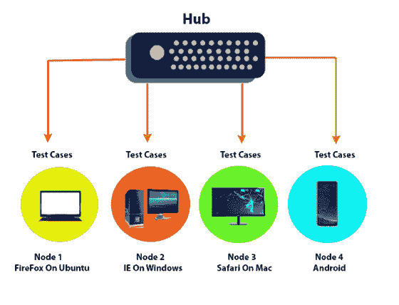
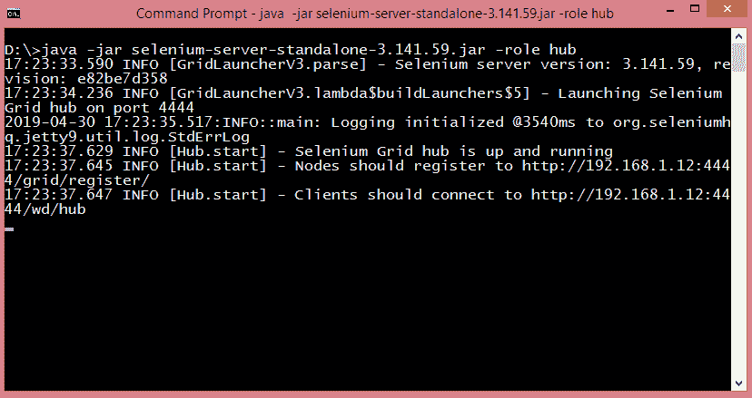
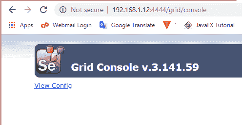

# 什么是Selenium网格？

> 原文：<https://www.javatpoint.com/selenium-grid>

*   Selenium Grid 是 Selenium 中的一项功能，它允许您在不同的机器上跨不同的平台运行测试用例。触发测试用例的控制在本地机器上，当测试用例被触发时，它们由远程机器自动执行。假设你有 5 个测试用例。您的本地机器正在运行多个应用，因此您希望在远程机器上运行您的测试用例。您需要配置远程服务器，以便测试用例可以在那里执行。
*   它支持分布式测试执行。最初，您有一台本地机器，在那里您编写测试用例并在同一台机器上执行。然而，在一个大的组织中，你有多个测试用例，不可能在同一台机器上运行所有的测试用例。在大型组织中，您有多个服务器，因此本地机器将测试用例分布在不同的机器/服务器上。
*   您还可以在 Selenium Grid 上的多台机器上并行运行测试用例。

## Selenium网格的体系结构

### 中心

*   集线器是接收所有测试请求并将它们分发到正确节点的中心点或本地机器。实际触发测试用例的机器称为 Hub
*   Selenium网格中只能有一个集线器。
*   包含集线器的机器触发测试用例，但是您将看到浏览器在其他机器上是自动化的。

### 结节

节点是 selenium 实例，它将执行您在集线器上加载的测试用例。节点可以在具有不同平台和浏览器的多台机器上启动。

#### 注意:当您配置节点时，您是在不同的平台上运行测试用例。没有规则规定，如果您的中心在 windows 中运行测试，那么所有节点都必须只在 windows 中执行测试用例。节点可以有不同的平台，比如 MAC 上的 Safari，Ubuntu 上的 Firefox，WinXP 上的 Internet Explorer，安卓。

## 为什么是Selenium网格？

Selenium网格非常有用，原因如下:

*   **在不同的平台上运行:**可以在不同的平台上运行测试用例，所以是平台无关的。例如，您有一个带 internet explorer 9 的集线器。Hub 有 internet explorer 9，因为许多旧网站都支持 IE 9。现在我们想在不同的平台上运行测试用例，比如说 Internet Explorer。众所周知，一台计算机上只能安装一个版本的浏览器。您需要配置要将测试用例发送到的节点。
*   **并行执行:**如果设置了 Selenium Grid，可以同时运行多个案例。这节省了运行测试套件的时间。

## 如何设置Selenium网格

*   下载Selenium独立服务器以运行远程Selenium WebDriver。它在一个单独的 jar 文件中可用。

*   将 jar 文件存储在任何驱动器上。
*   打开 cmd。
*   通过 cmd 注册集线器。输入命令**Java-jar selenium-server-standalone-3 . 8 . 1 . jar-角色中枢**。该命令将机器视为一个中枢。

从上面的屏幕中，我们观察到 hub 的地址是[http://192 . 168 . 1 . 12:4444/grid/register](http://192.168.1.12:4444/grid/register)。集线器所在的端口号是 4444，我们需要向这些节点注册集线器。

*   打开链接，即[http://192 . 168 . 1 . 12:4444/服务器所在的网格/控制台](http://192.168.1.12:4444/grid/console)。集线器只是服务器。

上面的屏幕显示集线器已经创建，但是它没有创建任何东西，因为集线器没有向节点注册。现在我们需要向集线器注册节点。

*   登录到另一台机器，并将其注册为集线器的节点。我将通过团队查看器将我的机器远程连接到另一台机器。要向您的集线器注册节点，您只能从节点机器而不能从您的机器注册，因此我将我的机器连接到另一台机器。在节点机器中，运行命令“**Java-jar selenium-server-standalone-3 . 141 . 59 . jar 角色 web driver-hub>IP address>/grid/register-port 5566**”。
*   现在，如果我们想在谷歌 chrome 或火狐浏览器中运行测试用例，那么我们需要在节点机器中下载 chrome 驱动程序或 geekodriver。为了实现这一点，我们需要在节点机中运行以下命令:
    **“Java-Dwebdriver . chrome . driver = " D:\ chrome driver . exe "-jar selenium-server-standalone-3 . 141 . 59 . jar role web driver-hub>IP address>/grid/register-port 5566 "**

其中，D 代表命令行中的参数。如果您放置 D，那么命令假设它被赋予了一个参数，并且在运行测试用例时需要小心。必须有浏览器的 exe 文件。没有 exe 文件，我们无法运行 selenium 测试用例。

#### 注意:Selenium独立服务器和 exe 文件必须在同一路径。