# 硒与 C#教程

> 原文：<https://www.javatpoint.com/selenium-csharp>


在本节中，我们将学习如何在 Visual Studio 和 NUnit 框架的帮助下，用 C#编程语言创建 Selenium 测试脚本。

在本教程中，我们将学习以下主题:

*   [解释硒？](#Explain)
*   [什么是 C#？](#Csharp)
*   [为什么 C#对自动化测试有用？](#Why)
*   [含碳硒#](#with)
*   [用 Visual Studio 在 C#中配置 Selenium】](#VisualStudio)
*   [在 Visual Studio 中使用 NUnit 配置硒](#NUnit)

* * *

## 解释硒？

Selenium 是最重要的自动化测试工具之一，因为它支持多种编程语言，如 **Java、Python、C#、Ruby、Perl 和 PHP、**等。

并在不同的操作系统上，如**视窗、苹果电脑、Linux** 上，自动执行各种浏览器的测试脚本，如**谷歌浏览器、火狐、Safari、互联网浏览器和 Opera** 。

Selenium 支持其他测试工具，如 TestNG 和 JUnit 来管理测试用例和生成测试报告。

有关硒的更多详细信息，请参考以下链接:

[https://www.javatpoint.com/selenium-tutorial](https://www.javatpoint.com/selenium-tutorial)

## 什么是 C#？

C#是一种面向对象的编程语言，运行在**上。Net framework，**发音为 **C-sharp** 。

开发 C#语言来运行 **CLR，**代表**公共语言运行时**。

在 C#中，我们可以借助函数将程序拆分成多个部分；这就是为什么它也被称为**结构化编程语言**的原因。

有关 C#语言的更多详细信息，请参考以下链接:

[https://www.javatpoint.com/c-sharp-tutorial](https://www.javatpoint.com/c-sharp-tutorial)

## 为什么 C#对自动化测试有用？

*   C#对于自动化测试很有用，因为它允许自动化测试工程师借助上的 **Visual Studio** 开发应用程序。Net 框架。
*   C#是另一种也支持与 Selenium 绑定的编程语言。
*   这个语言绑定将随着 java 程序一起更新。
*   C# IDE 是 **Visual Studio** ，相比 java 的 Eclipse 给出了更快的开发调试体验。
*   C#有很多内置的功能，这使得开发速度很快。

## 含 C#的硒

在本节中，我们将了解如何下载、安装 **Visual Studio** 并用 Visual Studio、NUnit Framework 配置 Selenium，并使用 C#编程语言在 Visual Studio 中执行测试脚本。

要在 C#中使用硒，请遵循以下过程:

*   **用 Visual Studio 在 C#中配置 Selenium】**
*   **在 Visual Studio 中使用 NUnit 配置硒**

## 用 Visual Studio 在 C#中配置硒

下面是用 visual studio 在 C#中配置 Selenium 的过程:

*   **下载并安装 C# IDE (Visual Studio)**
*   **在 Visual Studio 中新建项目**
*   **在 Visual Studio 中添加引用**
*   **用 C#** 写一个 Selenium 测试脚本
*   **在 Visual Studio 中运行 Selenium 测试脚本**

### 下载并安装 Visual Studio

**Visual Studio** 是一个 C# **IDE** 【集成开发环境】，用于在 **Windows、Mac** 等各种平台上开发应用。

在这里，我们正在下载安装 **Windows** 平台的 Visual Studio。

### 下载 Visual Studio

要下载最新版本的 Windows 平台 Visual Studio，请参考以下链接:[https://visualStudio.microsoft.com/downloads/](https://visualstudio.microsoft.com/downloads/)

*   点击以上链接后，在**下载**部分，我们将点击**社区**区域下的**免费下载**按钮，如下图截图所示:

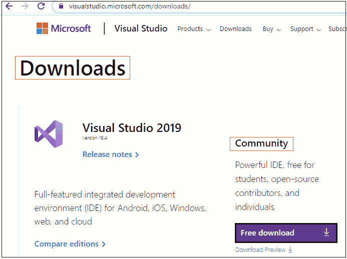

*   一旦我们点击了免费下载按钮，它就会下载 visual Studio 的 **exe** 文件。
*   之后，打开下载的 **exe** 文件，如下图截图所示:

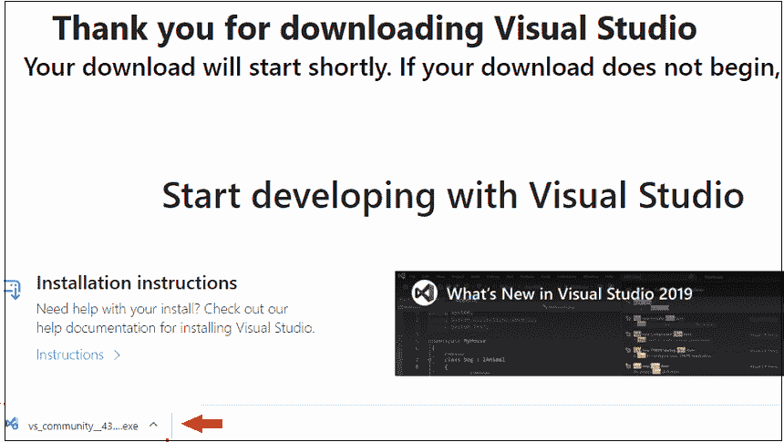

### 安装 Visual Studio

下载 **Windows** 平台的 Visual Studio 后，我们就可以安装了。

要安装 Visual Studio，请执行以下过程:

*   双击下载的可执行文件后，屏幕上会出现 **Visual Studio Installer** 窗口，点击**继续**按钮进行下一步操作，如下图所示:


*   点击**继续**按钮后，开始为 visual Studio 安装文件。

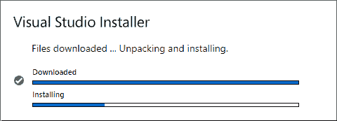

*   一旦这个过程完成，**安装-visual Studio-社区 2019-16.4.3** 窗口将出现在屏幕上，我们在这里选择**通用 Windows 平台开发**和**。网络桌面开发选项**在**桌面&移动**部分。
*   点击**安装**按钮，如下图所示:

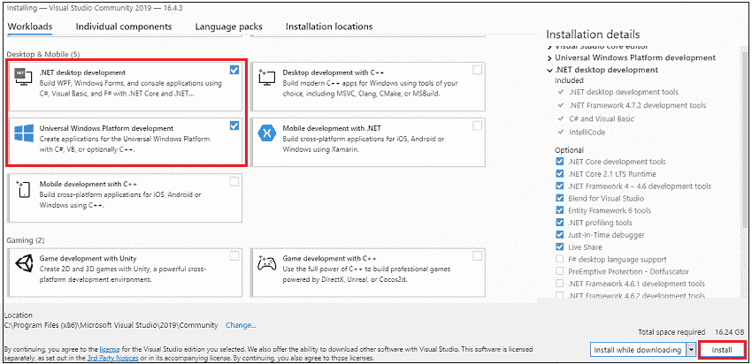

*   安装过程将需要一些时间，因为文件很大，正如我们在下面的截图中看到的:

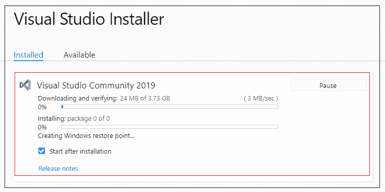

*   安装过程完成后，我们会在启动 visual Studio 之前点击**重启**按钮。


*   一旦系统重启(重启)，我们将在开始菜单上搜索“ **Visual Studio 2019** ”，并双击它。
*   屏幕上会出现下面的弹出窗口，我们会点击**不是现在，也许以后**如果我们没有账户的话，就像下面截图中看到的那样:

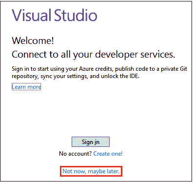

*   在下一个窗口中，我们可以为 Visual Studio 选择**主题**。
*   选择好 Visual Studio 的主题后，点击**开始 Visual Studio** 按钮，如下图所示:

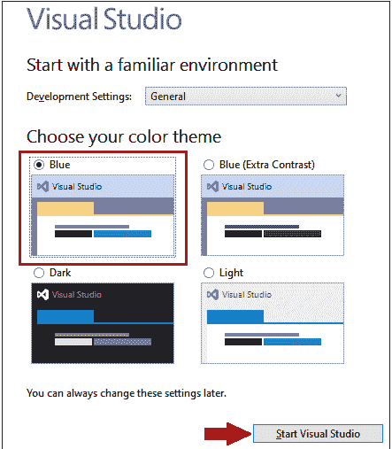

*   我们得到了 Visual Studio 的**开始**窗口。

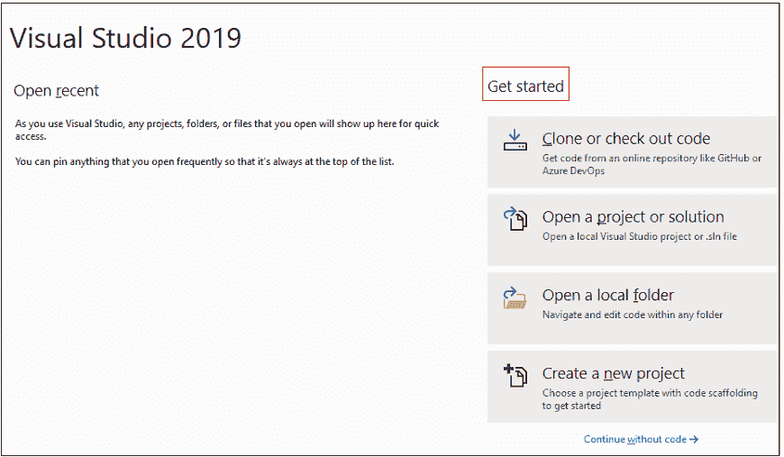

### 创建新项目

安装完成后，我们准备在 Visual Studio 上创建一个新项目。

要在 Visual Studio 上创建项目，请执行以下过程:

*   右键点击**文件**菜单，转到**新建**，在给定的弹出菜单中选择**项目**选项，如下图截图所示:

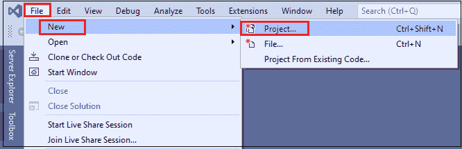

*   **新建项目**窗口将出现在屏幕上，我们将在**全语言**下拉菜单中选择 **C#** 语言。
*   然后从**所有平台**下拉列表中选择**窗口**平台选项。
*   并搜索**。网络框架模板**在**搜索栏中，**并选择**控制台应用(。NET 框架)**从它开始。
*   之后，点击**下一步**按钮，如下图所示:

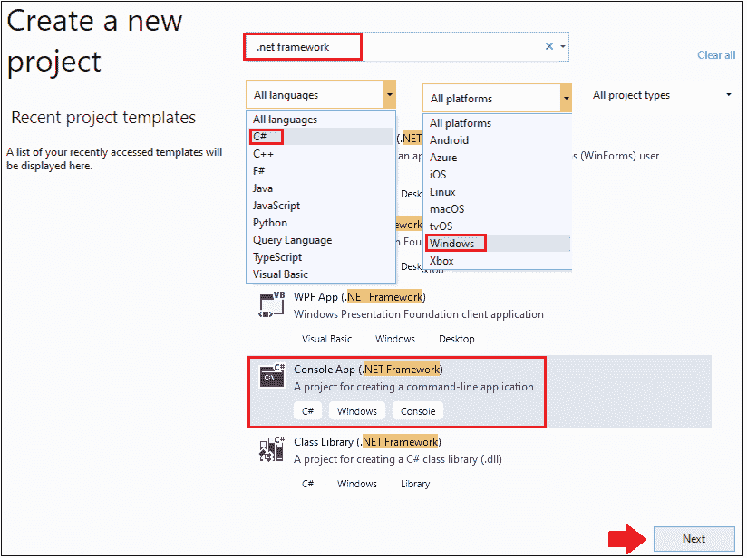

*   一旦我们点击下一步按钮，**配置您的新项目**窗口将出现在屏幕上，我们将提供我们的**项目名称【硒元素测试】，**并点击**创建**按钮，如下图所示:

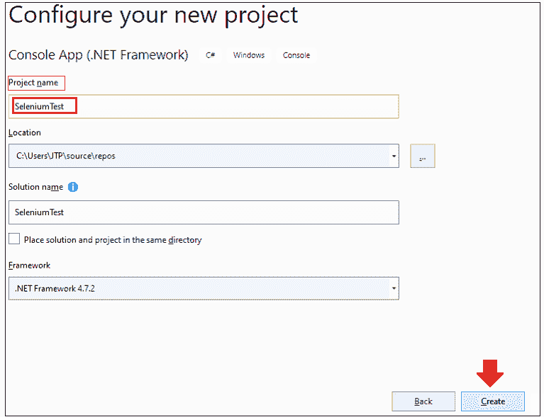

*   项目成功创建后，屏幕上将出现以下窗口:

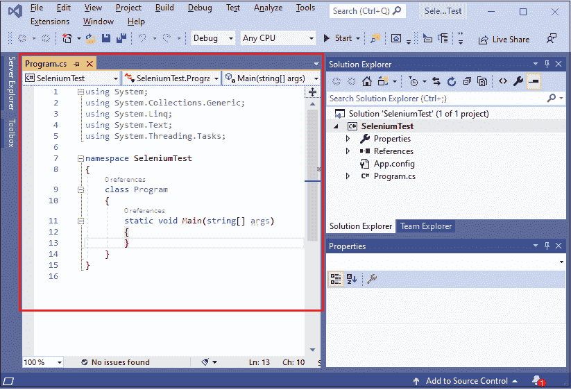

### 在 Visual Studio 中添加引用

项目创建完成后，我们将借助 Visual Studio 中的 **NuGet 包管理器**添加 **Selenium WebDriver** 和 **Chrome driver** 的引用。

### 添加硒网络驱动程序参考

按照以下过程，在 Visual Studio 中添加 Selenium 网络驱动程序的引用:

*   在**解决方案浏览器**中，右键单击**参考**，并在给定的弹出菜单中选择**管理 NuGet 包**选项，如下图所示:

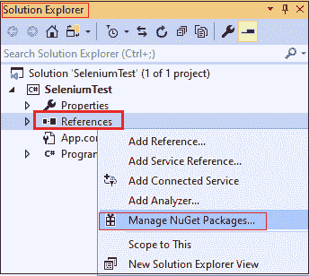

*   将打开**管理 NuGet 包**窗口，我们将在其中搜索**硒**并选择**网络驱动程序**，然后点击**安装**按钮，如下图所示:

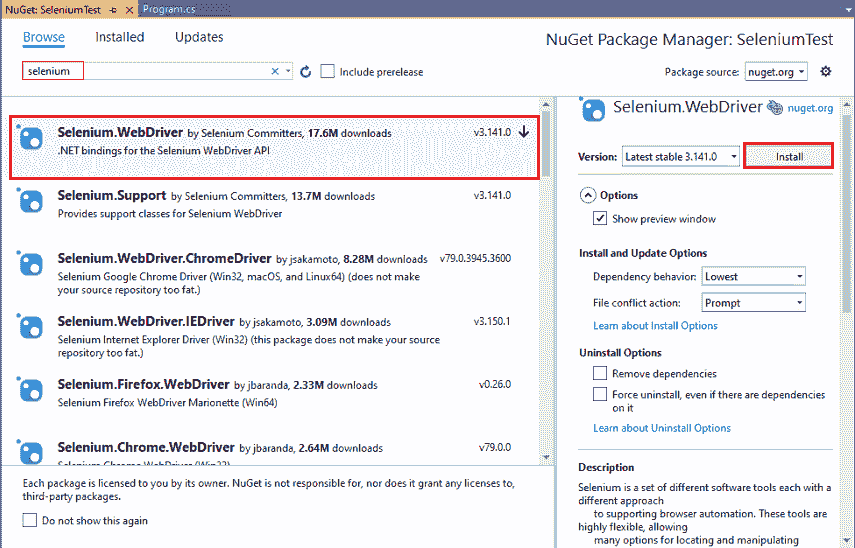

*   然后，点击**预览更改窗口**中的**确定**按钮，如下图所示:

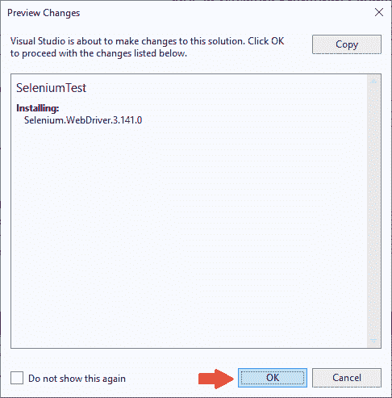

*   一旦软件包成功安装，它将给出下面的输出消息。

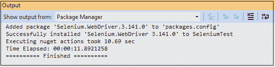

### 添加 Chrome 驱动程序引用

遵循以下流程，在 Visual Studio 中添加对 **Chrome 驱动程序**的引用:

*   要在 chrome 浏览器上执行操作，我们将再次右键单击**参考**，并从弹出菜单中选择**管理 NuGet 软件包**选项。
*   然后在搜索栏中搜索 **chrome 驱动**，选择 **Chrome。点击**安装**按钮，如下图所示:**

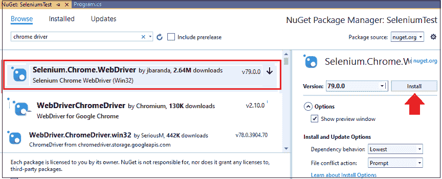

*   并且，点击**预览更改**窗口中的**确定**按钮进行进一步处理。

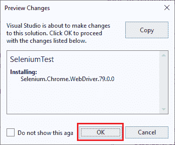

*   在 Visual Studio 中添加了 Selenium 网络驱动程序和 Chrome 驱动程序引用后，我们就可以用 C#编程语言编写测试脚本了。

### 用 C#编写一个 Selenium 测试脚本

要使用 C#编程语言编写 Selenium 测试脚本，请执行以下步骤:

| 步伐 | 行动 | 投入 | 预期结果 |
| **1。** | 为浏览器创建引用 |  | 应该创建浏览器的引用。 |
| **2。** | 导航至**谷歌主页**。 | [https://www.google.com/](https://www.google.com/) | 必须显示谷歌主页。 |
| **3。** | 识别**谷歌搜索文本框**并传递值。 | Javatpoint 教程 | 应该识别谷歌搜索框，并输入值。 |
| **4。** | 识别并点击**谷歌搜索**按钮。 |  | 谷歌搜索按钮应该被识别和点击。 |
| **5。** | 关闭浏览器。 |  | 浏览器应该关闭。 |

我们正在一步一步地创建我们的测试脚本，以便让您详细了解每个组件。

**第一步**

要为浏览器创建引用，我们将遵循以下过程:

#### 注意:要声明接口:在接口名称前加前缀“I”。如下表所示，在 C#中，我们将“I”放在接口(IWebDriver)之前，而在 java 中，没有必要将“I”放在接口(WebDriver)名称之前。

| C# | 爪哇 |
| 自动化测试 | web 驱动程序 |
| iwebelemont | 韦伯蒙特 |

下面是示例代码:

```

IWebDriver driver = new ChromeDriver();

```

*   在编写上面这段代码时，我们遇到了下面的错误:

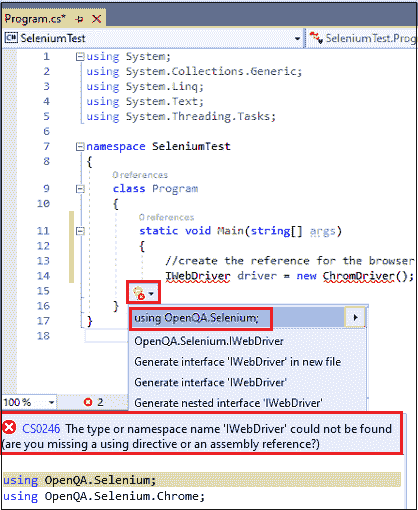

*   为了克服这个错误，我们将使用下面的语句，它帮助我们添加 Selenium 引用。

```

using OpenQA.Selenium;

```

*   添加 chrome 驱动程序的引用时，会出现以下错误:

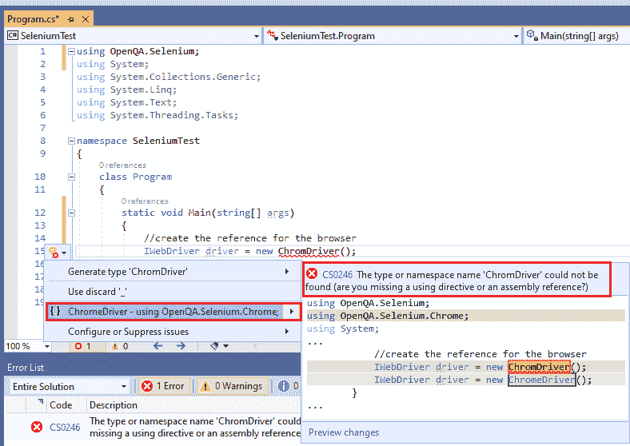

*   为了解决这个错误，我们将在代码中使用下面的语句。

```

using OpenQA.Selenium.Chrome;

```

**第二步**

在这一步中，我们将在浏览器中导航[https://www.google.com/](https://www.google.com/)网址。

示例代码如下:

```

driver.Navigate().GoToUrl("https://www.google.com/");

```

#### 注意:GoToUrl()方法用于导航网址。

**第三步**

要识别谷歌搜索框，请遵循以下流程:

在这一步中，我们试图借助其**名称**属性来定位**谷歌搜索文本框**。

*   右键点击**谷歌搜索文本框**，在弹出菜单中选择**检查**选项，如下图所示:
    
*   开发人员工具窗口将启动，其中包含开发**谷歌搜索**文本框时使用的所有特定代码，我们将在其中复制其**名称**属性的值，即“ **q** ”。
    
*   示例代码如下:

```

IWebElement ele = driver.FindElement(By.Name("q"));

```

**第四步**

在这一步中，我们将在谷歌搜索框中传递该值。

下面是示例代码:

```

ele.SendKeys("javatpoint tutorials");

```

**第五步**

要识别谷歌搜索按钮，请遵循以下流程:

*   右键单击**谷歌搜索**按钮，从给定的弹出菜单中选择**检查**选项，如下图所示:


*   开发人员工具窗口将启动，其中包含开发**谷歌搜索**按钮时使用的所有特定代码。
*   然后，复制其**名称**属性的值，即“ **btnK** ，如下图所示:


*   并且，示例代码如下:

```

IWebElement ele1 = driver.FindElement(By.Name("btnK"));
//click on the search button
ele1.Click();

```

**第六步**

在最后一步中，我们将在浏览器上执行的所有操作完成后关闭浏览器。

下面是示例代码:

```

driver.Close();

```

完成所有测试场景后，我们的最终测试脚本将如下所示。

```

using OpenQA.Selenium;
using OpenQA.Selenium.Chrome;
using System;
using System.Collections.Generic;
using System.Linq;
using System.Text;
using System.Threading;
using System.Threading.Tasks;
namespace SeleniumTest
{
class Program
{
static void Main(string[] args)
{
Console.Write("test case started ");
//create the reference for the browser
IWebDriver driver = new ChromeDriver();
// navigate to URL
driver.Navigate().GoToUrl("https://www.google.com/");
Thread.Sleep(2000);
// identify the Google search text box
IWebElement ele = driver.FindElement(By.Name("q"));
//enter the value in the google search text box
ele.SendKeys("javatpoint tutorials");
Thread.Sleep(2000);
//identify the google search button
IWebElement ele1 = driver.FindElement(By.Name("btnK"));
// click on the Google search button
ele1.Click();
Thread.Sleep(3000);
//close the browser
driver.Close();
Console.Write("test case ended ");
}
}
}

```

### 运行测试脚本

编写完 Selenium 测试脚本后，我们将运行我们的测试脚本。

按照以下流程运行测试脚本:

*   点击**开始**按钮执行程序 **cs** 文件，如下图所示:

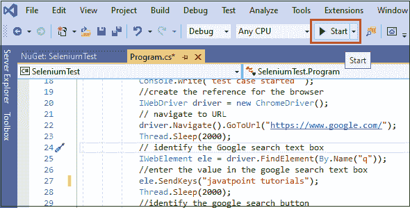

*   点击**开始**按钮后，执行过程开始，如下图所示:

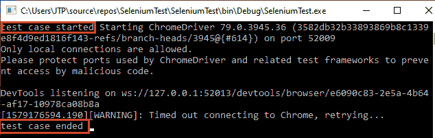

*   上述测试脚本将启动谷歌 Chrome 浏览器，并自动执行所有测试场景。

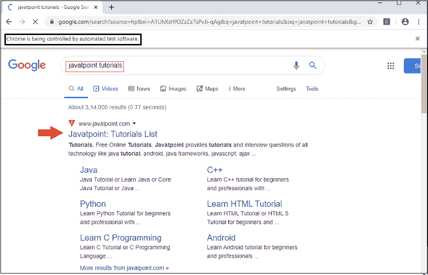

## 在 Visual Studio 中使用 NUnit 配置硒

在借助 NUnit 编写测试脚本之前，我们先了解一下 **NUnit 框架**，在 Visual Studio 中下载安装 NUnit 框架

*   **什么是 NUnit 框架？**
*   **下载 NUnit3 测试适配器**
*   **添加 NUnit** 的引用
*   **创建一个 NUnit 类**
*   **使用 NUnit** 编写硒测试脚本
*   **执行测试脚本**

### 什么是 NUnit 框架？

**NUnit** 是一个面向所有**的**单元测试**框架。网络语言**。它是开源软件，并且已经完全重新设计以利用许多新功能。网络语言。

它还支持广泛的。Net 语言平台。

### 下载 NUnit3 测试适配器

**NUnit3 测试适配器**是一个扩展，允许我们在 Visual Studio 内部运行 NUnit 测试。

要在 Visual Studio 中下载 NUnit3 测试适配器，请执行以下步骤:

*   首先，进入**扩展**并在 Visual Studio 中选择**管理扩展**选项。

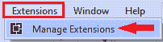

*   屏幕上将出现**管理扩展**窗口，我们将在其中搜索 **NUnit、**并点击**下载**按钮获取 **NUnit 3 测试适配器**，如下图所示:

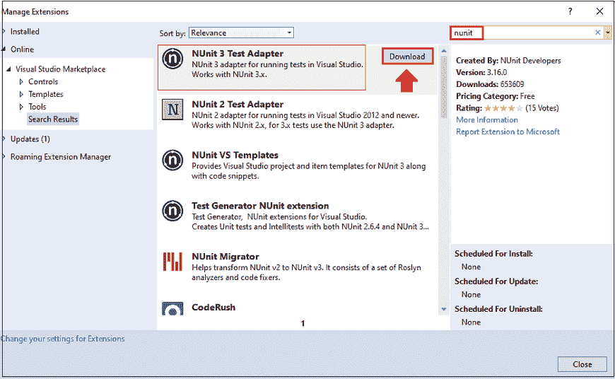

*   一旦我们点击下载按钮，它会要求我们关闭我们的 Visual Studio 来**修改**的更改，然后点击修改按钮，如下图所示:

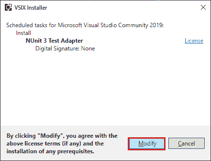

*   一旦我们点击修改按钮，它开始安装和修改 NUnit 3 测试适配器。
*   完成所有修改后，我们会看到下面的窗口:

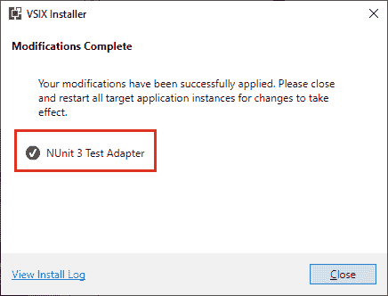

*   正如我们在“管理扩展”窗口中看到的那样， **NUnit 3 测试适配器**已成功安装。

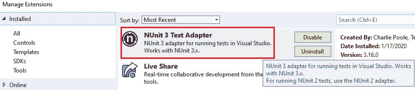

*   一旦我们完成了 NUnit 3 测试适配器的安装过程，我们将为 NUnit 添加参考。

### 为 NUnit 添加引用

要添加 NUnit 的引用，请遵循以下过程:

*   右键单击**解决方案资源管理器**中的**参考**，并在给定的弹出菜单中选择**管理新包**选项。

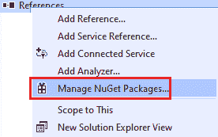

*   在**管理 NuGet 包**窗口，我们将在搜索栏中搜索 **NUnit** ，选择第一个选项为 **NUnit、**，点击**安装**按钮，如下图截图所示:

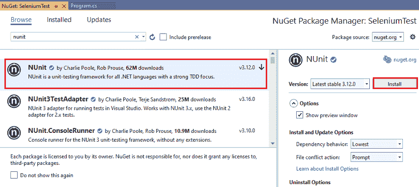

*   一旦我们点击安装按钮，**预览更改**窗口将出现在我们点击**确定**的屏幕上

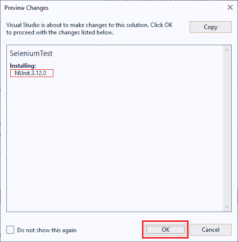

*   一旦软件包成功安装，我们将获得下面的输出消息。

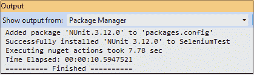

### 创建无信息类

要在 Visual studio 中创建一个 NUnit 类，请执行以下过程:

*   右键单击 **SeleniumTest** 项目，然后转到**添加**并从给定的弹出菜单中选择**类**选项。


*   屏幕上将出现**添加新项目**窗口，我们将提供**类名**作为**样本 1、**，点击**添加**按钮，如下图所示:

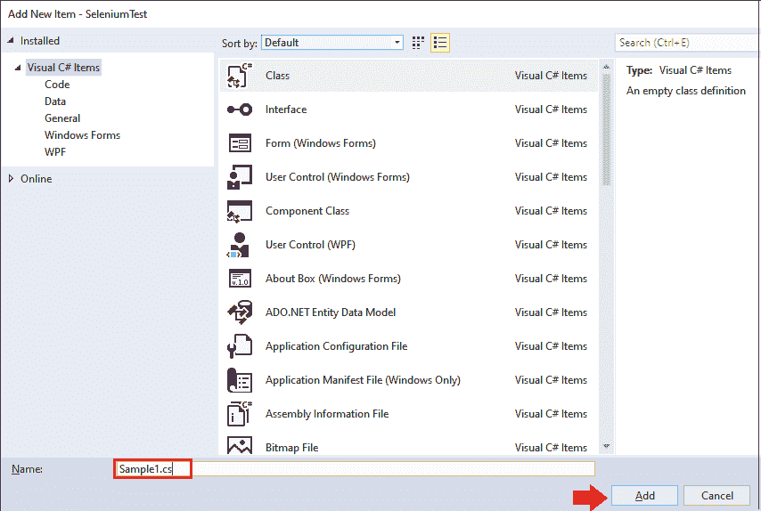

*   一旦我们点击了添加按钮，下面的窗口就会出现在屏幕上:

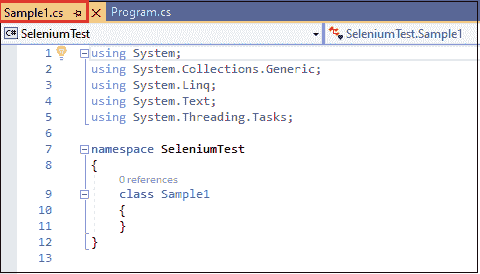

*   成功创建类后，我们准备使用 NUnit 编写测试脚本。

### 用 NUnit 编写硒测试脚本

要使用 NUnit 编写硒测试脚本，请遵循以下过程:

出于测试目的，我们将在脸书应用程序上执行**登录操作。**

| 步伐 | 行动 | 投入 | 预期结果 |
| **1。** | 打开谷歌 Chrome 浏览器。 |  | 谷歌浏览器应该打开了。 |
| **2。** | 导航到脸书登录页面。 | [https://www.facebook.com](https://www.facebook.com/) | 必须显示脸书登录页面。 |
| **3。** | 识别**用户名**文本框并传递值。 | [【邮件保护】](/cdn-cgi/l/email-protection) | 应识别用户名文本框，并输入值。 |
| **4。** | 识别**密码**文本框并传递值。 | 密码=####### | 应识别密码文本框，并输入值。 |
| **5。** | 识别**登录**按钮并点击。 |  | 应该识别并单击登录按钮。 |
| **6。** | 关闭浏览器。 |  | 浏览器应该关闭。 |

我们正在一步一步地创建我们的测试脚本，让您完全理解我们是如何借助 Visual studio 中的 NUnit 框架编写测试脚本的。

**第一步**

要访问谷歌浏览器，我们将创建 **IWebDriver** 作为全局变量。

下面是示例代码:

```

//create the reference for the browser
 IWebDriver driver = new ChromeDriver();

```

#### 注意:
全局变量:全局变量在程序中所有函数都可以访问的任何函数之外声明。

我们将把代码分成不同的部分，同时在 NUnit 测试方法的帮助下使用 NUnit 编写代码，例如:

*   打开浏览器**:初始化**
*   执行浏览器操作**:执行测试**
*   关闭浏览器**:结束测试**

```

The syntax for the NUnit test method:
public void MethodName()

```

**示例:**

```

public void Initialize()
{
//open the browser
}
public void ExecuteTest()
{
//perform browser operations
}
public void EndTest()
{
//close the browser
}

```

**第二步**

在下一步中，我们将在 **Initialize()** 方法下导航到给定的 URL。

下面是示例代码:

```

public void Initialize()
{
//navigate to URL
driver.Navigate().GoToUrl("https://www.facebook.com/");
//Maximize the browser window
driver.Manage().Window.Maximize();
Thread.Sleep(2000);
}

```

**第三步**

在这一步中，我们将在**executtest()方法下识别**脸书**登录页面的**用户名文本框**。**

遵循以下流程:

*   右键点击**用户名**文本框，点击**检查**元素，如下图截图所示:

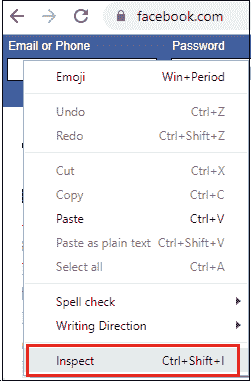

*   开发人员工具窗口将打开，其中包含用户名文本框开发中使用的所有特定代码。

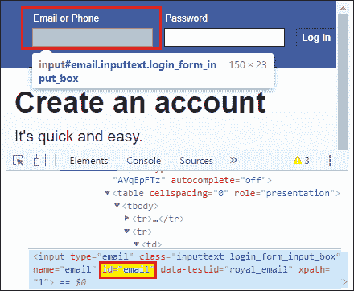

*   将其 **id** 属性的值复制为“**邮箱**，粘贴到代码中。

下面是示例代码:

```

public void ExecuteTest()
{
//identify the username text box
IWebElement ele = driver.FindElement(By.Id("email"));
//enter the username value
ele.SendKeys("xyz11@gmail.com");
Thread.Sleep(2000);
Console.Write("username value is entered \n");

```

**第四步**

之后，我们将识别脸书登录页面的**密码**文本框，为此请遵循以下流程:

*   右键点击**密码**文本框，点击弹出菜单中的**检查**元素选项，如下图所示:

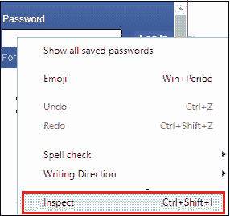

*   它将启动一个开发人员工具窗口，其中包含密码文本框开发中使用的所有特定代码。

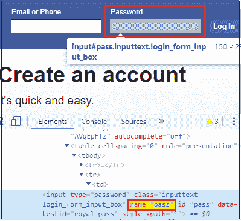

*   将其**名称**属性的值复制为“**通行**，粘贴到代码中。

下面是示例代码:

```

//identify the password text box
IWebElement ele1 = driver.FindElement(By.Name("pass"));
//enter the password value
ele1.SendKeys("########");
Console.Write("password is entered");

```

**第五步**

一旦我们确定了用户名或密码文本框，我们将找到**登录**按钮并执行点击操作。

*   右键单击**登录**按钮，从给定的弹出菜单中选择**检查**选项，如下图所示:

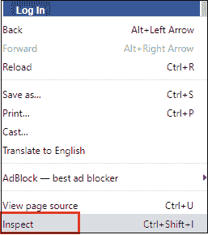

*   开发人员工具窗口将启动，包含所有特定代码，这些代码用于登录按钮的开发，如下图所示:

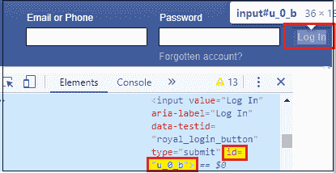

*   复制其 **Id** 属性“ **u_0_b** 的值，粘贴到代码中。

下面是示例代码:

```

//click on the Log in button
IWebElement ele2 = driver.FindElement(By.Id("u_0_b"));
ele2.Click();
Thread.Sleep(3000);
Console.Write("login button is clicked")

```

**第七步**

在测试脚本的最后一步，我们将在 **EndTest()** 方法下关闭浏览器。

下面是关闭浏览器的示例代码:

```

public void EndTest()
{
//close the browser
driver.Close();    
}

```

将所有步骤组合在一起后，我们的脚本将如下所示:

```

using OpenQA.Selenium;
using OpenQA.Selenium.Chrome;
using System;
using System.Collections.Generic;
using System.Linq;
using System.Text;
using System.Threading.Tasks;
using System.Threading;
namespace SeleniumTest
{
class Sample1
{
//create the reference for the browser
IWebDriver driver = new ChromeDriver();
public void Initialize()
{
//navigate to URL
driver.Navigate().GoToUrl("https://www.facebook.com/");
//Maximize the browser window
driver.Manage().Window.Maximize();
Thread.Sleep(2000);
}
public void ExecuteTest()
{
//identify the username text box
IWebElement ele = driver.FindElement(By.Id("email"));
//enter the username value
ele.SendKeys("xyz11@gmail.com");
Thread.Sleep(2000);
Console.Write("username value is entered");          
//identify the password text box
IWebElement ele1 = driver.FindElement(By.Name("pass"));
//enter the password value
ele1.SendKeys("########");
Console.Write("password is entered");     
//click on the Login button
IWebElement ele2 = driver.FindElement(By.Id("u_0_b"));
ele2.Click();
Thread.Sleep(3000);
Console.Write("login button is clicked");
}
public void EndTest()
{
//close the browser
driver.Close();    
}
}
}

```

#### 注意:在上面的代码中，使用您的脸书身份证号码:[【电子邮件保护】](/cdn-cgi/l/email-protection)和密码:# # # # # # # ##

### 执行测试脚本

要运行测试脚本，请遵循以下过程:

*   进入工具栏中的**测试**，选择**测试浏览器**，如下图截图所示:

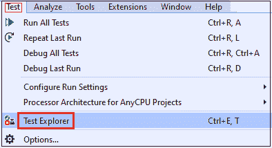

*   屏幕上将出现**测试资源管理器**窗口，要查看所有可用的测试，我们必须构建我们的解决方案。

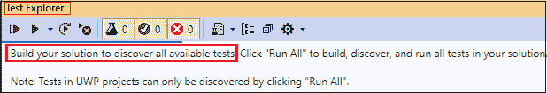

*   要构建解决方案，请转到**构建**并从给定的弹出菜单中选择**构建解决方案**，如下图所示:

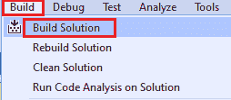

*   一旦我们完成了构建解决方案，我们就不能在测试资源管理器窗口上看到我们的测试，因为我们没有添加 **NUnit 属性**。
*   **NUnit** 提供了一些内置属性，但是这里我们使用的是**设置、测试和拆卸**
*   因此，我们将在代码中添加 **Test** 属性，如下所示:

#### 注意:
测试属性:用于将方法标记为可从 NUnit 测试运行程序中调用。

```

[Test]
public void ExecuteTest()

```

*   添加**测试属性时，**会给出以下错误。
*   为了克服这个错误，我们将使用 **NUnit 框架**的引用，如下图所示:

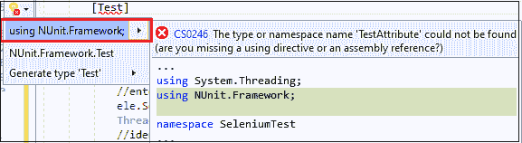

*   现在，我们转到**测试资源管理器**并再次构建解决方案，我们将在**测试资源管理器**上获得**执行测试**
*   之后，我们将**运行**所选的测试，如下图所示:

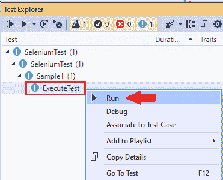

*   运行测试脚本后，它将能够打开浏览器，如下图所示:

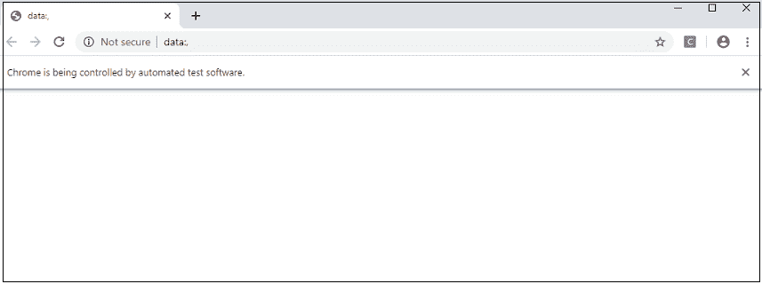

*   测试将**失败**，因为我们没有在代码中的任何地方调用**初始化**方法。
*   因此，我们需要通过在代码中添加两个名为 **SetUp 和拆卸**的属性来告诉 NUnit Framework。

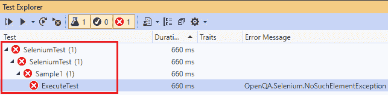

#### 注意:
SEtuP:SEtuP 属性用于标识要立即调用的方法；每次测试运行。
拆卸:该属性用于标识在每个测试执行后立即调用的方法。而且这个方法保证会被调用，即使抛出异常。

添加所有三个属性后，我们的最终代码将如下所示:

```

using OpenQA.Selenium;
using OpenQA.Selenium.Chrome;
using System;
using System.Collections.Generic;
using System.Linq;
using System.Text;
using System.Threading.Tasks;
using System.Threading;
using NUnit.Framework;
namespace SeleniumTest
{
class Sample1
{
//create the reference for the browser
IWebDriver driver = new ChromeDriver();
[SetUp]
public void Initialize()
{
//navigate to URL
driver.Navigate().GoToUrl("https://www.facebook.com/");
//Maximize the browser window
driver.Manage().Window.Maximize();
Thread.Sleep(2000);
}
[Test]
public void ExecuteTest()
{
//identify the username text box
IWebElement ele = driver.FindElement(By.Id("email"));
//enter the username value
ele.SendKeys("xyz11@gmail.com");
Thread.Sleep(2000);
Console.Write("username value is entered \n");          
//identify the password text box
IWebElement ele1 = driver.FindElement(By.Name("pass"));
//enter the password value
ele1.SendKeys("########");
Console.Write("password is entered \n");     
//click on the Login button
IWebElement ele2 = driver.FindElement(By.Id("u_0_b"));
ele2.Click();
Thread.Sleep(3000);
Console.Write("login button is clicked \n");
}
[TearDown]
public void EndTest()
{
//close the browser
driver.Close();    
}
}
}

```

*   之后，再次执行构建解决方案并运行所选测试。
*   我们的测试在测试资源管理器窗口中通过，如下图所示:

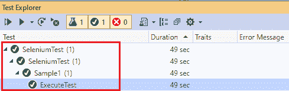

*   上面的测试脚本将启动谷歌 Chrome 浏览器，并自动执行所有测试场景，如下图所示:

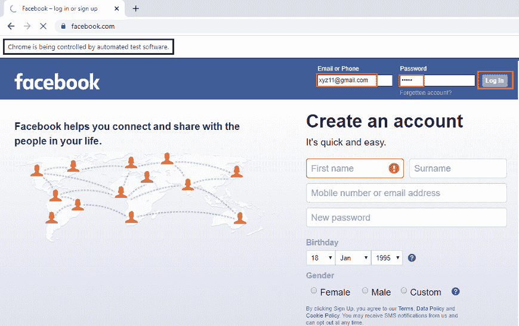

*   或者如果我们想看输出，我们会传递一些值，通过点击**输出链接**来看输出。
*   我们可以看到控制台上执行的所有操作的输出，如下面的截图所示:

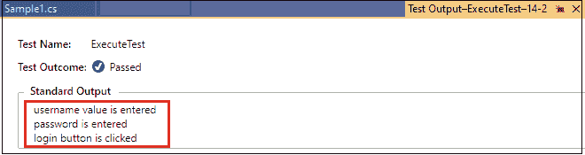

* * *