# 硒马文

> 原文：<https://www.javatpoint.com/selenium-maven>

Maven 是最新的构建测试工具。与蚂蚁相比，它有几个新特性，比如依赖性等。

Maven 是一个项目构建或项目管理工具。每当多个测试工程师将他们的文件集成到同一个框架中时，它用于检查框架组件之间的编译问题。

它总是维护监视器、框架组件或构建，并且每当在框架中发生修改时，它都提供构建状态修改。

如果框架中没有编译问题，它将提供“**构建成功**消息，否则将提供“**构建失败**消息。

Maven 有像 dependency 这样的新特性，用于在测试执行之前从互联网下载 dependency jar。

在 Maven 的帮助下，我们可以在命令行中执行测试脚本，而无需 eclipse。它总是提供框架文件夹结构。

有关 Maven 的更多信息，请参考以下链接:

[https://www.javatpoint.com/maven-tutorial](https://www.javatpoint.com/maven-tutorial)

Maven 中有两个可用的软件:

*   **Maven Eclipse 插件**
*   **Maven 命令行插件**

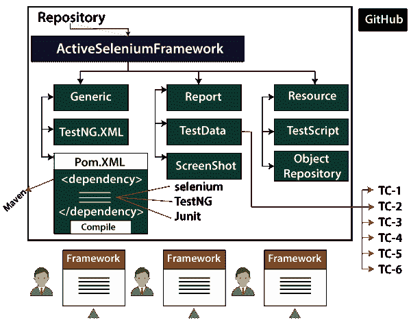

## Maven Eclipse 插件

它是最新的 Eclipse 版本(如火星、露娜、氧气)的默认插件，用于通过 Eclipse 创建一个 Maven 项目。

**为 Eclipse 安装 Maven 插件，配合 Selenium TestNG 使用**

很多时候，在 Eclipse 中会自动安装 Maven 插件，但如果没有的话，我们会去 **Eclipse Market Place** 搜索 **Maven** ，从那里下载 **M2E 集成版**。

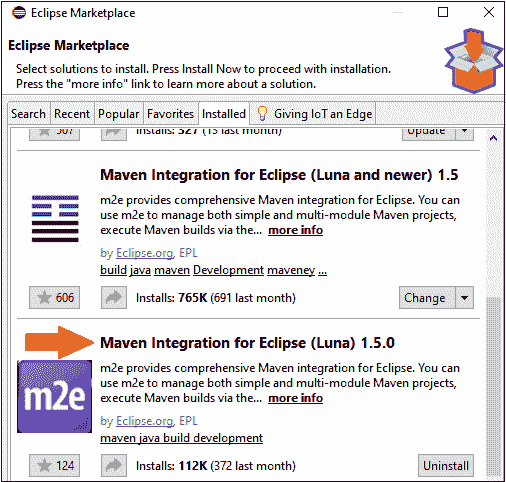

**创建 Maven 项目的步骤**

要创建 Maven 项目，请执行以下步骤:

*   转到**文件→新建→项目**

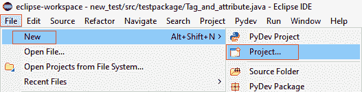

*   然后，展开 **Maven** 文件夹，选择 **Maven 项目**选项，点击**下一步**

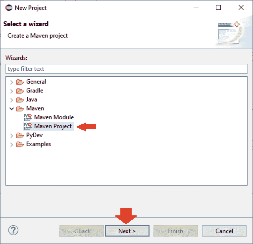

*   再次点击**下一步**按钮进行下一步操作。

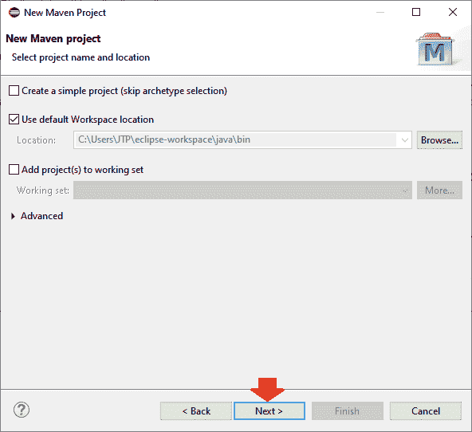

*   不做任何操作，点击**下一步**按钮。

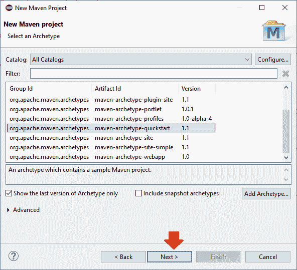

*   点击下一步按钮后，我们将提供**组 ID** 和**神器 ID** 在我们的案例中，我们将给出组 ID 为**微星项目**和神器 ID 为**微星项目**，点击**完成**按钮，如下图截图所示:

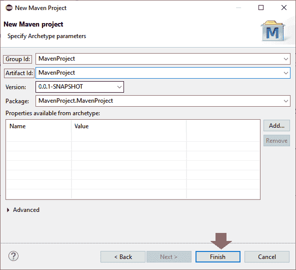

*   一旦我们完成了 Maven 项目的创建，我们的 **Maven 文件夹结构**将如下所示:

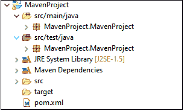

## Maven 命令行插件

它用于在没有 Eclipse 的情况下在命令提示符下执行 Selenium 测试脚本，应该显式安装该软件。

### Maven 命令行插件的安装步骤

要安装 Maven 命令行插件，请执行以下步骤:

#### 注意:在我们开始 Maven 的安装过程之前，我们将确保安装了 Java，并且还设置了环境变量。

**第一步:下载 Apache Maven**

*   首先去谷歌搜索 **Maven 下载**点击 First 链接，如下图截图所示:
    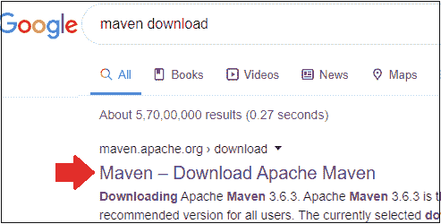
*   一旦我们点击链接，它将导航到 Maven 社区。除了**二进制 zip 存档，**点击给定的链接，如下图所示:
    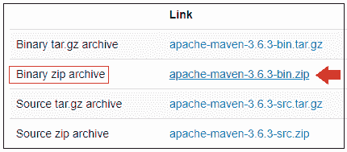
*   下载 zip 文件夹，之后解压放入 **C 驱动器**，复制文件夹的位置。

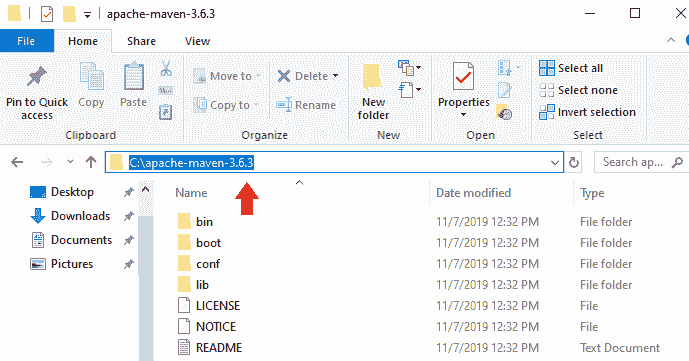

**步骤 2:在系统变量**中添加 M2_Home

*   复制位置后，我们将进入**环境变量**窗口，点击**系统变量**部分的**新建**按钮，如下图所示:

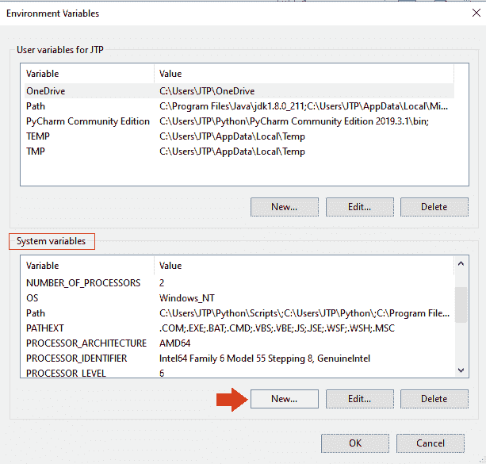

*   之后，我们会提供**变量名**和**变量值**，点击**确定**

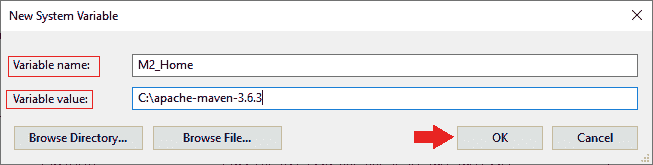

**步骤 3:将%M2_Home%\bin 添加到路径**

*   一旦我们创建了 M2_Home 系统变量，我们就会找到**路径**变量，点击**编辑**按钮，如下图截图所示:

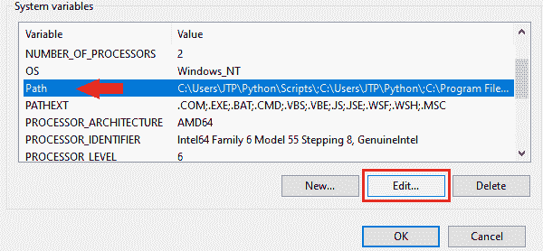

*   屏幕上会出现**编辑变量窗口**，然后点击**新增**按钮和**% M2 _ 首页%\bin** 值，点击**确定**

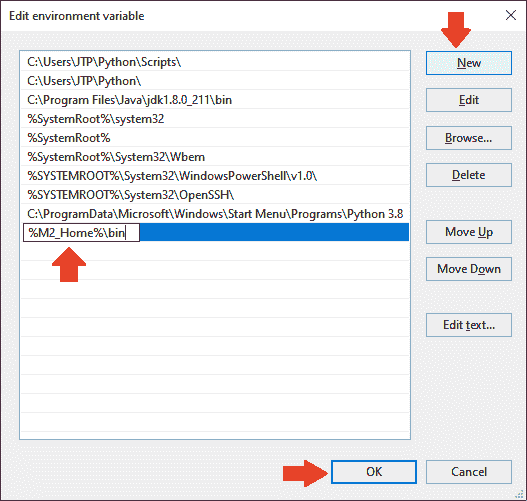

**第四步:验证**

*   设置环境变量后，我们将检查 Maven 是否安装成功。
*   为此，我们将打开命令提示符并键入以下命令:

```

mvn- version

```

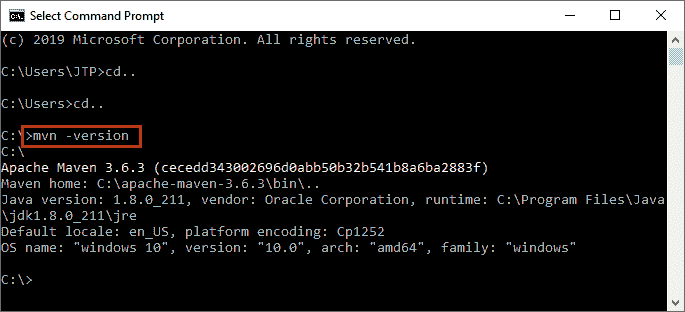

*   在上面的截图中，我们可以看到 Apache Maven 已经成功安装。

## 如何使用 Maven 处理或下载依赖关系 Jar

在开始编写 Maven 代码之前，我们需要在 pom.xml 文件中添加像 [TestNG](https://www.javatpoint.com/testng-tutorial) 和 [Selenium](https://www.javatpoint.com/selenium-tutorial) 这样的通用依赖项。

为此，我们将遵循以下流程:

*   我们自动在同一个项目中获得 Pom.xml 文件。
*   要下载 **TestNG** 和 **Selenium** 的依赖 jar，我们应该为 Pom.xml 文件中的所有工具编写一个依赖代码。
*   要获取依赖代码，请进入谷歌搜索并输入“ **TestNG Maven 依赖关系**，然后点击给定的链接。
    T3】
*   并复制 TestNG 的依赖代码，粘贴到 pom.xml 文件中。
    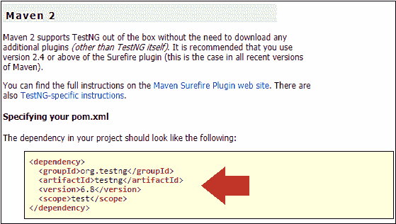
*   在**范围**部分，将值从**测试**更改为**编译**，最终的依赖代码将如下所示:

```

<dependency>
 <groupId>org.testng</groupId>
 <artifactId>testng</artifactId>
 <version>6.8</version>
 <scope>compile</scope>
</dependency>

```

然后，我们将为 Selenium 添加 Maven 依赖项，为此，我们将遵循与之前相同的过程:

*   去谷歌搜索 **Maven selenium dependency** ，点击给定的链接，如下图截图所示:

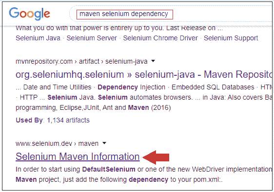

*   从链接中复制依赖代码，粘贴到 **xml** 文件中。

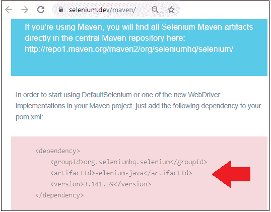

*   添加 **TestNG 和 Selenium** 的依赖代码后，Pom.xml 文件将如下所示:

```

<dependency>
<groupId>org.testng</groupId>
<artifactId>testng</artifactId>
<version>6.8</version>
<scope>compile</scope>
</dependency>
 <dependency>
<groupId>org.seleniumhq.selenium</groupId>
<artifactId>selenium-java</artifactId>
<version>3.141.59</version>
</dependency>
 </dependencies>

```

*   然后按 **ctrl+s** 保存 pom.xml 文件。
*   添加完依赖项后，我们可以看到所有的 jars 文件都添加到了 **MavenProject** 下的 **Maven 依赖项**文件夹中。
    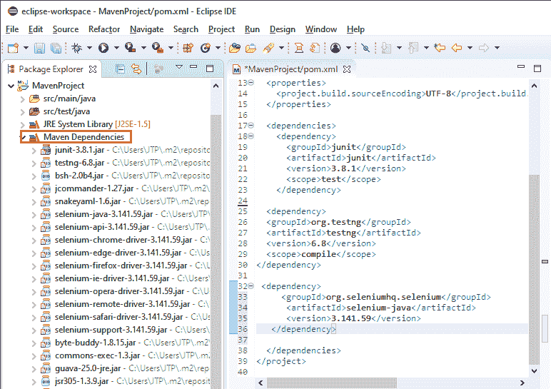

## 通过 Maven 和 TestNG 执行 Selenium 代码

*   我们将借助@Test、@BeforeTest 和@ AfterTest 注释编写一个示例测试用例。
*   首先，我们将推出**谷歌 Chrome**
*   然后，导航到 javatpoint 网站。
*   并借助 **getTitle()** 、 **getCurrentURL()** 获取网站当前页面 URL 和标题

**注**

**getTitle():** 这个方法用来抓取页面的标题。

**getCurrentURL():** 用于抓取页面的当前 URL。

为了执行上面的测试脚本，我们将在 MavenProject 中创建一个包。

*   要在 MavenProject 中创建包，我们将右键单击**src/test/Java→New→Package**

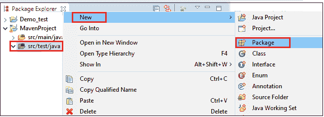

*   之后，我们将提供包名为“ **testpackage** ，点击**完成**按钮，如下图所示:
    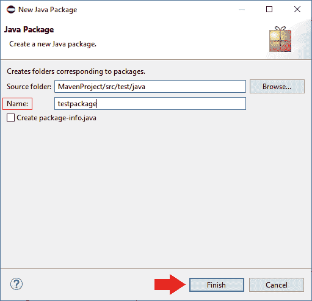
*   创建包后，我们将创建一个类。

要在 MavenProject 中创建类，请遵循以下过程:

*   右键单击新创建的包，选择**新建**，然后从给定列表中选择**类**，如下图所示:

**测试包→新→类**

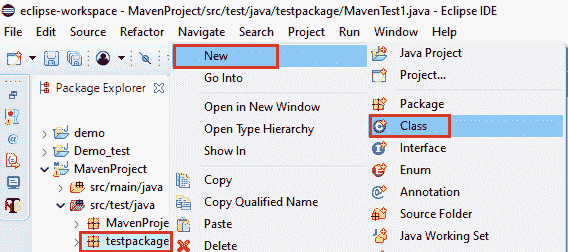

*   并且，提供类名为“**mavente1**”并点击**完成**

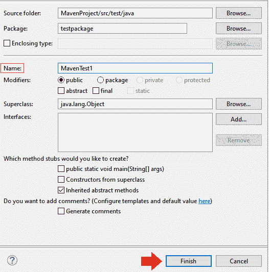

创建包和类后，我们将开始编写代码。

根据我们的代码需求，我们将添加多个依赖项。

添加依赖项后，我们的 pom.xml 文件如下所示:

```

<dependencies>
<dependency>
<groupId>junit</groupId>
<artifactId>junit</artifactId>
<version>3.8.1</version>
<scope>test</scope>
</dependency>
<dependency>
<groupId>org.testng</groupId>
<artifactId>testng</artifactId>
<version>6.8</version>
<scope>compile</scope>
</dependency>
<dependency>
<groupId>com.google.inject</groupId>
<artifactId>guice</artifactId>
<version>4.1.0</version>
<classifier>no_aop</classifier>
</dependency>
<dependency>
<groupId>org.seleniumhq.selenium</groupId>
<artifactId>selenium-java</artifactId>
<version>3.141.59</version>
</dependency>
<dependency>
<groupId>org.seleniumhq.selenium</groupId>
<artifactId>selenium-chrome-driver</artifactId>
<version>2.50.0</version>
</dependency>
<dependency>
<groupId>com.google.guava</groupId>
<artifactId>guava</artifactId>
<version>22.0</version>
</dependency>
<dependency>
<groupId>com.google.api-client</groupId>
<artifactId>google-api-client-appengine</artifactId>
<version>1.23.0</version>
<exclusions>
<exclusion>
<groupId>com.google.guava</groupId>
<artifactId>guava-jdk5</artifactId>
</exclusion>
</exclusions>
</dependency>
<dependency>
<groupId>com.google.code.gson</groupId>
<artifactId>gson</artifactId>
<version>2.2.4</version>
</dependency>
</dependencies>

```

下面是示例代码:

```

package testpackage;
import java.util.concurrent.TimeUnit;
import org.openqa.selenium.WebDriver;
import org.openqa.selenium.chrome.ChromeDriver;
import org.testng.annotations.AfterTest;
import org.testng.annotations.BeforeTest;
import org.testng.annotations.Test;
public class MavenTest1 {
public String baseUrl = "https://www.javatpoint.com/";
String driverPath = "C://chromedriver_win321//chromedriver.exe";
public WebDriver driver ; 
@Test			
public void test() {	
// set the system property for Chrome driver	
System.setProperty("webdriver.chrome.driver", driverPath);
// Create driver object for CHROME browser
driver = new ChromeDriver();
driver.manage().timeouts().implicitlyWait(20, TimeUnit.SECONDS);
driver.manage().window().maximize();
driver.get(baseUrl);
// get the current URL of the page
String URL= driver.getCurrentUrl();
System.out.print(URL);
//get the title of the page
String title = driver.getTitle();				 
System.out.println(title);
}	
@BeforeTest
public void beforeTest() {	
System.out.println("before test");
}	
@AfterTest
public void afterTest() {
driver.quit();
System.out.println("after test");
} 		
}

```

### 执行代码

我们可以通过多种方式运行上述代码:

*   **通过测试运行**
*   **跑过 Maven**
*   **运行命令行**

### 运行测试

如果我们使用 TestNG 运行上述代码，我们将遵循以下过程:

*   右键单击 **java** 文件，选择**运行方式→ 1 测试测试**，如下图所示:

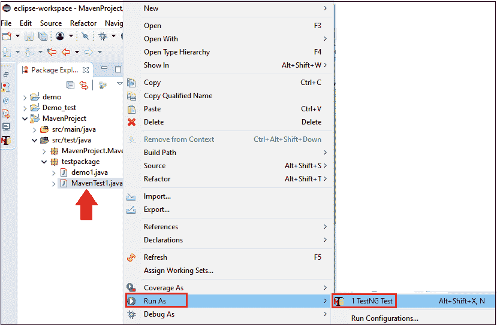

*   成功运行代码后，它将给出以下输出:

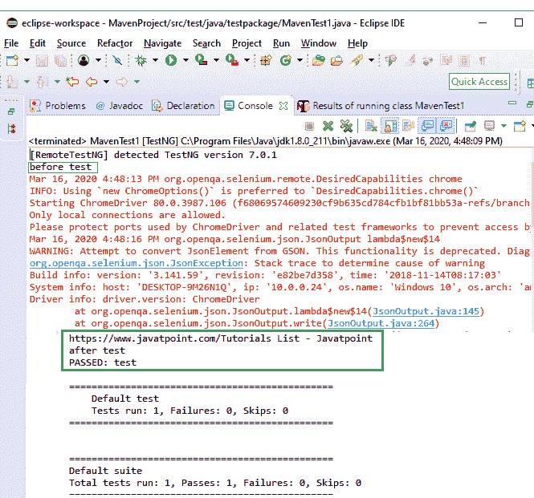

*   它会在控制台窗口启动浏览器，如下图所示:
    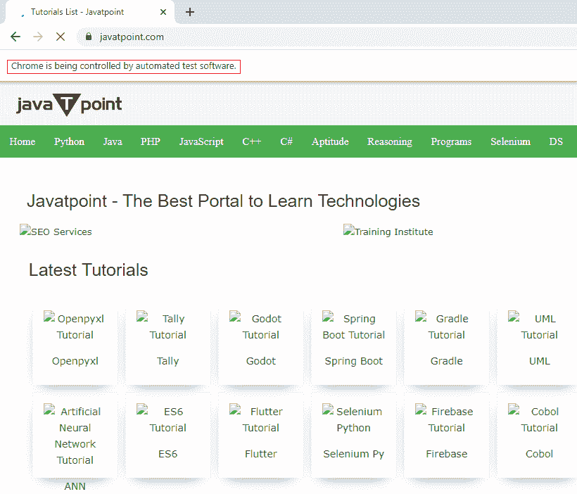

### 跑过马文

要通过 Maven 运行相同的代码，请执行以下步骤:

首先，我们需要将**MavenTest1.java**文件转换为**测试**文件，为此遵循以下流程:

*   右键单击 **java** 文件，选择**测试**，然后在给定列表中选择**转换为测试**选项。

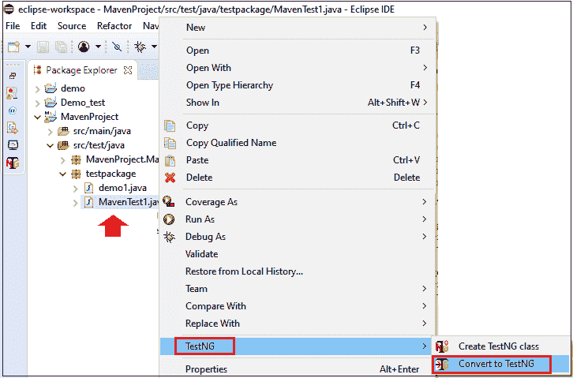

*   一旦我们选择**转换为测试**选项，它将打开下面的窗口，然后我们将点击**完成**

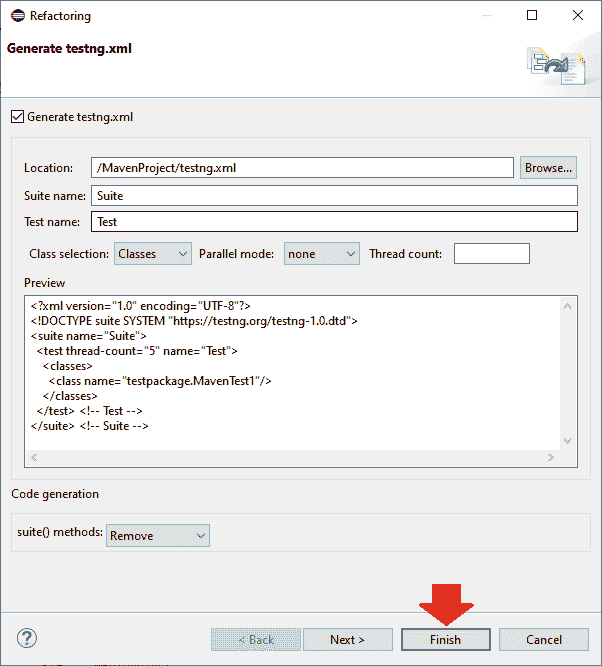

*   转换后的 TestNG 文件如下所示:

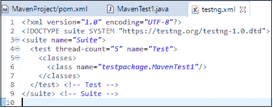

之后，我们将运行 **testng.xml** 文件，因此为此，我们需要在 **pom.xml** 文件中添加 Maven 插件。

因此，我们将添加三个不同的插件，如下所示:

*   **Maven 编译器插件**
*   **Maven surefire 插件**
*   **Maven 源码插件**

**注:**

**Maven 编译器插件**用于编译一个 Maven 项目的源代码。Maven test 命令将连接到互联网，并将所有依赖项 jar 下载到. M2 文件夹本地存储库中，然后编译整个 selenium 源代码，如下图所示:

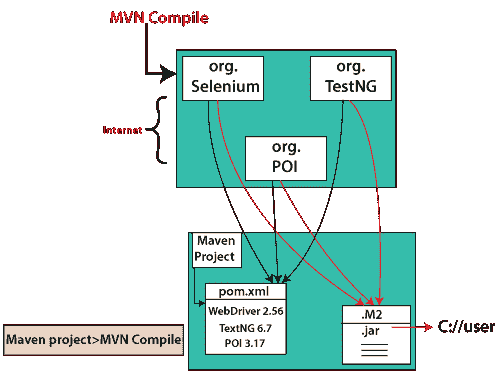

当我们必须运行应用程序的单元测试时，使用 **Maven surefire 插件**。

**Maven 源插件**用于构建拥有**的 jars 文件。java** 源文件。

添加所有插件后，我们的 pom.xml 如下所示:

```

<build>
<plugins>
<plugin>
<groupId>org.apache.maven.plugins</groupId>
<artifactId>maven-compiler-plugin</artifactId>
<version>3.1</version>
<configuration>
<source>1.6</source>
<target>1.6</target>
</configuration>
</plugin>
<plugin>
<groupId>org.apache.maven.plugins</groupId>
<artifactId>maven-surefire-plugin</artifactId>
<version>2.19.1</version>
<configuration>
<suiteXmlFiles>
<suiteXmlFile>C:\Users\JTP\eclipse-workspace\MavenProject\testng.xml</suiteXmlFile>
</suiteXmlFiles>
</configuration>
</plugin>
<plugin>
<groupId>org.apache.maven.plugins</groupId>
<artifactId>maven-source-plugin</artifactId>
<executions>
<execution>
<id>attach-sources</id>
<goals>
<goal>jar</goal>
</goals>
</execution>
</executions>
</plugin> 
</plugins>
</build>

```

*   保存 pom.xml 文件并执行代码。
*   要执行上述代码，右键单击 **MavenProject →运行方式→ Maven Test** ，如下图所示:

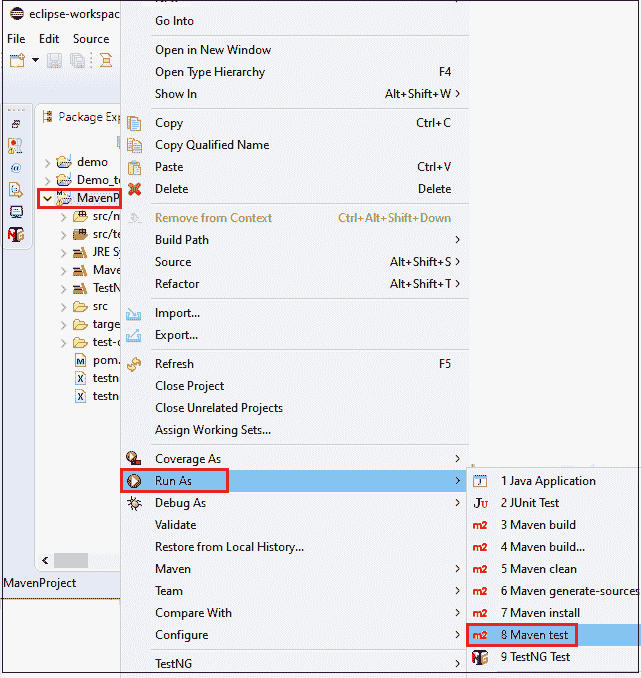

*   当所有测试用例都通过并且构建成功运行时，它将给出以下输出:

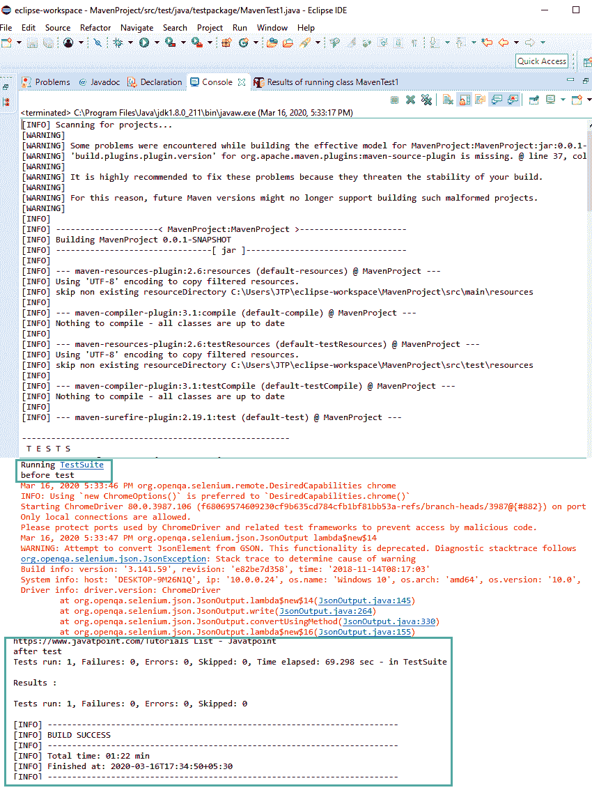

*   它将在控制台窗口中启动浏览器，如下图所示:


### 通过命令行运行

如果我们在 Maven 命令的帮助下使用一些远程机器，那么我们需要进入命令提示符。

为此，我们将转到 Maven 项目的特定目录，为此，右键单击**Maven 项目**，并从给定的弹出菜单中选择**属性**选项。

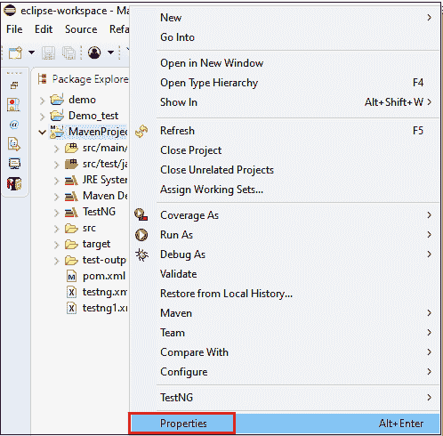

*   然后复制 **MavenProject** 的位置，粘贴在命令提示符下，到达文件的正确位置。

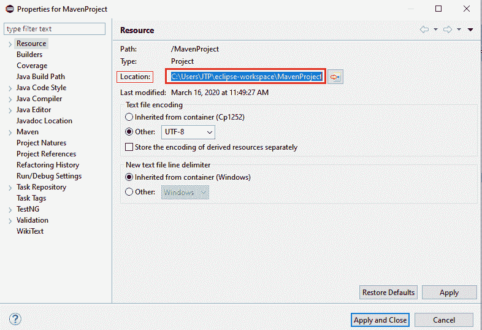

*   然后，在命令提示符下键入以下命令:

```

cd eclipse-workspace\MavenProject

```

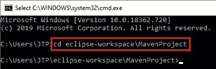

一旦我们进入了 MavenProject，我们将使用 Maven 的一些常见命令，如下所示:

| Maven 命令 | 描述 |
| **mvn 清洁安装** | 该命令用于生成、编译和执行 jars 文件。 |
| **mvn 测试** | 当我们必须在适当的单元测试框架的帮助下对编译的源代码执行测试时，我们将使用这个命令。 |
| **mvn 编译** | 它用于编译 Maven 项目的源代码。 |
| **mvn 包** | 它将以不同的格式打包执行的代码，如 Jar。 |

*   在这里，我们将执行 **mvn 清洁安装**
*   并且，这个命令将执行 Maven 的所有四个生命周期，然后执行测试用例，并且它将创建 jar 文件。成功执行后，浏览器将被启动，构建也成功了，如下图所示:

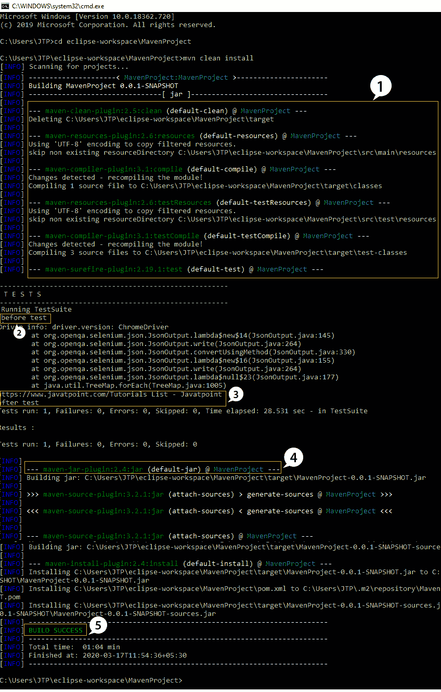

**示例 2** :在这个示例中，我们简单地创建了两个单元测试用例，其中我们将加减两个变量(p 和 q)，并通过 TestNG 和 Maven 运行代码。

下面是示例代码:

```

package testpackage;
import org.testng.Assert;
import org.testng.annotations.Test;
public class demo1 {
@Test
public void sum() {
System.out.print("Sum method");
int p=10;
int q=20;
Assert.assertEquals(30, p+q);
}
@Test
public void sub() {
System.out.print("Sub method");
int p=20;
int q=10;
Assert.assertEquals(10, p-q);
}
}

```

### 执行测试中的代码

要在 TestNG 的帮助下运行代码，请遵循以下过程:

*   右键单击 **java** 文件，选择**运行方式→ 1 测试测试**，如下图所示:

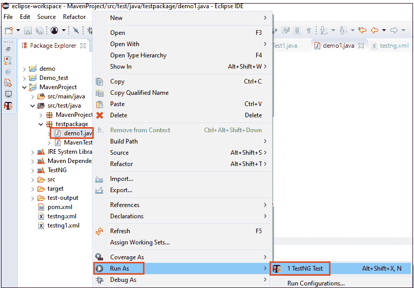

*   代码运行成功后，会给出如下输出:
    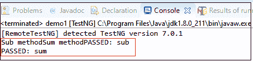

### 通过 Maven 执行代码

要在 Maven 的帮助下运行相同的代码，请执行以下步骤:

*   首先，我们需要将 Demo1.java 文件转换成测试文件，为此
*   右键单击 **java** 文件，选择**测试**，然后在给定的弹出菜单中选择**转换为测试**。

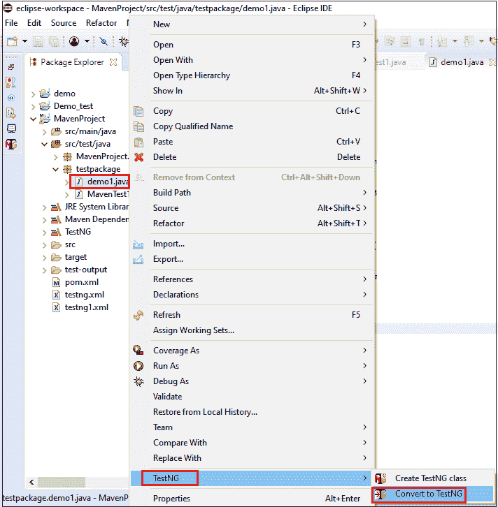

*   并且，我们还可以根据需要更改文件名，点击**完成**

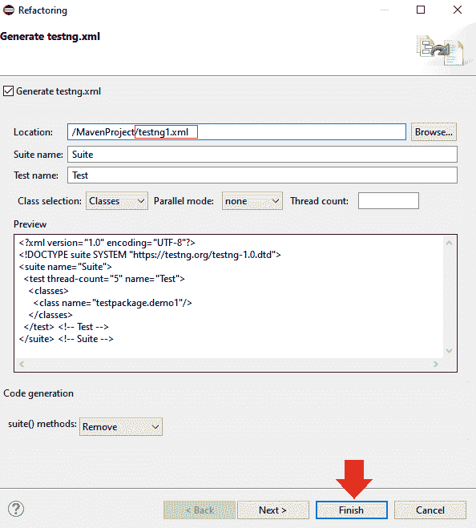

*   之后，我们将通过插件提供 **xml** 文件到 **pom.xml** 文件的路径，就像我们在上面的例子中所做的那样:

```

<plugin>
<groupId>org.apache.maven.plugins</groupId>
<artifactId>maven-surefire-plugin</artifactId>
<version>2.19.1</version>
<configuration>
<suiteXmlFiles>
<suiteXmlFile>C:\Users\JTP\eclipse-workspace\MavenProject\testng1.xml</suiteXmlFile>
</suiteXmlFiles>
</configuration>
</plugin>

```

*   在 pom.xml 文件中添加了 Maven-surefire-plugin 之后，我们将通过按 ctrl+s 来保存文件。
*   然后，右键点击 **MavenProject →运行方式→ Maven Test** ，如下图所示:

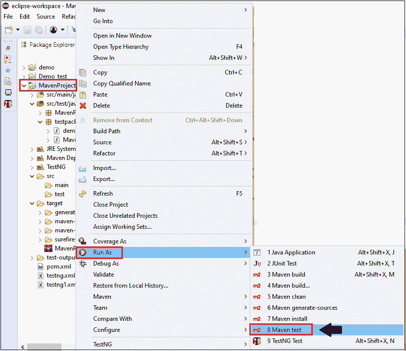

*   当所有测试用例都通过并且构建成功运行时，它将给出以下输出:


* * *