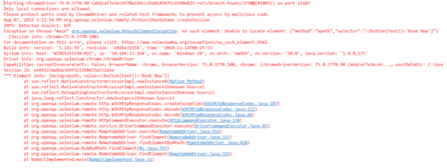
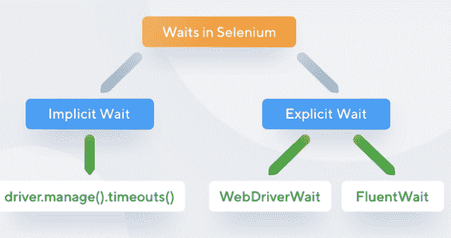

# Selenium等待

> 原文：<https://www.javatpoint.com/selenium-waits>

您可能在编写第一个 Selenium 程序时遇到过等待命令。在本文中，您将了解什么是Selenium等待。要开始学习 Selenium Waits，您需要了解各种类型和其他必要的因素。

## 什么是Selenium等待？

Selenium 中的等待是执行**测试用例的重要代码之一。**它运行在某些被称为脚本的命令上，这些命令通过它进行页面加载。Selenium等待使页面**不那么蓬勃**和**可靠。**在有利的条件下，它提供了足够和合适的各种等待选项。这确保了在使用它执行自动化测试时，您不会陷入混乱和失败的脚本中。

精心制作的[Selenium](https://www.javatpoint.com/selenium-tutorial)waities 帮助用户在跨不同网页进行页面重定向时解决各种问题。它是通过刷新整个网页并用新元素重新加载来实现的。有时，也有来自**阿贾克斯**的电话。因此，在重新加载页面并反映刷新后网页上出现的元素时，可能会存在一些时间延迟。

理解 Selenium Waits 的另一个例子是使用 **navigate()** 命令来回导航网页。这种导航()方法来自 [**网络驱动程序，**](https://www.javatpoint.com/selenium-webdriver) ，其主要任务是模拟和展示实时场景，如在涉及浏览历史的网页之间导航。

## 为什么你需要Selenium的等待？

如今，大多数现代应用的前端要么建立在 [Ajax](https://www.javatpoint.com/ajax-tutorial) 上，要么建立在 [JavaScript](https://www.javatpoint.com/javascript-tutorial) 上，其次是 Angular、React 或任何其他流行的框架，这些框架需要一些时间来将元素加载到网页上。因此，在这种情况下，当您试图定位脚本中仍未加载到网页上的元素时，Selenium 会抛出**“ElementNotVisibleException”**消息。

为了澄清，您可以查看下面的代码片段，其中使用 Selenium 执行自动化测试。

给定的代码将帮助您在使用 Selenium 执行自动化测试时展示相同的问题。以 easemytrip.com 为例，发帖用户选择“发件人”和“收件人”目的地以及行程日期。web 应用需要一定的时间来加载所需的航班详细信息。在这种情况下，不应用等待，用户倾向于预订列表中的第一个航班。由于页面尚未加载，脚本无法找到“立即预订”按钮。它导致抛出一个**“no SuchElementException”。**如下所示:

```

import org.open.selenium.By;
import org.openqa.selenium.JavascriptExecutor;
import org.openqa.selenium.Keys;
import org.openqa.selenium.WebDriver;
import org.openqa.selenium.chrome.ChromeDriver;
import 
com.gargoylesoftware.htmlunit.javascript.background.JavaScriptExec
utor;
public class NoWaitImplemented {
    public static void main(String[] args) throws InterruptedException {
        System.setProperty("webdriver.chrome.driver", 
".\\Driver\\chromedriver.exe");        
        WebDriver driver=new ChromeDriver();        
        driver.manage().window().maximize();
        driver.get("https://www.easemytrip.com/");        
        driver.findElement(By.id("FromSector_show")).sendKeys("Delhi", 
Keys.ENTER);        
driver.findElement(By.id("Editbox13_show")).sendKeys("Mumbai", 
Keys.ENTER);
        driver.findElement(By.id("ddate")).click();
        driver.findElement(By.id("snd_4_08/08/2019")).click();
        driver.findElement(By.className("src_btn")).click();
        driver.findElement(By.xpath("//button[text()='Book Now']")).click();    
    }
}

```

上面的代码片段描述了使用 Selenium 执行自动化测试时的相同问题。在这个代码片段中，您可以看到**“easymtrip . com”**的示例，其中用户将选择带有旅程日期的**【出发地】**和**【目的地】**目的地选择。web 应用需要一定的加载时间来加载基于用户提供的选定输入字段的可用航班。在这种情况下，用户可能只从列表中选择并预订第一个航班。由于页面仍在加载，脚本未能找到“立即预订”按钮。这直接抛出一个**“nosucheelementexpection”**返回状态，输出如下所示。



## Selenium的等待类型



### 隐式等待

隐式等待的主要功能是告诉 web 驱动等待一段时间后抛出**“无此元素异常”。**默认设置敲零。一旦设置了时间，驱动程序将自动等待您定义的时间量，然后抛出上面给出的异常。

**语法:**

```

driver.manage().timeouts().implicitlyWait(TimeOut, 
TimeUnit.SECONDS);

```

为了理解隐式等待是如何工作的，让我们考虑一个例子。

```

package JavaTpoint;
import java.util.concurrent.TimeUnit;
import org.openqa.selenium.By;
import org.openqa.selenium.WebDriver;
import org.openqa.selenium.WebElement;
import org.openqa.selenium.chrome.ChromeDriver;
import org.openqa.selenium.support.ui.ExpectedConditions;
import org.openqa.selenium.support.ui.WebDriverWait; 
public class ImplicitWait{
public static void main(String[] args) throws InterruptedException
{
System.setProperty("webdriver.chrome.driver", "C:Selenium-java-
javaTpointchromedriver_win32chromedriver.exe");
WebDriver driver = new ChromeDriver();
driver.manage().window().maximize();
driver.manage().deleteAllCookies();
driver.manage().timeouts().pageLoadTimeout(40, 
TimeUnit.SECONDS); // pageload timeout
driver.manage().timeouts().implicitlyWait(20, TimeUnit.SECONDS);    
// Implicit Wait for 20 seconds
driver.get("https://login.google.com/");
driver.findElement(By.xpath("//input[@id='login-
username']")).sendKeys("JavaTpoint.com"); //Finding element and 
sending values
Thread.sleep(1000);
driver.findElement(By.xpath("//input[@id='login-signin']")).click(); //Clicking on the next button if element is located
}
}

```

在上面给出的代码片段中，隐式等待仅定义为 **20 秒，**表示输出将在特定元素的最大等待时间 20 秒内加载或到达。

#### 注意:隐式等待是全局应用的。它可用于驱动程序实例。这也意味着，如果驱动程序同时与一千个元素进行交互，隐式等待将只适用于这 1000 个元素。不能超越这一点。

### 显式等待

显式等待也称为**动态等待**，因为它是高度特定的条件。它是由 WebDriverWait 类实现的。要理解为什么在 Selenium 中需要显式等待，您必须了解程序中等待语句的基本知识。简单来说，你必须知道一些条件。创建这样的条件是为了让您了解显式等待的要点以及它们为什么重要。

**条件 1:**

假设您有一个由登录表单组成的网页，该表单接受输入并加载主页或主页内容。由于时间和网络频率的限制，该页面是动态的，有时需要 10 秒或 15 秒才能完全加载。显式等待在这种情况下很有用，它允许您等到页面不存在时再显示。

**条件 2:**

假设您正在开发一个以旅行为主题的应用，用户填写 web 表单并使用提交按钮提交表单。现在，您可能需要等到并且除非没有显示特定的数据。在这种情况下，显式等待会有所帮助，因为它会等待尚未显示的元素集的特定时间段。

**语法:**

```

 WebDriverWait wait=new 
WebDriverWait(WebDriveReference,TimeOut);

```

上面的语法证明了 WebDriver Wait 的一个对象是正确的，并被传递给驱动程序的首选项，超时被作为一个参数。为了更广泛地理解这一点，考虑下面的示例应用。

```

package JavaTpoint;
import java.util.concurrent.TimeUnit;
import org.openqa.selenium.By;
import org.openqa.selenium.WebDriver;
import org.openqa.selenium.WebElement;
import org.openqa.selenium.chrome.ChromeDriver;
import org.openqa.selenium.support.ui.ExpectedConditions;
import org.openqa.selenium.support.ui.WebDriverWait; 
public class Locators {
public static void main(String[] args) throws InterruptedException {
System.setProperty("webdriver.chrome.driver", "C:Selenium-java-
javatpointchromedriver_win32chromedriver.exe");
WebDriver driver = new ChromeDriver();
driver.manage().window().maximize();
driver.manage().deleteAllCookies();
driver.manage().timeouts().pageLoadTimeout(40, 
TimeUnit.SECONDS);
driver.manage().timeouts().implicitlyWait(30, TimeUnit.SECONDS);
driver.get("https://www.facebook.com/");
WebElement firstname= driver.findElement(By.name("firstname"));
WebElement lastname= driver.findElement(By.name("lastname"));
sendKeys(driver, firstname, 10, "Edureka");
sendKeys(driver, lastname, 20, "Edureka");
WebElement forgotAccount= 
driver.findElement(By.linkText("Forgotten account?"));
clickOn(driver,forgotAccount, 10);
driver.manage().timeouts().implicitlyWait(30, TimeUnit.SECONDS);
}
public static void sendKeys(WebDriver driver1, WebElement element, 
int timeout, String value){
new WebDriverWait(driver1, 
timeout).until(ExpectedConditions.visibilityOf(element));
element.sendKeys(value);
}
public static void clickOn(WebDriver driver1, WebElement element, 
int timeout)
{
new WebDriverWait(driver1, 
timeout).until(ExpectedConditions.elementToBeClickable(element));
element.click();
}
}

```

在上面给出的示例代码片段中，您可以看到已经创建了使用定位器的脸书注册证书。此外，还创建了一个通用实用函数，使所有元素都可以用于显式等待。此外，sendKeys()方法是为内部提供显式等待的特定文本字段定义的。在 sendKeys()方法中，元素有一些预期的条件。这意味着要求驾驶员等待 20 秒，直到并且除非元素的预期条件可见。此外，应用 sendKeys()方法的主要目的是获取名字和姓氏，并将它们传递给驱动程序。名字和姓氏的超时时间被定义为 10 秒。

当执行上述程序时，Chrome 驱动程序将启动 Chrome，它将在 facebook.com 导航以获取上述值。虽然不是强制性的，但明确设置特定值的超时是可以改变的。这里相加的另一个优点是，一旦定义了 10 秒的超时，它就适用于网页上的所有元素，然后就不能修改了。同样的概念也适用于上面程序中定义的 onClick()方法，但是该方法仅限于链接。这是执行、理解和执行显式等待的最佳方式。

#### 注意:动态权重被认为是动态的，因为如果您采用隐式、显式或 Fluent 等待，并将超时方法定义为 20 秒，并且如果元素只占用 5 秒，则不考虑剩余的 15 秒。它不会等整整 20 秒。

## 内隐和外显的区别

1.  隐式等待适用于脚本中的所有元素，而显式等待仅适用于那些由用户定义的值。
2.  隐式等待需要在找到的元素上指定“预期条件”，而显式等待不需要用此条件指定。
3.  隐式等待需要时间框架规范，比如元素可见性、可点击元素和要选择的元素。相比之下，显式等待是动态的，不需要这样的规范。

### 流畅的等待

流畅等待与显式等待非常相似。它在管理和运作方面是相似的。在 Fluent Wait 中，只有当您不知道某个元素可点击或可见所需的时间时，才可以对其执行等待操作。Fluent 提供的几个差异因素如下:

**汇集频率**

显式情况下的池化频率为 500 毫秒。但是，使用 Fluent Wait，该池频率可以根据您的需要更改为任何值。这通常意味着告诉脚本在每‘x’秒后关注该元素。

忽略例外

在池化时，如果找不到元素，您可以忽略一些期望，如“NoSuchElement”。除此之外，类似于显式和隐式等待，您可以定义元素可操作或可见的时间量。

**语法:**

```

 Wait fluentWait = new FluentWait<webdriver>(driver)
       .withTimeout(60, SECONDS) // this defines the total amount of 
time to wait for
       .pollingEvery(2, SECONDS) // this defines the polling frequency
       .ignoring(NoSuchElementException.class); // this defines the 
exception to ignore 
      WebElement foo = fluentWait.until(new Function<webdriver webelement="">()
 {
     public WebElement apply(WebDriver driver)  //in this method 
defined your own subjected conditions for which we need to wait for
     {  return driver.findElement(By.id("foo"));
}});</webdriver></webdriver> 
```

虽然语法看起来非常复杂，但当您开始使用它时，它会派上用场。这就是为什么可能所有的软件测试人员都喜欢使用显式和隐式等待，因为语法简单。Fluent 等待看起来很复杂，因为它没有提供需要应用于元素的预定义条件。相反，Fluent Wait 在应用方法中定义了它的条件。

```

 package javaTpoint.test;
import org.testng.annotations.Test;
import java.util.NoSuchElementException;
import java.util.concurrent.TimeUnit;
import java.util.function.Function;
import org.openqa.selenium.By;
import org.openqa.selenium.WebDriver;
import org.openqa.selenium.WebElement;
import org.openqa.selenium.chrome.ChromeDriver;
import org.openqa.selenium.support.ui.ExpectedConditions;
import org.openqa.selenium.support.ui.FluentWait;
import org.openqa.selenium.support.ui.Wait;
import org.openqa.selenium.support.ui.WebDriverWait;
import org.testng.annotations.Test;
public class AppTest3 {
	protected WebDriver driver;
	@Test
	public void javaTpointTutorial() throws InterruptedException 
	{
	System.setProperty ("webdriver.chrome.driver",".\\chromedriver.exe" );
	String eTitle = "Demo javaTpoint Page";
	String aTitle = "" ;
	driver = new ChromeDriver();
	// launch Chrome and redirect it to the Base URL
	driver.get("https://javatpoint.com/home" );
	//Maximizes the browser window
	driver.manage().window().maximize() ;
	//get the actual value of the title
	aTitle = driver.getTitle();
	//compare the actual title with the expected title
	if (aTitle.contentEquals(eTitle))
	{
	System.out.println( "Test Passed") ;
	}
	else {
	System.out.println( "Test Failed" );
		}	
	Wait wait = new FluentWait<webdriver>(driver)							
			.withTimeout(30, TimeUnit.SECONDS) 			
			.pollingEvery(5, TimeUnit.SECONDS) 			
			.ignoring(NoSuchElementException.class);
	WebElement clickseleniumlink = wait.until(new 
Function<webdriver webelement="">(){	
		public WebElement apply(WebDriver driver ) {
			return 
driver.findElement(By.xpath("/html/body/div[1]/section/div[2]/div/di
v[1]/div/div[1]/div/div/div/div[2]/div[2]/div/div/div/div/div[1]/div/div/a/i"));
		}
	});
	//click on the selenium link
	clickseleniumlink.click();
	//close~ browser
	driver.close() ;
	}
}</webdriver></webdriver> 
```

在上面的代码片段中，您可以观察到流畅的等待已经被设置为 30 秒的超时，并且通过“NoSuchElementException”将频率保持在 5 秒。在另一个实例中，创建了一个新的函数来识别前一页上的 web 元素。如果发现元素落在同一时间范围内，它可能会执行所有操作。如果由于某种原因，出现任何错误，该函数将返回“ElementNotVisibleException”。

## Selenium等的云应用

大多数测试人员更喜欢使用一些基于云的服务提供商为他们正在工作的项目执行自动化测试，这些服务提供商是为适应 Selenium 而设计的。LamdbaTest 就是这样一种流行的基于云的测试方法。LambdaTest 是一个强大的跨平台浏览器测试工具。

假设您正在运行一个类似 LambdaTest 的基于云的 Selenium Grid，这就是 Selenium 复杂测试套装出现快速超时问题的地方。您还可以暂停网络驱动程序 90 秒，这也可以作为默认的时间限制，从而避免自动化脚本成功运行时出现超时错误。

## 最后的想法

Selenium Waits 帮助用户设计具有可靠性和较少依赖性的脚本。通过确保业务部门使用 Selenium 实现自动化测试背后的结果和目的，您可以选择您想要继续的等待。另一个需要注意的重要方面是确保您不会在应用中不必要地保留 Selenium Waits。最初，在 Selenium 的早期版本中有线程选项，现在被 Waits 所取代。Selenium waits 提供了动态测试方法，以及使用 JUnit 或其他测试机制等平台进行测试的最佳环境。在本文中，您看到了前一种等待的区别，如隐式、显式和流畅。您还了解了为什么 Fluent Wait 不是首选的，尽管它非常复杂，但是对于开发人员来说，使用 Selenium 执行单元测试方法在语法上很难。后来，您通过示例代码片段了解了 Selenium Wait 的各个方面是如何紧密集成的。

* * *