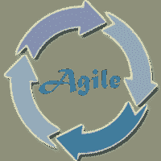

# 敏捷教程

> 原文：<https://www.javatpoint.com/agile>

敏捷教程有时被称为敏捷方法论。本教程包含了敏捷的基本和高级概念。我们的敏捷教程是为初学者和专业人士设计的。敏捷是软件开发方法论的迭代方法，使用 1 到 4 周的短迭代。使用敏捷方法，软件以最快和更少的变化发布。敏捷方法的优势是通过快速、持续地开发和交付有用的软件来满足客户的需求。

## 先决条件

在学习敏捷方法论之前，你应该对软件工程或者软件开发生命周期有一个基本的了解。

## 观众

我们的敏捷教程旨在帮助初学者和专业人士。

## 问题

我们保证您在这个敏捷教程中不会发现任何问题。但是如果有任何错误，请在联系表格中发布问题。

* * *