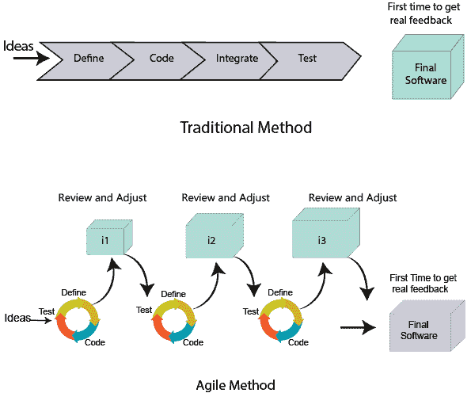
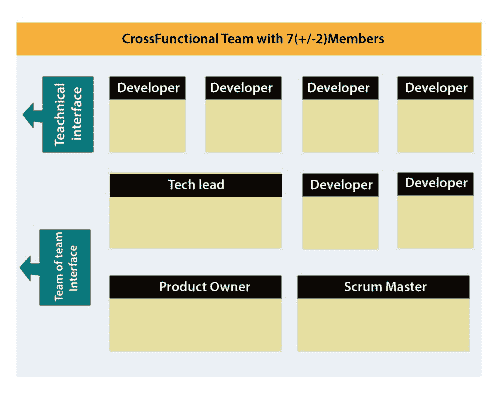
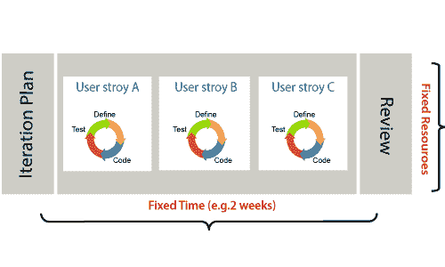
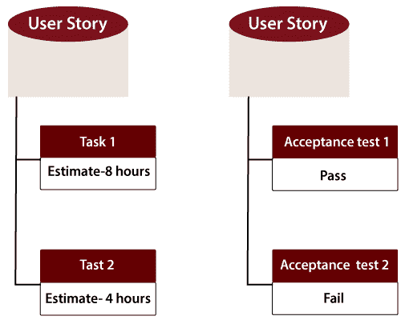

# 什么是敏捷方法？

> 原文：<https://www.javatpoint.com/agile-methodology>

敏捷方法是软件开发的迭代方法。敏捷方法的每次迭代需要 1 到 4 周的短时间间隔。敏捷开发过程与交付不断变化的业务需求相一致。它以更快、更少的变更分发软件。

单相软件开发需要 6 到 18 个月。在单阶段开发中，所有的需求收集和风险管理因素都是初步预测的。

敏捷软件开发过程经常需要可行产品的反馈。可行的产品在迭代的 1 到 4 周内交付。

## 敏捷中的角色

敏捷方法中有两种不同的角色。他们是 Scrum 大师和产品所有者。

### 1.Scrum 大师

Scrum Master 是一个团队领导者和设施提供者，他帮助团队成员遵循敏捷实践，这样团队成员就能满足他们的承诺和客户的需求。scrum 主管的职责如下:

*   它们使所有角色和职能之间能够密切合作。
*   他们移除所有发生的阻塞。
*   他们保护队伍不受任何干扰。
*   他们与组织合作，跟踪公司的进展和流程。
*   他们确保敏捷检查和调整流程得到正确利用，包括
    *   计划的会议
    *   日常站立
    *   演示
    *   回顾
    *   回顾会议，以及
    *   促进团队会议和决策过程。

### 2.产品所有者

产品负责人是从商业角度管理产品的人。产品负责人承担以下责任:

*   他定义了需求并优先考虑它们的价值。
*   他设定发布日期和内容。
*   他在迭代和发布计划会议中扮演积极的角色。
*   他确保团队致力于最有价值的需求。
*   他代表了顾客的声音。
*   他接受符合完成定义和定义的接受标准的用户故事。

## 跨职能团队

每个敏捷团队都包含 5 到 9 名成员的自给自足的团队。每个成员的平均经验从 6 年到 10 年不等。敏捷团队包含 3 到 4 名开发人员、1 名测试人员、1 名技术主管、1 名 scrum 大师和 1 名产品负责人。

Scrum 主和产品所有者被认为是团队接口的一部分，另一方面，剩余的成员是技术接口的一部分。

## 敏捷团队如何规划他们的工作？

敏捷方法不是一套特定的仪式或特定的开发技术。相反，它是一组方法，展示了对紧密反馈周期和持续改进的承诺。敏捷团队在迭代中工作以交付客户需求，每次迭代需要 10 到 15 天。然而，最初的敏捷宣言并没有设定两周迭代的时间段或者理想的团队规模。

每个用户需求都是基于计划的，以及它们的积压优先级和大小。团队决定，他们有多少范围，每个团队有多少时间来执行他们计划的任务。

## 什么是用户需求？

用户需求定义了用户在功能方面的需求。可能有两种类型功能。

*   作为一个<user role="">我想要<functionality>这样</functionality></user>
*   为了<business value="">成为<user role="">我想要<functionality>。</functionality></user></business>

在软件发布计划期间，使用相对比例点对用户需求进行粗略估计。在迭代计划期间，需求被分解成任务。

### 用户需求和任务之间的关系

*   用户需求讨论要做什么。它定义了用户的需求。
*   任务谈论如何完成它。它定义了如何实现功能。
*   用户需求由任务实现。每一个需求都作为一项任务被收集起来。
*   当用户需求在当前迭代中被计划时，它被分成不同的任务。
*   用户任务以小时为单位进行估算，一般在 2 到 12 小时之间。
*   使用验收测试验证需求。

## 当需求完成时

敏捷团队决定任务完成的意义。可能有不同的标准:

*   当整个任务(开发、测试)完成时。
*   当所有验收测试正在运行并通过时。
*   当没有发现缺陷时。
*   产品所有者已经接受了要求。
*   当软件产品交付给最终用户时。

## 什么是软件验收标准？

验收标准被定义为产品所有者要求的功能、行为和性能。它定义了要做什么，以便开发人员知道用户需求何时完成。

* * *