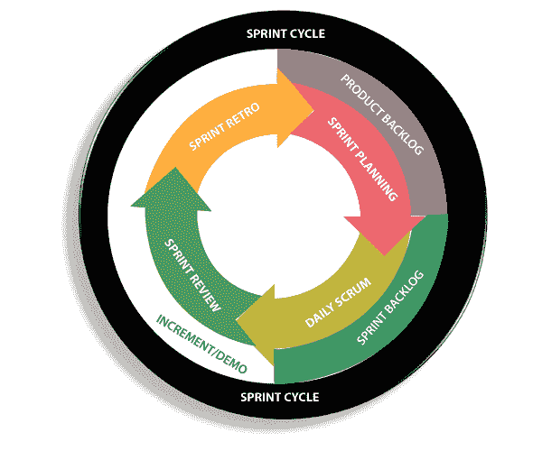
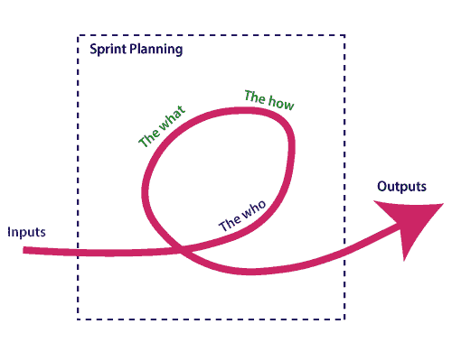

# 什么是 Scrum？

> 原文：<https://www.javatpoint.com/agile-scrum>

**Scrum 是一个帮助敏捷团队协同工作的框架**。使用它，团队成员可以交付和维护复杂的产品。它鼓励团队在实践中学习，在解决问题时自我组织。浮渣是通过框架完成的工作，并不断向客户传递价值。

它是开发团队最常用的软件。它的原理和教训可以应用于各种团队合作。它的政策和经验是 Scrum 框架流行的一个原因。Scrum 描述了一组帮助团队构建的工具、会议和角色。它还管理团队完成的工作

## 框架

Scrum 和敏捷不是一回事，因为 Scrum 专注于持续改进，这是敏捷的核心基础。Scrum 框架专注于持续完成工作。

## 什么是短跑？

有了 scrum，一个产品就建立在一系列被称为**冲刺**的重复中。它将复杂的大项目分解成小块。它使项目更易于管理，允许团队交付高质量、更快、更频繁的工作。短跑给了他们更多的灵活性来适应变化。

对于致力于完成设定工作量的 Scrum 团队来说，冲刺是一个短暂的、有时间限制的阶段。冲刺是 Scrum 和敏捷方法论的核心组成部分。正确的冲刺将帮助我们的敏捷团队发布更好的软件。

## 什么是冲刺计划？

冲刺计划是 Scrum 中启动冲刺的一个动作。sprint 计划的主要目的是定义在 sprint 中可以交付什么。它还侧重于如何完成这项工作。它是与整个 Scrum 团队成员一起完成的。

冲刺阶段是一系列需要完成所有工作的阶段。在我们开始开发之前，我们必须开始冲刺。我们需要描述实现冲刺目标需要多长时间，以及我们将从哪里开始。

## 影响冲刺计划的因素

*   **什么:**产品所有者描述冲刺的目标以及有助于实现该目标的积压项目。
*   **How:**敏捷开发团队计划其必要的工作，即如何实现和交付 sprint 目标。
*   **Who:**产品所有者根据客户寻求的价值来定义目标。开发人员需要了解他们如何能够或者不能实现这个目标。
*   **输入:**产品积压提供了可能成为当前冲刺一部分的输入内容列表。该团队查看以增量方式完成的现有工作。
*   **输出:**冲刺计划的关键结果是满足所描述的团队目标。该产品设定了 sprint 的目标，以及他们将如何开始朝着目标努力。

## 什么是产品积压？

产品积压是开发团队注册的工作列表。它是由路线图及其要求驱动的。基本任务被表示在产品积压的顶部，以便团队成员知道首先交付什么。开发团队不会从产品所有者的角度来处理积压的工作，产品所有者也不会将工作推给开发团队。开发团队从产品积压中提取工作。

## 积压从两个“R”开始

基本的产品积压是由团队的**路线图**和**需求**提供的。路线图重复分解成几个史诗，每个史诗将有几个需求和用户故事。

产品所有者将每个客户故事组织成一个列表。这个故事是为开发团队组织的。产品所有者选择交付第一部完整的 epic。

## 影响产品所有者优先级的因素

*   客户优先级
*   获得反馈的重要性
*   相对实施难度
*   工作项目之间的共生关系

* * *