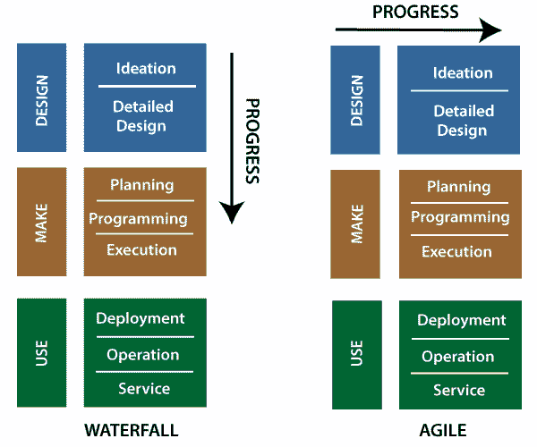
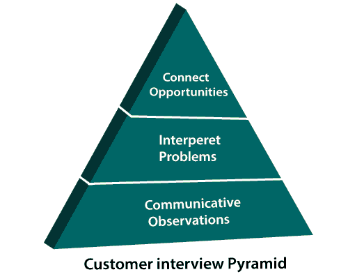

# 敏捷设计

> 原文：<https://www.javatpoint.com/agile-design>

设计在任何软件开发过程中都起着至关重要的作用。敏捷团队还关注“如何设计”，因为有以下四个因素:

*   在规划过程中，许多关键因素都集中在忠实的设计上。在产品实施过程中，设计力量倾向于瀑布文化。
*   设计师也在有限的时间内与跨团队互动。
*   设计师并不总是有一个简单的方法向工程团队报告反馈。
*   表示层和逻辑层仍然不是透明的。它们在代码库中没有清晰地分开，使得样式更改变得困难。

## 产品设计流程和客户访谈

敏捷分为几种方法和过程。这些方法和过程保持了技术的迭代和自由流动的本质。敏捷设计和开发方法特别用于工程开发，这个过程叫做 Scrum。

客户访谈可能是项目设计阶段的一个信息部分。在采访中，我们会看到一些“灯泡”运动。它鼓励与团队其他成员(工程、营销、设计等)一起面试的人。)

我们可以利用几个资源进行采访——后勤、方法和技巧。

## 客户访谈金字塔:

Atlassian 是一个简单的框架，有助于建立客户采访金字塔。这个金字塔看起来像

**交流观察:**在金字塔的底部，我们会得到极小值。我们都应该从采访中回来，并能够列出观察结果，因为我们不需要任何经验来规范你所看到的。

**解读问题:**在沟通观察上面，是一个解读问题。它解释了用户的行为，并用一个概括的问题陈述将它们分组。

**连接机会:**这是金字塔的顶峰，在这里，最大的价值来自于将问题与潜在机会或相关模式相结合。这有助于影响路线图，并决定下一步要解决的问题。

* * *