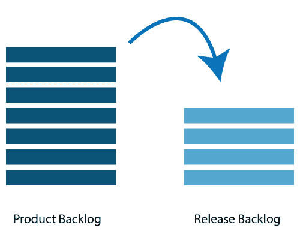

# 敏捷发布计划

> 原文：<https://www.javatpoint.com/agile-release-planning>

发布计划的主要目的是制定一个向产品交付增量的计划。每隔 2 到 3 个月做一次。

## 谁参与了计划的发布？

以下人员参与产品发布计划——Scrum 主、产品所有者、敏捷开发团队、利益相关者。

*   **Scrum Master:**Scrum Master 是一个团队领导者和设施提供者，他帮助团队成员遵循敏捷实践，以便他们能够满足他们的承诺和客户需求。
*   **产品负责人:**产品负责人是从商业角度经营产品的人。他定义了需求并优先考虑它们的价值。
*   **敏捷开发团队:**敏捷开发团队提供对技术可行性或任何依赖性的判断。
*   **利益相关者:**利益相关者是客户、主题、项目经理，在围绕发布计划做出的决策中充当顾问。

## 规划的先决条件:

发布计划的先决条件如下:

*   产品所有者管理分级的产品积压。发布产品时，产品所有者觉得在产品发布期间包含五到十个功能。
*   高层次的视野
*   市场和业务目标
*   团队根据能力、已知速度或任何技术挑战的投入。
*   已确认需要新产品积压项目

## 所需材料:

发布计划所需的材料清单如下:

*   活动挂图、记号笔、白板/li >
*   发布的议程、目的/li >
*   用于共享计划会议期间所需的计算机数据/工具的投影仪/li >
*   计划数据

## 规划数据:

发布计划期间需要的数据列表如下:

*   以前的迭代数据或发布计划请求
*   以前版本/迭代的行动计划
*   要考虑的特征或缺陷
*   组织和个人日历
*   以前发布/估计的速度

## 输出:

以下是发布计划的输出:

*   发布计划
*   承诺
*   要监控的问题、依赖性、关注点和假设
*   它建议改进未来的发布计划

## 规划议程

*   **开幕式:**欢迎留言、点评目的、组织工具、业务赞助商介绍。
*   **产品愿景和路线图:**展示了产品的全貌。
*   **回顾之前的版本:**针对任何可能影响计划的项目讨论的产品规划议程。
*   **产品发布名称/主题:**检查路线图主题当前状态，如有必要进行必要调整。
*   **问题和关注点:**在议程中，我们检查任何关注点或问题，然后记录下来。
*   **审核并更新 done 的定义:**审核 Done 的产品构建或定义，并根据技术进行适当的更改。
*   **回顾:**需要参与者的反馈才能使会议成功。
*   **关闭:**庆祝成功。

* * *