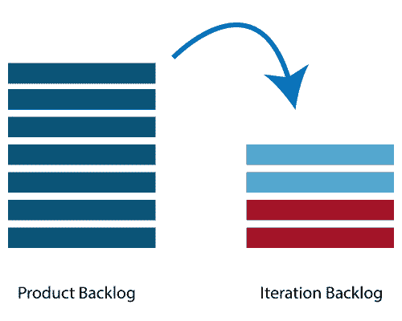

# 敏捷迭代规划

> 原文：<https://www.javatpoint.com/agile-iteration-planning>

迭代计划的主要目的是为了团队。团队应该是一套完整的顶级产品积压项目。完成排名靠前的产品积压是对迭代长度和团队速度所需时间的承诺。

## 谁参与了迭代计划？

**Scrum Master:**Scrum Master 是团队领导和设施提供者。他帮助团队成员遵循敏捷实践，这样他们就可以满足他们的承诺和客户需求。

**产品负责人:**产品负责人处理产品积压及其验收标准的完整视图。

**敏捷开发团队:**敏捷交付定义了他们的任务并设定了工作量。努力的目标是评估实现承诺的需求。

## 规划的先决条件

*   产品积压中的项目是有大小的，并且分配了一个相对的故事点。
*   产品所有者给出了投资组合项目的排名。
*   每个投资组合项目的验收标准都有明确说明。

## 规划过程

**迭代规划涉及以下步骤:**

*   确定迭代中适合多少需求(故事)。
*   将这个需求分解成任务。将每个任务分配给它们的所有者。
*   每项任务都设定了一些预计时间。
*   这些估计帮助团队成员检查每个成员迭代需要多少小时。
*   团队成员通过查看他们的速度或能力来分配任务。因此，团队成员不会负担过重。

## 速度计算

敏捷团队根据之前的迭代计算速度。速度是迭代中需要完成用户故事的平均单元数。假设，一个团队在前三次迭代中，在每次迭代中取 10，12，8 个故事点，这表明团队可以取 10 作为下一次迭代的速度。

计划速度告诉团队在当前迭代中可以完成多少用户需求。如果团队立即完成分配的工作，那么可以引入更多的用户需求。否则，需求也可以移出到下一个迭代。

## 任务能力

三个因素决定了团队的能力:

*   一天中理想工作时间的总数
*   一个人给出每次迭代的总天数
*   成员完全可用于团队的时间百分比。

一个团队有 6 名成员，致力于在一个项目上每天工作 8 小时。并且迭代期间没有成员休假，那么两周迭代的任务能力将为-
6×8×10 = 480 小时

## 迭代计划步骤

*   产品所有者描述产品积压中排名最高的项目。
*   团队成员描述完成项目所需的任务。
*   团队成员拥有任务。
*   团队成员估计自己完成每项任务的时间。
*   对迭代中的所有项目重复上述步骤。
*   如果任何成员的工作负荷过重，那么他/她的任务将分配给其他团队成员。

* * *