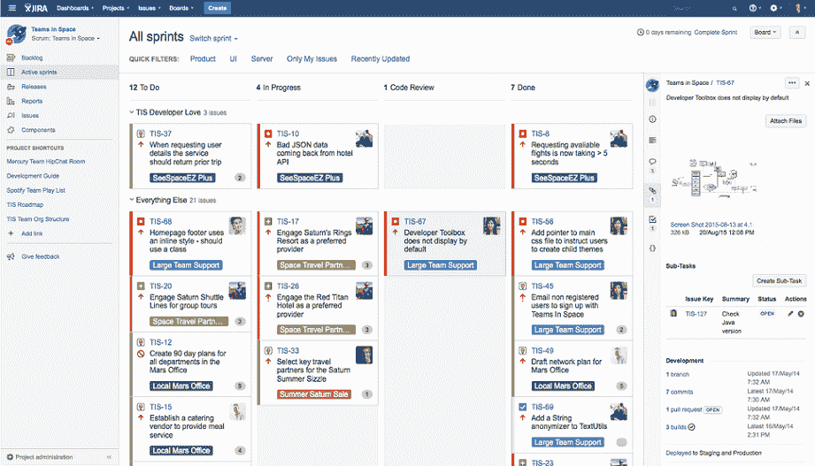
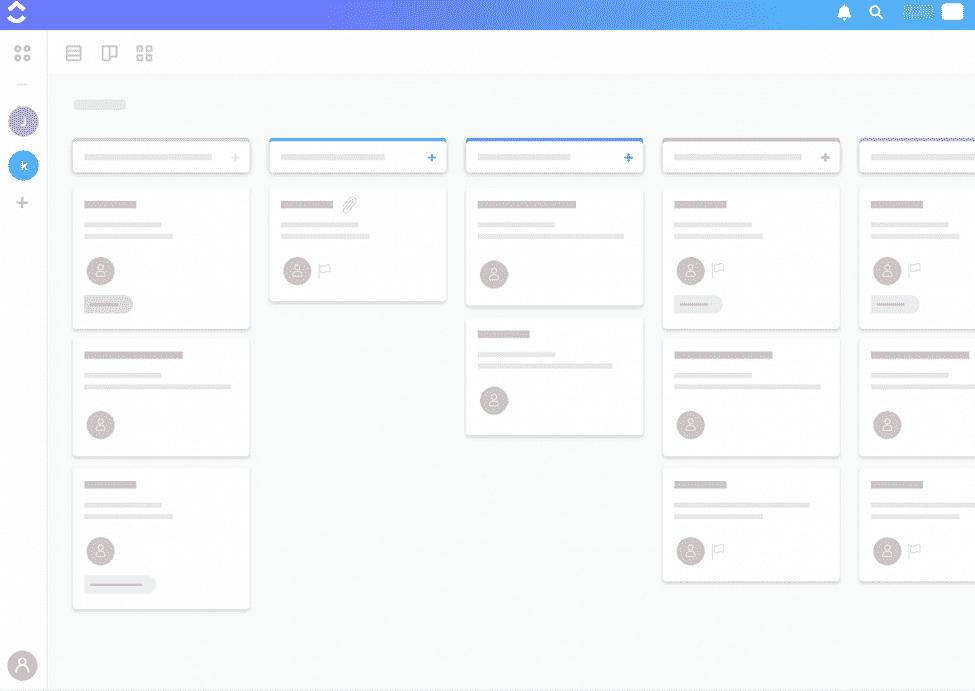
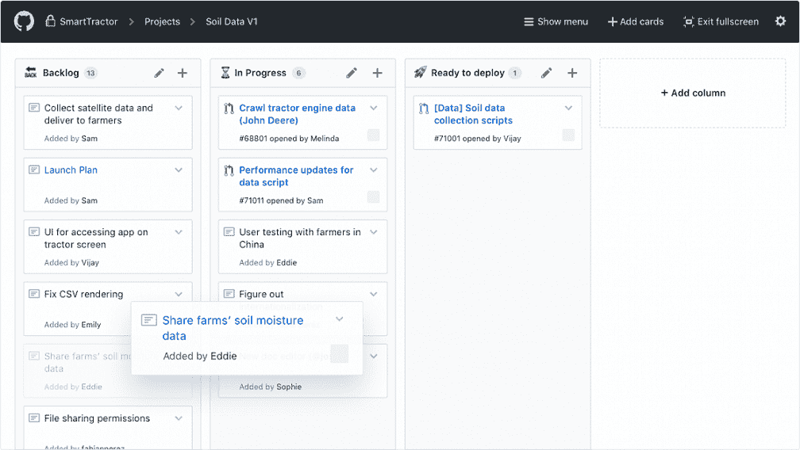
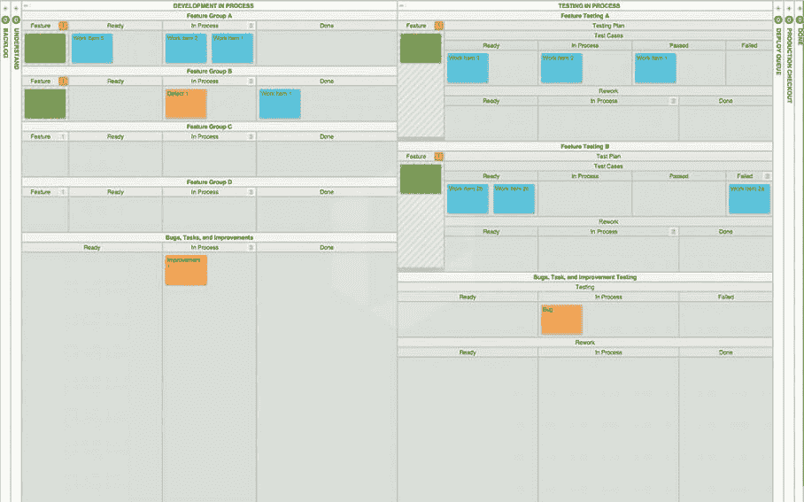

# 敏捷工具

> 原文：<https://www.javatpoint.com/agile-tools>

在敏捷开发中，领导项目管理不是最容易的工作。在你的日常冲刺和下一次冲刺之间跳跃，会导致你很难专注于工作。敏捷开发工具满足了你的需求，并为你服务。

**市场上有几种敏捷工具。下面列出了其中一些:**

### 敏捷轴

**吉拉**是澳大利亚公司**亚特兰蒂斯**开发的工具。用于**问题跟踪、bug 跟踪和项目管理**。这些错误和问题与您的软件和移动应用程序有关。吉拉仪表板包含许多有用的功能和特点。该功能和特性使得问题的处理更加安全。

### 敏捷软件特性:

*   问题跟踪
*   Bug 跟踪
*   纸板
*   史诗
*   自定义字段

### 时钟升级

**ClickUp** 是终极敏捷管理工具之一。它适用于任何使用敏捷方法的人。它是唯一一个目标是“快速轻松地移动”的项目管理工具。 **CuickUp** 在一些最著名的敏捷团队手里，包括**谷歌**和**苹果！**这是一个永远免费的计划，所以，团队可以拿到 ClickUp。

### 敏捷软件特性:

*   创建史诗
*   使用故事点
*   分析短跑成绩
*   时间估计
*   开始日期和截止日期
*   时间跟踪

### 开源代码库

**Github** 是最大的托管 Git 服务之一，开发者可以在这里存储大量项目的所有代码。Github 为整个团队提供了实时编辑记录的功能**。Github 还集成了许多其他工具，因此开发人员和产品所有者等许多人可以同时处理相同的代码。**

 **项目经理可以让 Github 为他们的团队工作。它包括许多项目管理工具，帮助他检查开发团队正在做什么。

### 敏捷软件特性:

*   问题跟踪
*   提及
*   标签
*   链接问题和拉取请求

### LeanKit

**LeanKit** 是一个**看板**板上的终极管理工具，为你的冲刺提供敏捷的进度。它使用卡片来表示团队成员的工作项目和实时状态。它非常适合远程员工，确保每个人都能实时看到看板。它防止同一任务完成两次，并确保整个团队保持在同一页面上。

LeanKit 对于跨职能团队来说工作得很好，这对 Scrum 或看板板来说是有益。

### 敏捷软件特性:

*   纸板视图模板
*   跟踪问题和缺陷
*   管理项目组合
*   精益指标和报告

### 平面盒

Planbox 是一个跟踪燃尽图过程的工具。用这个每个人都知道你离冲刺有多远？的完成/目标。燃尽图是敏捷周期中最重要的部分。Planbox 还集成了客户错误报告和修复程序，使其对广泛的用户有用。

它有一个预先报告的特性，这使得在每日 Scrum 中回顾状态和需要改进的地方变得很容易。

* * ***