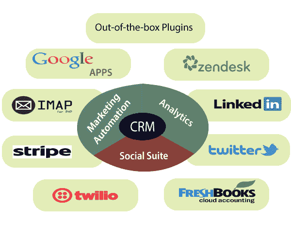

# 敏捷客户关系管理

> 原文：<https://www.javatpoint.com/agile-crm>

敏捷客户关系管理是一个集销售、服务自动化和营销于一体的单一平台客户关系管理。它包括销售跟踪、营销自动化、联系人管理、网络分析、电话、双向电子邮件和具有简单、干净和现代界面的服务台。

客户关系管理是一种软件，有助于管理品牌与当前和未来客户的互动。

客户关系管理软件允许您建立、组织和展示客户信息数据库。当发现新数据时，您和您的团队可以更新这些信息。它是所有客户和潜在客户信息的中央仓库，有助于您的团队更有条理、更有效率。它还允许团队之间的团队合作，并为管理层提供对个人绩效和业务整体增长的更深入判断。

## 为什么我们要建立敏捷客户关系管理

作为一个企业家，每个人都希望得到积极的反馈，增加新产品的成功。从最初的几个客户开始，你用他们的名字吸引他们，对他们足够了解，一天可以和他们交谈多次。之后，他们可能会帮助你分享你的产品。然后，你会获得更多的成功，但管理与所有客户的沟通也会更麻烦。

## 敏捷客户关系管理的需求

敏捷客户关系管理的主要需求分为以下几点:

1.  ***易于使用的营销自动化:*** 这很容易使用，因为不是每个小企业的老板都应该需要了解自动化的技术细节。
2.  ***一个可管理的 CRM:*** 它好用又实惠。
3.  ***电话:*** 可能没有什么比在 CRM 上看到某人的电话号码，然后在我们的电话上拨打他们的号码更烦人的了。我们也花了很多时间解决我们的手机计划！
4.  ***社交套件:*** 社交媒体在 CRM 营销中发挥着至关重要的作用，将客户与其联系起来。如果企业主一开始没有融入社交媒体，那么他们就会被甩在后面。
5.  ***全双向邮件整合:*** 店主想将个人邮件完全整合到 CRM 中。因此，他们可以在客户关系管理系统内部发送、接收和查看所有者和客户之间的电子邮件。

## 敏捷客户关系管理的好处

客户关系管理的显著好处是业务转移到集中平台来存储其数据。它使得从一个公共来源获取信息变得容易。由于最佳客户关系管理的存在，组织有信心在没有任何额外成本的情况下关注他们的客户。

在客户关系管理出现之前，数据分散在电子表格、文档、地址簿、笔记本和电子邮件系统中。客户关系管理简化了这个繁琐的过程，数据可以通过一个集中的位置访问。

* * *